# 一.认识python

## 1、Python发展背景

* Python的作者，Guido von Rossum（吉多·范·罗苏姆，中国Python程序员都叫他 龟叔），荷兰人。1982年，龟叔从阿姆斯特丹大学获得了数学和计算机硕士学位。然而，尽管他算得上是一位数学家，但他更加享受计算机带来的乐趣。用他的话说，虽然拥有数学和计算机双料资质，他总趋向于做计算机相关的工作，并热衷于做任何和编程相关的事情。
* 在那个时候，龟叔接触并使用过诸如Pascal、C、Fortran等语言。这些语言的基本设计原则是让机器能更快运行。在80年代，虽然IBM和苹果已经掀起了个人电脑浪潮，但这些个人电脑的配置很低。比如早期的Macintosh，只有8MHz的CPU主频和128KB的RAM，一个大的数组就能占满内存。所有的编译器的核心是做优化，以便让程序能够运行。为了增进效率，语言也迫使程序员像计算机一样思考，以便能写出更符合机器口味的程序。在那个时代，程序员恨不得用手榨取计算机每一寸的能力。有人甚至认为C语言的指针是在浪费内存。至于动态类型，内存自动管理，面向对象…… 别想了，那会让你的电脑陷入瘫痪。
* 这种编程方式让龟叔感到苦恼。龟叔知道如何用C语言写出一个功能，但整个编写过程需要耗费大量的时间，即使他已经准确的知道了如何实现。他的另一个选择是shell。Bourne Shell作为UNIX系统的解释器已经长期存在。UNIX的管理员们常常用shell去写一些简单的脚本，以进行一些系统维护的工作，比如定期备份、文件系统管理等等。shell可以像胶水一样，将UNIX下的许多功能连接在一起。许多C语言下上百行的程序，在shell下只用几行就可以完成。然而，shell的本质是调用命令。它并不是一个真正的语言。比如说，shell没有数值型的数据类型，加法运算都很复杂。总之，shell不能全面的调动计算机的功能。
* 龟叔希望有一种语言，这种语言能够像C语言那样，能够全面调用计算机的功能接口，又可以像shell那样，可以轻松的编程。ABC语言让龟叔看到希望。**ABC是由荷兰的数学和计算机研究所开发的。龟叔在该研究所工作，并参与到ABC语言的开发 **。ABC语言以教学为目的。与当时的大部分语言不同，ABC语言的目标是“让用户感觉更好”。ABC语言希望让语言变得容易阅读，容易使用，容易记忆，容易学习，并以此来激发人们学习编程的兴趣。比如下面是一段来自Wikipedia的ABC程序，这个程序用于统计文本中出现的词的总数：

```py
   HOW TO RETURN words document:
      PUT {} IN collection
      FOR line IN document:
         FOR word IN split line:
            IF word not.in collection:
               INSERT word IN collection
      RETURN collection
```

* HOW TO用于定义一个函数。一个Python程序员应该很容易理解这段程序。ABC语言使用冒号和缩进来表示程序块。行 尾没有分号。for和if结构中也没有括号() 。赋值采用的是PUT，而不是更常见的等号。这些改动让ABC程序读起来像一段文字。
* 尽管已经具备了良好的可读性和易用性，ABC语言最终没有流行起来。在当时，ABC语言编译器需要比较高配置的电脑才能运行。而这些电脑的使用者通常精通计算机，他们更多考虑程序的效率，而非它的学习难度。除了硬件上的困难外，ABC语言的设计也存在一些致命的问题：
  * 可拓展性差。ABC语言不是模块化语言。如果想在ABC语言中增加功能，比如对图形化的支持，就必须改动很多地方。
  * 不能直接进行IO。ABC语言不能直接操作文件系统。尽管你可以通过诸如文本流的方式导入数据，但ABC无法直接读写文 件。输入输出的困难对于计算机语言来说是致命的。你能想像一个打不开车门的跑车么？
  * 过度革新。ABC用自然语言的方式来表达程序的意义，比如上面程序中的HOW TO 。然而对于程序员来说，他们更习惯 用function或者define来定义一个函数。同样，程序员更习惯用等号来分配变量。尽管ABC语言很特别，但学习难度 也很大。
  * **传播困难 **。ABC编译器很大，必须被保存在磁带上。当时龟叔在访问的时候，就必须有一个大磁带来给别人安装ABC编 译器。 这样，ABC语言就很难快速传播。
* 1989年，为了打发圣诞节假期，龟叔开始写Python语言的编译器。Python这个名字，来自龟叔所挚爱的电视剧Monty Python's Flying Circus。他希望这个新的叫做Python的语言，能符合他的理想：创造一种C和shell之间，功能全面，易学易用，可拓展的语言。龟叔作为一个语言设计爱好者，已经有过设计语言的尝试。这一次，也不过是一次纯粹的hacking行为。

## 2、Python语言的诞生

* 1991年，第一个Python编译器诞生。它是用C语言实现的，并能够调用C语言的库文件。从一出生，Python已经具有了 ：类，函数，异常处理，包含表和词典在内的核心数据类型，以及模块为基础的拓展系统。
* Python语法很多来自C，但又受到ABC语言的强烈影响。来自ABC语言的一些规定直到今天还富有争议，比如强制缩进。 但这些语法规定让Python容易读。另一方面，Python聪明的选择服从一些惯例，特别是C语言的惯例，比如回归等号赋值。龟叔认为，如果“常识”上确立的东西，没有必要过度纠结。
* Python从一开始就特别在意可拓展性。Python可以在多个层次上拓展。从高层上，你可以直接引入. py文件。在底层，你可以引用C语言的库。Python程序员可以快速的使用Python写. py文件作为拓展模块。但当性能是考虑的重要因素时，Python程序员可以深入底层，写C程序，编译为.so文件引入到Python中使用。Python就好像是使用钢构建房一样，先规定好大的框架。而程序员可以在此框架下相当自由的拓展或更 改。
* 最初的Python完全由龟叔本人开发。Python得到龟叔同事的欢迎。他们迅速的反馈使用意见，并参与到Python的改进。龟叔和一些同事构成Python的核心团队。他们将自己大部分的业余时间用于hack Python。随后，Python拓 展到研究所之外。Python将许多机器层面上的细节隐藏，交给编译器处理，并凸显出逻辑层面的编程思考。Python程 序员可以花更多的时间用于思考程序的逻辑，而不是具体的实现细节。这一特征吸引了广大的程序员。Python开始流行。


* 计算机硬件越来越强大，Python又容易使用，所以许多人开始转向Python。龟叔维护了一个mail list，Python用户就通过邮件进行交流。Python用户来自许多领域，有不同的背景，对Python也有不同的需求。Python相当的开放，又容 易拓展，所以当用户不满足于现有功能，很容易对Python进行拓展或改造。随后，这些用户将改动发给龟叔，并由龟叔决定是否将新的特征加入到Python或者标准库中。如果代码能被纳入Python自身或者标准库，这将极大的荣誉。由于龟叔至高无上的决定权，他因此被称为“终身的仁慈独裁者”。

* Python以及其标准库的功能强大。这些是整个社区的贡献。Python的开发者来自不同领域，他们将不同领域的优点带给Python。比如Python标准库中的正则表达是参考Perl，而lambda, map, filter, reduce等函数参考了Lisp。Python本身的一些功能以及大部分的标准库来自于社区。Python的社 区不断扩大，进而拥有了自己的newsgroup，网站，以及基金。从Python 2.0开始，Python也从mail list的开发方式，转为完全开源的开发方式。社区气氛已经形成，工作被整个社区分担，Python也获得了更加高速的发展。

* 到今天，Python的框架已经确立。Python语言以对象为核心组织代码，支持多种编程范式，采用动态类型，自动进行内存回收。Python支持解释运行，并能调用C库进行拓展。Python有强大的标准库。由于标准库的体系已经稳定，所以Python的生态系统开始拓展到第三方包。这些包，如Django、web.py、wxpython、numpy、matplotlib、PIL，将Python升级成了物种丰富的热带雨林。

* Python崇尚优美、清晰、简单，是一个优秀并广泛使用的语言。Python在TIOBE排行榜中排行第八，它是Google的第三大开发语言，Dropbox的基础语言，豆瓣的服务器语言。Python的发展史可以作为一个代表，带给我许多启示。

* 在Python的开发过程中，社区起到了重要的作用。龟叔自认为自己不是全能型的程序员，所以他只负责制订框架。如果问题太复杂，他会选择绕过去，也就是cut the corner。这些问题最终由社区中的其他人解决。社区中的人才是异常丰富的，就连创建网站，筹集基金这样与开发稍远的事情，也有人乐意于处理。如今的项目开发越来越复杂，越来越庞大，合作以及开放的心态成为项目最终成功的关键。

* Python从其他语言中学到了很多，无论是已经进入历史的ABC，还是依然在使用的C和Perl，以及许多没有列出的其他 语言。可以说，Python的成功代表了它所有借鉴的语言的成功。同样，Ruby借鉴了Python，它的成功也代表了Python某些方面的成功。每个语言都是混合体，都有它优秀的地方，但也有各种各样的缺陷。同时，一个语言“好与不好”的评判，往往受制于平台、硬件、时代等等外部原因。程序员经历过许多语言之争。其实，以开放的心态来接受各个语言，说不定哪一天，程序员也可以如龟叔那样，混合出自己的语言。

  ## 3、关键点常识

* Python的发音与拼写

* Python的作者是Guido van Rossum（龟叔）

* Python正式诞生于1991年

* Python的解释器如今有多个语言实现，我们常用的是CPython（官方版本的C语言实现），其他还有Jython（可以运行在Java平台）、IronPython（可以运行在.NET和Mono平台）、PyPy（Python实现的，支持JIT即时编译）

* Python目前有两个版本，Python2和Python3，最新版分别为2.7.13和3.6.2

* Life is shot, you need Python. 人生苦短，我用Python。

## 4、Python优缺点

### 优点

* **简单 **：Python是一种代表简单主义思想的语言。阅读一个良好的Python程序就感觉像是在读英语一样，尽管这个英语的要求非常严格！Python的这种伪代码本质是它最大的优点之一。它使你能够专注于解决问题而不是去搞明白语言本身。
* 易学：就如同你即将看到的一样，Python极其容易上手。前面已经提到了，Python有极其简单的语法。
* **免费、开源**：Python是FLOSS（自由/开放源码软件）之一。简单地说，你可以自由地发布这个软件的拷贝、阅读它的源代码、对它做改动、把它的一部分用于新的自由软件中。FLOSS是基于一个团体分享知识的概念。这是为什么Python如此优秀的原因之一——它是由一群希望看到一个更加优秀的Python的人创造并经常改进着的。
* **高层语言 **：当你用Python语言编写程序的时候，你无需考虑诸如如何管理你的程序使用的内存一类的底层细节。
* **可移植性 **：由于它的开源本质，Python已经被移植在许多平台上（经过改动使它能够工作在不同平台上）。如果你小心地避免使用依赖于系统的特性，那么你的所有Python程序无需修改就可以在下述任何平台上面运行。这些平台包括Linux、Windows、FreeBSD、Macintosh、Solaris、OS/2、Amiga、AROS、AS/400、BeOS、OS/390、z/OS、Palm OS、QNX、VMS、Psion、Acom RISC OS、VxWorks、PlayStation、Sharp Zaurus、Windows CE甚至还有PocketPC、Symbian以及Google基于linux开发的Android平台！
* **解释型语言 **：一个用编译型语言比如C或C++写的程序可以从源文件（即C或C++语言）转换到一个你的计算机使用的语言（二进制代码，即0和1）。这个过程通过编译器和不同的标记、选项完成。当你运行你的程序的时候，连接/转载器软件把你的程序从硬盘复制到内存中并且运行。而Python语言写的程序不需要编译成二进制代码。你可以直接从源代码运行程序。在计算机内部，Python解释器把源代码转换成称为字节码的中间形式，然后再把它翻译成计算机使用的机器语言并运行。事实上，由于你不再需要担心如何编译程序，如何确保连接转载正确的库等等，所有这一切使得使用Python更加简单。由于你只需要把你的Python程序拷贝到另外一台计算机上，它就可以工作了，这也使得你的Python程序更加易于移植。
* **面向对象 **：Python既支持面向过程的编程也支持面向对象的编程。在“面向过程”的语言中，程序是由过程或仅仅是可重用代码的函数构建起来的。在“面向对象”的语言中，程序是由数据和功能组合而成的对象构建起来的。与其他主要的语言如C++和Java相比，Python以一种非常强大又简单的方式实现面向对象编程。
* **可扩展性**：如果你需要你的一段关键代码运行得更快或者希望某些算法不公开，你可以把你的部分程序用C或C++编写，然后在你的Python程序中使用它们。
* **丰富的库 **：Python标准库确实很庞大。它可以帮助你处理各种工作，包括正则表达式、文档生成、单元测试、线程、数据库、网页浏览器、CGI、FTP、电子邮件、XML、XML-RPC、HTML、WAV文件、密码系统、GUI（图形用户界面）、Tk和其他与系统有关的操作。记住，只要安装了Python，所有这些功能都是可用的。这被称作Python的“功能齐全”理念。除了标准库以外，还有许多其他高质量的库，如wxPython、Twisted和Python图像库等等。
* **规范的代码 **：Python采用强制缩进的方式使得代码具有极佳的可读性。

### 缺点

Python语言非常完善，没有明显的短板和缺点，唯一的缺点就是执行效率慢，这个是解释型语言所通有的，同时这个缺点也将被计算机越来越强大的性能所弥补。

## 5、Python应用场景

* **Web自动化**

  unittest单元测试框架不仅可以适用于单元测试，还可以适用Web自动化测试用例的开发与执行，该测试框架可组织执行测试用例，并且提供了丰富的断言方法，判断测试用例是否通过，最终生成测试结果。

* **移动端自动化**

  MonkeyRunner工具是使用Jython(使用Java编程语言实现的Python)写出来的，它提供了多个API，通过Monkeyrunner API 可以 写一个Python的程序来模拟操作控制Android设备app,测试其稳定性并通过截屏可以方便地记录出现的问题。

* **Web应用开发**

  Python经常被用于Web开发。比如，通过mod_wsgi模块，Apache可以运行用Python编写的Web程序。Python定义了WSGI标准应用接口来协调Http服务器与基于Python的Web程序之间的通信。一些Web框架，如Django,TurboGears,web2py,Zope等，可以让程序员轻松地开发和管理复杂的Web程序。

* **操作系统管理、服务器运维的自动化脚本**

  在很多操作系统里，Python是标准的系统组件。
  大多数Linux发行版以及NetBSD、OpenBSD和Mac OS X都集成了Python，可以在终端下直接运行Python。有一些Linux发行版的安装器使用Python语言编写，比如Ubuntu的Ubiquity安装器,Red Hat Linux和Fedora的Anaconda安装器。Gentoo Linux使用Python来编写它的Portage包管理系统。Python标准库包含了多个调用操作系统功能的库。通过pywin32这个第三方软件 包，Python能够访问Windows的COM服务及其它Windows API。使用IronPython，Python程序能够直接调用.Net Framework。一般说来，Python编写的系统管理脚本在可读性、性能、代码重用度、扩展性几方面都优于普通的shell脚本。

* **网络爬虫**

  Python有大量的HTTP请求处理库和HTML解析库，并且有成熟高效的爬虫框架Scrapy和分布式解决方案scrapy-redis，在爬虫的应用方面非常广泛。

* **科学计算**

  NumPy、SciPy、Pandas、Matplotlib可以让Python程序员编写科学计算程序。

* **桌面软件**

  PyQt、PySide、wxPython、PyGTK是Python快速开发桌面应用程序的利器。

* **服务器软件（网络软件）**

  Python对于各种网络协议的支持很完善，因此经常被用于编写服务器软件、网络爬虫。第三方库Twisted支持异步网络编程和多数标准的网络协议(包含客户端和服务器)，并且提供了多种工具，被广泛用于编写高性能的服务器软件。

* **游戏**

  很多游戏使用C++编写图形显示等高性能模块，而使用Python或者Lua编写游戏的逻辑、服务器。相较于Python，Lua的功能更简单、体积更小；而Python则支持更多的特性和数据类型。

* **构思实现，产品早期原型和迭代**

  Google、NASA、Facebook都在内部大量地使用Python。


# 二.Pycharm的安装和使用

## 1.Pycharm简介

Pycharm是由JetBrains开发的Python集成开发环境(IDE),支持调试,语法高亮,Project管理,代码跳转,智能提示,自动完成,单元测试,版本控制等常用功能.

## 2.Pycharm的安装和测试

* pycharm官网: www.jetbrains.com

* pycharm创建项目:

  * 打开 Pycharm，选择 `Create New Project`，创建一个新项

    

  * 选择`Pure Python`表示创建一个纯Python程序项目, `Location` 表示该项目保存的路径，`Interpreter`表示使用的Python解释器版本，最后点击`Create` 创建项目。

    

  * 右击项目，选择`New`，再选择`Python File` 

    

  * 在弹出的对话框中输入的文件名HelloPython，点击`OK`，表示创建一个Python程序的文本文件，文本文件后缀名默认.py

    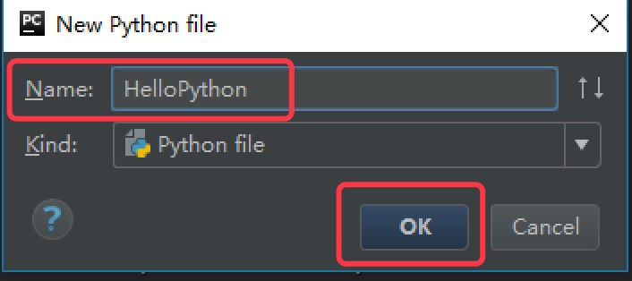

  * 输入以下代码，并右击空白处，选择`Run`运行，表示打印一个字符串"Hello World!"。

    ```py
    print("Hello World!")
    ```

    

  * 运行成功后，Pycharm Console窗口将显示我们的输出结果。

    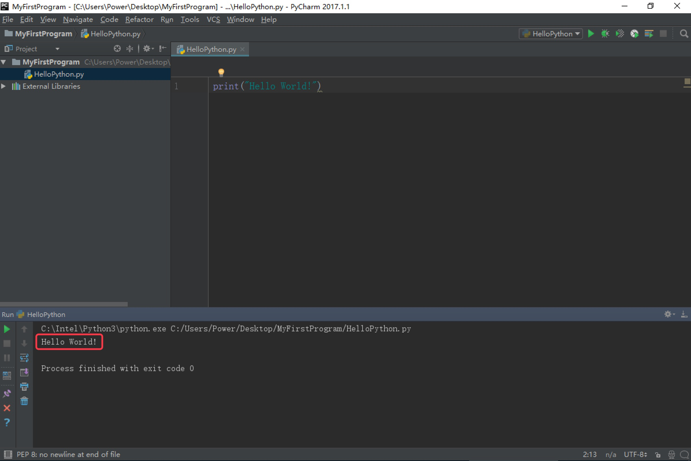

  ​

## 3.练一练

要求：编写一个程序，输出`itcast.cn`


## 4.Pycharm的配置

* 主题
* 字体


# 三.python的注释

## 1.注释是什么?

注释，是对书籍或文章的语汇、内容、背景、引文作介绍、评议的文字。

我们这里可以理解为对一段代码或者某一行代码做介绍.


##2.Python中注释的分类:

* 单行注释
* 多行注释

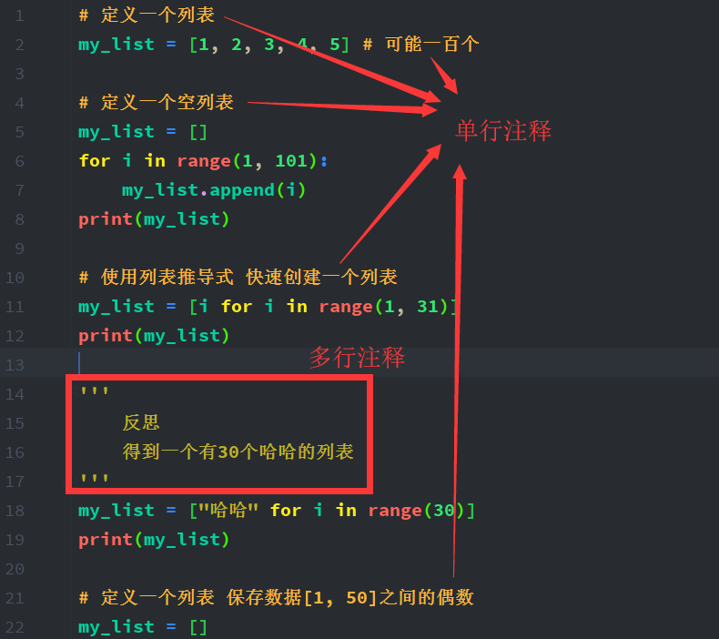


## 3.注释的写法:

* 单行注释:

  以#开头，#右边的所有东西当做说明，而不是真正要执行的程序，起辅助说明作用

  例如:

  ```python
  # 我是注释，可以在里写一些功能说明之类的哦
  print('hello world')
  ```

  ​

* 多行注释

  以'''开头,以'''结尾,中间包裹的都是注释的内容.   或者以"""开头,以"""结尾.

  多行注释内部可以换行,可以空行,只要是在'''包裹范围内都是注释的区域.

  例如:

  ```python
  '''
      我是多行注释，这里可以写很多很多行的功能说明

      我们来完成下面的功能 ，打印一首诗
      名字叫做：春江花月夜
  '''
  print('╔═╤═╤═╤═╤═╤═╤═╤═╤═╤═╤═╤═╤═╤═╤═╤═╤═╤═╤═╤═╗')
  print('║　│　│　│　│　│　│　│　│　│　│　│　│　│　│　│　│　│　│　│  ║')
  print('║　│　│　│　│　│　│　│　│　│　│　│　│　│　│　│　│　│　│　│　║')
  print('║　│春│滟│江│空│江│江│人│不│白│谁│可│玉│此│鸿│昨│江│斜│不│　║')
  print('║　│江│滟│流│里│天│畔│生│知│云│家│怜│户│时│雁│夜│水│月│知│　║')
  print('║　│潮│随│宛│流│一│何│代│江│一│今│楼│帘│相│长│闲│流│沉│乘│　║')
  print('║　│水│波│转│霜│色│人│代│月│片│夜│上│中│望│飞│潭│春│沉│月│　║')
  print('║　│连│千│绕│不│无│初│无│待│去│扁│月│卷│不│光│梦│去│藏│几│　║')
  print('║春│海│万│芳│觉│纤│见│穷│何│悠│舟│徘│不│相│不│落│欲│海│人│　║')
  print('║江│平│里│甸│飞│尘│月│已│人│悠│子│徊│去│闻│度│花│尽│雾│归│　║')
  print('║花│，│，│，│，│，│，│，│，│，│，│，│，│，│，│，│，│，│，│　║')
  print('║月│海│何│月│汀│皎│江│江│但│青│何│应│捣│愿│鱼│可│江│碣│落│　║')
  print('║夜│上│处│照│上│皎│月│月│见│枫│处│照│衣│逐│龙│怜│潭│石│月│　║')
  print('║　│明│春│花│白│空│何│年│长│浦│相│离│砧│月│潜│春│落│潇│摇│　║')
  print('║　│月│江│林│沙│中│年│年│江│上│思│人│上│华│跃│半│月│湘│情│　║')
  print('║　│共│无│皆│看│孤│初│望│送│不│明│妆│拂│流│水│不│复│无│满│　║')
  print('║　│潮│月│似│不│月│照│相│流│胜│月│镜│还│照│成│还│西│限│江│　║')
  print('║　│生│明│霰│见│轮│人│似│水│愁│楼│台│来│君│文│家│斜│路│树│　║')
  print('║　│。│。│。│。│。│？│。│。│。│？│。│。│。│。│。│。│。│。│　║')
  print('║　│　│　│　│　│　│　│　│　│　│　│　│　│　│　│　│　│　│　│　║')
  print('║　│　│　│　│　│　│　│　│　│　│　│　│　│　│　│　│　│　│　│　║')
  print('╚═╧═╧═╧═╧═╧═╧═╧═╧═╧═╧═╧═╧═╧═╧═╧═╧═╧═╧═╧═╝')
  ```
  ​

  ​

  ##4.注释的作用:

  - 能够大大增强程序的可读性
  - 能够使用注释进行代码测试
  - 能够帮助我们快速理解别人写的代码与逻辑

  ​

  ##5.总结

  ####python中,注释有两种:


* 单行注释:

  * 只能注释一行
  * '# ' 号后面的内容都会被注释掉
  * 快捷键:  ctrl + /     取消的快捷键:   ctrl  +  /
  * 注释内容是什么都可以,随意写

* 多行注释: 

  * 可以同时注释多行    (用单行注释也可以实现)

  * 多行注释写法:    ''' 注释内容'''    或者   """注释内容"""

  * 多行注释没有快捷键

    ​


# 补充: python程序中的中文支持:

- python3.x解析器中，是默认支持中文的，但是在python2.x解析器中就需要一定的额外设置才可以

- 如果需要在python2.x的解析器中使用中文,需要在每个.py文件的最前端写上如下代码: 

  ```python
  # coding=utf-8
  ```

  否则会报错.

- 另外,python官方建议最好的书写形式为:

  ```python
  # -*- coding:utf-8 -*-
  ```

  当然,这两种都是可行的.作用一样.


# 四.变量

## 1.变量的定义:

python中,在程序运行时,可以随着程序的运行更改的量成为变量.

简单理解: 变量就是用来临时存储数据的容器.

可以认为好比是 逛超市 买面条 使用购物车 装面条

变量 -> 购物车

 数据 -> 面条

## 2.变量的使用:

```python
# 第一次输入一个10
num1 = 10
# 第二次输入一个20
num2 = 20
# 后来输出结果为30
ret = num1 + num2
# 输出结果
print(ret)


# 定义一个特殊值
# 开发方便
pi = 3.1415926234567823245678
```

## 3.使用变量的好处:

* 提高人效,定义一处,多处使用
* 提高开发效率
* 敏捷开发
* 测试自动化


# 五.变量的类型

## 1.生活中关于"类型"的例子

> 不同类型的容器: 


> **由上图我们可知: 不同类型的容器,大小是不同的,用途也是不同的,容器的特点也是不同的. **

那么,由此我们可以联想到 : 程序中的容器类型是否也有所不同呢?   答案是肯定的.

## 2.Python中的变量类型:

程序中,为了更充分的利用内存空间以及更有效率的管理内存，变量是有不同的类型的，如下所示:


```python
# 需要掌握的变量类型:
# int	(有符号整形)
# float	(浮点数)
# bool	(布尔)
# str	(字符串) 	全写: string
```

```python
# str(字符串)类型定义的形式:
name = "这里是字符串的内容"

# int(有符号整数)类型定义的形式:
age = 10 

# float(浮点数)类型定义的形式:
height = 100.00

# bool(布尔)类型定义的形式:
is_man = True
```

## 3.python自动管理数据类型:

- 在python中，只要定义了一个变量，而且它有数据，那么它的类型就已经确定了，不需要咱们开发者主动的去说明它的类型，系统会自动辨别

## 4.获取Python中变量的数据类型

* 我们可以使用  type(变量的名字)  来查看变量的类型

  ```python
  # 例如:
  is_man = True
  print(type(is_man))
  # 得到的结果为:
  # <class 'bool'>
  ```

## 5.总结:

python中有变量类型,但是我们写代码的时候不需要关心,因为python在后面帮助我们管理各个数据类型,但是我们需要知道Python中的数据类型.面试常问.

需要掌握的变量类型:

​	int		(有符号整形)

​	float	(浮点数)

​	bool	(布尔)

​	str		(字符串) 

另外还需要我们大家掌握一个查看变量类型的方法: type(变量的名字)


# 六.标识符

## 1.什么是标识符

> 能够标识某一事物的符号.

例如,生活中的标识符: 

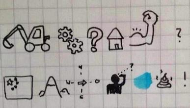

在程序中的标识符有以下特点:

* 开发人员自定义的一些符号和名称
* 经常用于程序中一些需要自定义的地方,例如变量名,  函数名,  类名,  模块名等

##2.标识符的规则

* 标识符由字母、下划线和数字组成，且数字不能开头

  * 由上面的规则,我们可以思考:  下面的示例中,那些是正确的标识符:

    ```
       fromNo12
       from#12
       my_Boolean
       my-Boolean
       Obj2
       2ndObj
       myInt
       test1
       Mike2jack
       My_tExt
       _test
       test!32
       haha(da)tt
       int
       jack_rose
       jack&rose
       GUI
       gui
       G.U.I
    ```


* python中的标识符是区分大小写的

  

## 3.命名规则

* 见名知意

* 驼峰命名法

  * 小驼峰式命名法（lower camel case）： 

    第一个单词以小写字母开始；第二个单词的首字母大写，例如：myName、aDog

  * 大驼峰式命名法（upper camel case）： 

    每一个单字的首字母都采用大写字母，例如：FirstName、LastName

  * 还有一种命名法是用下划线“_”来连接所有的单词:

    比如: send_func

## 4.关键字

* 什么是关键字

  python定义的一些具有特殊功能的标识符，就是所谓的关键字

  关键字，是python已经使用的了，所以不允许开发者自己定义和关键字相同的名字的标识符

* 查看关键字:

  ```python
  # 导入模块
  import keyword

  # 查看这个python版本的关键字
  print(keyword.kwlist)
  ```

  > python3.x中的关键字有: 
  >
  > ```
  > and     as      assert     break    class      continue   def     del
  > elif    else    except     exec     finally    for        from    global
  > if      in      import     is       lambda     not        or      pass
  > print   raise   return     try      while      with       yield
  > ```

  > 也可以在Python Shell通过以下命令进行查看当前系统中python的关键字

  ```
  >>> import keyword
  >>> keyword.kwlist
  ```

## 5.总结 :

​	关键字,变量名以及我们后面会学习到的函数名,类名等都是标识符.

​	标识符有一个大的规则: 由字母、下划线和数字组成，且数字不能开头

​	标识符**区分大小写 **

​	标识符有不同的命名形式: 驼峰    下划线  

​	标识符有些默认的潜规则:   最好看到名字知道意义.(见名知意)

​	关键字是Python官方规定的一些标识符,我们尽量不要定义成相同的名字,免得出错.


# 七.输出

## 1.什么是输出?

> 科学技术上指能量、信号等从某种机构或装置发出。

## 2.我们常见的输出:


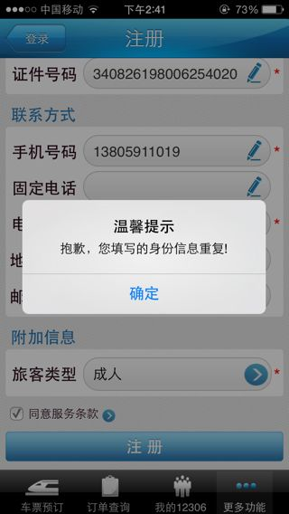

​	


## 3.程序中的输出形式:

```python
# 打印  -----> 其实就是在控制台进行输出
print('hello world')
print('萨瓦迪卡---泰语，你好的意思')
```


## 4.格式化输出

### 1)什么是格式化输出?

> 格式化输出是指通过print()等函数向指定的地方（比如屏幕）输出指定格式的内容

例如: 

​	我们想输出   int类型的数字

​	或者是:          float类型的数字

​	再或者:          bool类型的变量

​	......

例如: 有如下代码:

```python
pirnt("我今年10岁")
pirnt("我今年11岁")
pirnt("我今年12岁")
```

我们能否对其进行格式化输出?

### 2)格式化输出方法

```python
age = 10
print("我今年%d岁" % age)

age += 1
print("我今年%d岁" % age)

age += 1
print("我今年%d岁" % age)
```

### 3)认识格式化输出

> 在程序中，看到了`%`这样的操作符，**这就是Python中格式化输出**。

```python
age = 18
name = "xiaohua"
print("我的姓名是%s, 年龄是%d" % (name, age))
```

## 5.常用的格式符号

> 下面是完整的，它可以与％符号使用列表:

| 格式符号 |       转换       |
| ---- | :------------: |
| %c   |       字符       |
| %s   |      字符串       |
| %d   |    有符号十进制整数    |
| %u   |    无符号十进制整数    |
| %o   |     八进制整数      |
| %x   | 十六进制整数（小写字母0x） |
| %X   | 十六进制整数（大写字母0X） |
| %f   |      浮点数       |
| %e   |  科学计数法（小写'e'）  |
| %E   |  科学计数法（大写“E”）  |
| %g   |   ％f和％e 的简写    |
| %G   |    ％f和％E的简写    |

```python
# 业务需求: 定义四个变量
# 名字: 小明 年龄:30 身高: 190.2 是否为男性
# 全部使用命名规则为下划线
# 名字
my_name = "小明"
# 年龄
my_age = 30
# 身高
my_height = 190.2
# 是否为男性
is_man = True

# 依次输出内容:
# 我的名字: 小明
# %s 等于 str --> string
print("我的名字:%s" % my_name)
# 我的年龄:30岁
# %d 等于digit
print("我的年龄:%d岁" % my_age)
# 我的身高
# 默认情况下 Python使用%f 会保留小数点后面六位
# %f 等于 float
print("我的身高:%.2f" % my_height)

# 如果想打印一个bool值,如果想显示True,或者False 要使用%s
# 如果想显示1 或者 0 要使用%d
# 是否是男性 False
print("是否是男性:%s" % is_man)
# 是否是男性:0
print("是否是男性:%d" % is_man)
```


## 6. 换行输出

> 在输出的时候，如果有`\n`那么，此时`\n`后的内容会在另外一行显示

```python
    # 会在一行显示
    print("1234567890-------") 

    # 一行显示1234567890，另外一行显示-------
    print("1234567890\n-------") 
```

```python
# \n叫做换行符 就是键盘中的回车键
print("你好\n世界")

# 如果我就是想显示你好\n世界
print("你好\\n世界")

# 如果定义一个变量 成活率
num = 98
# 成活率达到了98%
# 单纯一个\  需要书写两个\\
# 单纯一个%  需要书写两个%%
print("成活率达到了%d%%" % num)
```


##7.练习题:

> 用格式化输出完成下面的内容: 
>
> ```
>     ==========我的名片==========
>     姓名: itheima   
>     QQ:xxxxxxx
>     手机号:185xxxxxx
>     公司地址:北京市xxxx
>     ===========================
> ```

解答:

```python
# 定义变量
# 名字
myName = "itheima"
# QQ
myQQ = "2390239"
# tel
myTel = 239203239
# 地址
myAddress = "北京市修正校区"
print("===========我的名片==============")
print("姓名:%s" % myName)
print("QQ: %s" % myQQ)
print("手机号:%d" % myTel)
print("地址:%s" % myAddress)
print("================================")

```


# 八.输入

## 1.什么是输入

> 科学技术上指向某种机构或装置发出能量、信号等。


## 2.常见的输入设备

> 键盘， 鼠标， 摄像头， 扫描仪， 光笔，手写输入板，游戏杆， 语音输入装置等都属于输入设备


## 3.不同版本的输入

### python2.x 版本中的输入方法:

#### 		1)    raw_input()方法

#### 		2)    input()方法

### python3.x 版本的输入方法:

### 	1)  input()方法


 ```python
# python2.x 和 python3.x 输入的区别:
# python2.x :
#          1. raw_input()
#          2. input()

# python3.x :
#          input()

# python2.x(raw_input) python3.x(input) :
# 无论你输入的是什么类型的值,输出的都是字符串类型

# python2.x(input):
# 你输入的是什么类型的值,输出的就是什么类型的


num1 = input("请在这里输入内容:")
print(num1)
print(type(num1))
 ```

## 4.我们主要学习python3.x 中的输入

```python
# 主要学习python3.x的输入

# python3.x程序的输入使用的input
# input得到的结果是字符串类型
my_name = input("请输入您的名字")
# 输入年龄
my_age = input("请输入您的年龄")

print(type(my_age))  # <class 'str'>

# 小明 22
# 如果想通过打印完成多个变量的输出 格式:
#                                   print(变量名1,变量名2,变量名3...)
print(my_name,my_age)
# 姓名: 小明 年龄: 22岁
print("姓名:% 年龄:%s岁" %(my_name,my_age))
```


# 九.运算符

## 1. 算术运算符

| 运算符  | 描述   | 实例                                       |
| ---- | ---- | ---------------------------------------- |
| +    | 加    | 两个对象相加 a + b 输出结果 30                     |
| -    | 减    | 得到负数或是一个数减去另一个数 a - b 输出结果 -10           |
| *    | 乘    | 两个数相乘或是返回一个被重复若干次的字符串 a * b 输出结果 200     |
| /    | 除    | b / a 输出结果 2                             |
| //   | 取整除  | 返回商的整数部分 9//2 输出结果 4 , 9.0//2.0 输出结果 4.0 |
| %    | 取余   | 返回除法的余数 b % a 输出结果 0                     |
| **   | 指数   | a**b 为10的20次方， 输出结果 100000000000000000000 |

> 注意：混合运算时，优先级顺序为： `**` 高于 `*` `/` `%` `//` 高于 `+` `-` ，为了避免歧义，建议使用 `()` 来处理运算符优先级。
>
> 并且，不同类型的数字在进行混合运算时，整数将会转换成浮点数进行运算。

```python
# +	加	两个对象相加 a + b 输出结果 30
# -	减	得到负数或是一个数减去另一个数 a - b 输出结果 -10
# *	乘	两个数相乘或是返回一个被重复若干次的字符串 a * b 输出结果 200
# /	除	b / a 输出结果 2

# 请输入第一个数字a:
a = int(input("请输入第一个数字a:"))
b = int(input("请输入第二个数字b:"))

# 加法
ret1 = a + b
print("加法运算结果:%d" % ret1)

# 减法
ret2 = a - b
print("减法结果:%d" % ret2)

# 乘法
ret3 = a * b
print("乘法结果:%d" % ret3)


# 除法
ret4 = a / b
print("除法结果:%d" % ret4)

# //	取整除	返回商的整数部分 9//2 输出结果 4 , 9.0//2.0 输出结果 4.0
# %	取余	返回除法的余数 b % a 输出结果 0
# **	指数	a**b 为10的20次方， 输出结果 10 0000 0000 0000 0000 000
num1 = 10
num2 = 2

# 取整除
ret5 = num1 // num2
print(ret5)
# 取余
ret6 = num1 % num2
print(ret6)
# 指数
ret7 = 10**2
print(ret7)
print(type(ret7))
```


## 2. 赋值运算符

### 1) 赋值运算符:

| 运算符  | 描述    | 实例                                       |
| ---- | ----- | ---------------------------------------- |
| =    | 赋值运算符 | 把 = 号右边的结果 赋给 左边的变量，如 num = 1 + 2 * 3，结果num的值为7 |


### 2) 复合赋值运算符

| 运算符 | 描述             | 实例                         |
| ------ | ---------------- | ---------------------------- |
| +=     | 加法赋值运算符   | c += a 等效于 c = c + a      |
| -=     | 减法赋值运算符   | c -= a 等效于 c = c - a      |
| *=     | 乘法赋值运算符   | c *= a 等效于 c = c * a      |
| /=     | 除法赋值运算符   | c /= a 等效于 c = c / a      |
| %=     | 取模赋值运算符   | c %= a 等效于 c = c % a      |
| **=    | 幂赋值运算符     | c ******= a 等效于 c = c **a |
| //=    | 取整除赋值运算符 | c //= a 等效于 c = c // a    |

```python
# +=	加法赋值运算符	c += a 等效于 c = c + a
# -=	减法赋值运算符	c -= a 等效于 c = c - a
# *=	乘法赋值运算符	c *= a 等效于 c = c * a
# /=	除法赋值运算符	c /= a 等效于 c = c / a
# %=	取模赋值运算符	c %= a 等效于 c = c % a
# **=	幂赋值运算符	c **= a 等效于 c = c ** a
# //=	取整除赋值运算符	c //= a 等效于 c = c // a

a = 10
b = 20

c = a + b

# 加法 常用的
ret1 = a + b
print(ret1)

a = a + b
a += b
# 得到30结果
b += a
print(b)

# 减法
a -= b
b -= a
print(b)

# 乘法
a *= b
print(a)

# 除法
a /= b
print(a)
```


# 十.常用的数据类型转换

| 函数                     | 说明                            |
| ---------------------- | ----------------------------- |
| int(x [,base ])        | 将x转换为一个整数                     |
| float(x )              | 将x转换为一个浮点数                    |
| complex(real [,imag ]) | 创建一个复数，real为实部，imag为虚部        |
| str(x )                | 将对象 x 转换为字符串                  |
| repr(x )               | 将对象 x 转换为表达式字符串               |
| eval(str )             | 用来计算在字符串中的有效Python表达式,并返回一个对象 |
| tuple(s )              | 将序列 s 转换为一个元组                 |
| list(s )               | 将序列 s 转换为一个列表                 |
| chr(x )                | 将一个整数转换为一个Unicode字符           |
| ord(x )                | 将一个字符转换为它的ASCII整数值            |
| hex(x )                | 将一个整数转换为一个十六进制字符串             |
| oct(x )                | 将一个整数转换为一个八进制字符串              |
| bin(x )                | 将一个整数转换为一个二进制字符串              |

```python
# python 面向对象语言
# python 中万事万物皆对象
# 将x转换为一个整数
# 定义一个字符串
my_str = "1234"
my_num = int(my_str)
print(type(my_num))
print(my_num)

# 将x转换为一个浮点数
my_str1 = "3.14"
my_f = float(my_str1)
print(type(my_f))
print(my_f)

# 将对象 x 转换为字符串
num = 123
my_str2 = str(num)
print(type(my_str2))
print(my_str2)


# 了解
# 用来计算在字符串中的"有效"Python表达式
# 并返回一个对象
my_str3 = "2323"
ret = eval(my_str3)
print(type(ret))
print(ret)

# eval往往会配合input使用
result = eval(input("请输入一个数字:"))
print(type(result))
print(result)
```


# 十一.顺序结构

> 顺序语句指的是代码按照从上往下的流程,依次顺序执行.

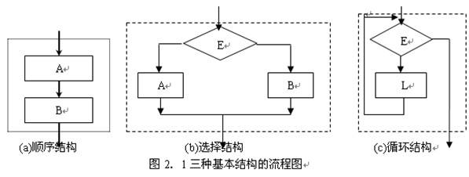


# 十二.分支结构(选择结构)

## 1.这章学习知识点归纳

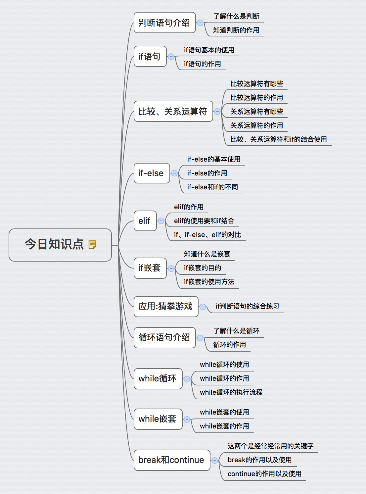

## 2.判断语句介绍

> 什么是判断语句: 

​	用于判断事物对与错的语句.

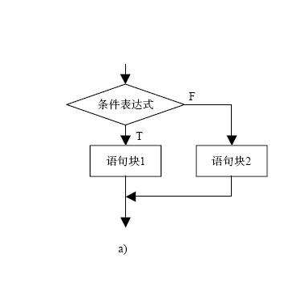


### 1)生活中的判断场景


## 3.if判断语句

###   1)  if判断语句介绍

- if语句是用来进行判断的，其使用格式如下：

```
    if 要判断的条件:
        条件成立时，要做的事情
        ...
```

- demo1:（demo的中文意思：演示、案例）

```python
    age = 30

    print("------if判断开始------")

    if age >= 18:
        print("我已经成年了")

    print("------if判断结束------")
```

- 运行结果:

```
    ------if判断开始------
    我已经成年了
    ------if判断结束------
```

- demo2:

```python
    age = 16

    print("------if判断开始------")

    if age >= 18:
        print("我已经成年了")

    print("------if判断结束------")
```

- 运行结果:

```
    ------if判断开始------
    ------if判断结束------
```

* 利用if语句,模拟一下进入火车站和进入网吧的场景

```python
# 模拟进入火车站
# 如果没有危险品 可以进入火车站
# if 要判断的条件(是真(True)是假(False))
#     条件成立(真(True))时,要做的事情01
#     条件成立(真(True))时,要做的事情02
#     条件成立(真(True))时,要做的事情03
#     条件成立(真(True))时,要做的事情04
#     条件成立(真(True))时,要做的事情05
#     ....

# 定义一个变量flag 如果flag为True,代表没有危险品,可以进入
flag = True
# 判断
if flag:
    print("您没有携带危险品,可以进入火车站!!!")
print("测试")


# 模拟进入网吧  请输入您的年龄 如果您的年龄大于18岁 才可以进入
my_age = int(input("请输入您的年龄:"))

# 进行年龄判断
if my_age >= 18:
    print("您已经成年了,随便玩吧")
print("测试")
```

### 2)练一练:

要求：从键盘获取自己的年龄，判断是否大于或者等于18岁，如果满足就输出“哥，已成年，网吧可以去了”

1. 使用input从键盘中获取数据，并且存入到一个变量中
2. 使用if语句，来判断 age>=18是否成立

### 3)  总结:

- 如果某些条件满足，才能做某件事情；条件不满足时，则不能做，这就是所谓的判断。
- 不仅生活中有，在软件开发中"判断"功能也经常会用到
- 能够看得出if判断语句的作用：就是当满足一定条件时才会执行代码块语句，否则就不执行代码块语句
- 代码的缩进为一个tab键，或者4个空格


## 4.比较(即关系)运算符

### 1)比较(即关系)运算符

> python中的比较运算符如下表

| 运算符  | 描述                               | 示例                        |
| ---- | -------------------------------- | ------------------------- |
| ==   | 检查两个操作数的值是否相等，如果是则条件变为真。         | 如a=3,b=3，则（a == b) 为 True |
| !=   | 检查两个操作数的值是否相等，如果值不相等，则条件变为真。     | 如a=1,b=3，则(a != b) 为 True |
| >    | 检查左操作数的值是否大于右操作数的值，如果是，则条件成立。    | 如a=7,b=3，则(a > b) 为 True  |
| <    | 检查左操作数的值是否小于右操作数的值，如果是，则条件成立。    | 如a=7,b=3，则(a < b) 为 False |
| >=   | 检查左操作数的值是否大于或等于右操作数的值，如果是，则条件成立。 | 如a=3,b=3，则(a >= b) 为 True |
| <=   | 检查左操作数的值是否小于或等于右操作数的值，如果是，则条件成立。 | 如a=3,b=3，则(a <= b) 为 True |

```python
# 定义一个变量a
a = 11
# 定义一个变量b
b = 11
# ==
# 判断a是否等于b
if a == b:
    print("a等于b")

# !=
if a != b:
    print("a不等于b")

# >
if a > b:
    print("a 大于 b")

# <
if a < b:
    print("a 小于 b")

# >=
if a >= b:
    print("a大于等于b")

# <=
if a <= b:
    print("a小于等于b")
```

### 2)  总结

* 比较运算符最主要的就是对比两个数的大小关系
* 两个数字的关系,无外乎:  大小    相等   不相等


## 5.逻辑运算符

### 1)  逻辑运算符

| 运算符  | 逻辑表达式   | 描述                                       | 实例                                   |
| ---- | ------- | ---------------------------------------- | ------------------------------------ |
| and  | x and y | 布尔"与"：如果 x 为 False，x and y 返回 False，否则它返回 y 的值。 | True and False， 返回 False。            |
| or   | x or y  | 布尔"或"：如果 x 是 True，它返回 True，否则它返回 y 的值。   | False or True， 返回 True。              |
| not  | not x   | 布尔"非"：如果 x 为 True，返回 False 。如果 x 为 False，它返回 True。 | not True 返回 False, not False 返回 True |

```python	
# 定义一个变量 记录名字
my_name = "mngr"
# 定义一个变量 记录密码
my_passwd = "12345"

# 使用and 且 或者 与
# 同真为真(True) 一假为假(False)
# 进行判断
if my_name == "mngr" and my_passwd == "12345":
    print("用户名和密码正确登录成功")

# or 或
# 定义一个变量 记录名字
# my_name = "mngr1"
# 定义一个变量 记录密码
my_passwd = "12345"

# 全假为假 一真则真
if my_name != "mngr" or my_passwd != "12345":
    print("您输入的用户名或者密码错误!!!")

print("测试")

# not 非 (取反)
# 非真则假 非假则真
is_man = False
print(is_man)
if not is_man:
    print("是女性")
```

###  2)   总结: 

* and :    (同真为真, 一假为假)

  ​	     **True**           and     **True** 		 ==> 	   **True**     

  ​            `False`    and     **True**  		 ==> 	  `False`    

  ​	       **True**           and    `False`	         ==>    `False` 

  ​	           `False`    and    `False`	         ==> 	  `False`


* or :       (全假为假, 一真则真)

  ​	      **True**               or               **True**               ===>        **True** 

  ​	          `False`        or                **True**               ===>        **True** 

  ​	           **True**               or             `False`         ===>        **True** 

  ​	             `False`       or             `False`          ===>      `False`

* not:   (非,   取反)

  ​		 not       **True**           ===>        `False`

  ​		 not      `False`     ===>          **True**


## 6.   if-else

> 还是一上网吧为例, 我们之前一直在讨论满足条件可以进入网吧的情况,但是没有考虑到不满足的情况, 如果又要考虑不满足的情况该如何写呢?  

答：使用 if-else

### <1>  if-else的使用格式

```
    if 条件:
        满足条件时要做的事情1
        满足条件时要做的事情2
        满足条件时要做的事情3
        ...(省略)...
    else:
        不满足条件时要做的事情1
        不满足条件时要做的事情2
        不满足条件时要做的事情3
        ...(省略)...
```

demo1:

```python
    chePiao = 1 # 用1代表有车票，0代表没有车票
    if chePiao == 1:
        print("有车票，可以上火车")
        print("终于可以见到Ta了，美滋滋~~~")
    else:
        print("没有车票，不能上车")
        print("亲爱的，那就下次见了"）
```

> 结果1：有车票的情况

```
    有车票，可以上火车
    终于可以见到Ta了，美滋滋~~~
```

> 结果2：没有车票的情况

```
    没有车票，不能上车
    亲爱的，那就下次见了
```


```python
# 判断是否好好学习:
# 如果好好学习  则月薪过万
# 如果没有好好学  回家种地(嫁人)

# 定义一个变量 bool 如果为True 就是好好学
flag = True
if flag:
    print('不忘初心,方得始终')
else:
    print('一事无成,回家啃老')
print('测试')   


# 模拟进入网吧  如果您的年龄大于等于18,允许进入
age = 19
if age >= 18:
    print('也没啥玩的,看看就走')
else:
    print('老实上课')
```

### <2>  练一练

要求：从键盘输入身高，如果身高没有超过150cm，则进动物园不用买票，否则需要买票。


### <3> 总结: 

```python
    if 条件(True):
      	进入if语句中要执行的内容
      	....
    else: #条件为False的情况下进入 
        进入else语句要执行的内容
        ....
```

* if语句的内容和else语句的内容为互斥的
* 进入if语句 ,  就不可能进入else
* 适用于  要么.......  要么...... 的句式


## 7.   elif

> 如果有这样一种情况：当xxx1满足时做事情1；当xxx1不满足、xxx2满足时做事情2；当xxx2不满足、xxx3满足时做事情3，那该怎么实现呢？

答:   elif    

### 1)    elif的功能

elif的使用格式如下:

```
    if xxx1:
        事情1
    elif xxx2:
        事情2
    elif xxx3:
        事情3
```

说明:

- 当xxx1满足时，执行事情1，然后整个if结束
- 当xxx1不满足时，那么判断xxx2，如果xxx2满足，则执行事情2，然后整个if结束
- 当xxx1不满足时，xxx2也不满足，如果xxx3满足，则执行事情3，然后整个if结束


### 2)   注意点

可以和else一起使用

```
   if 性别为男性:
       输出男性的体重
       ...
   elif 性别为女性:
       输出女性的体重
       ...
   else:
       第三种性别的体重
       ...
```

说明:

- 当 “性别为男性” 满足时，执行 “输出男性的体重”的相关代码
- 当 “性别为男性” 不满足时，如果 “性别为女性”满足，则执行 “输出女性的体重”的相关代码
- 当 “性别为男性” 不满足，“性别为女性”也不满足，那么久默认执行else后面的代码，即 “第三种性别的体重”相关代码

```python
# elif = else if  但是python中不支持else if的写法

# 定义一个变量 记录分数
score = 89
# 通过判断分数 得到一个描述(优良中差)
# s >= 90 优
# s >= 80 and s <= 90 良
# s >= 70 and s <= 80 中
# s >= 60 and s <= 70 差
# 其他情况 为  不及格

if score >= 90:
    print("优")
elif score >= 80 and score <= 90:
    print("良")
elif score >= 70 and score <= 80:
    print("中")
elif score >= 60 and score <= 70:
    print("差")
else:
    print("不及格")

# 代码优化:
if score >= 90:
    print("优")
elif score >= 80:
    print("良")
elif score >= 70:
    print("中")
elif score >= 60:
    print("差")   13528497467
else:
    print("不及格")
```

### 总结: 

* elif必须和if一起使用，否则出错

* else 一般用在最后，即所有条件都不满足时使用

* elif是else   if的缩写,但是python里面不支持else  if的写法, 故 只能用elif.

* if 语句  和 elif 语句  以及  else语句都是互斥的,只有一种情况能够执行,不可能同时执行多个

* 整体句式就是   要么......    要么........   要么......  要么.....   .........

  ​

  ​

##  8.  if嵌套

坐火车或者地铁的时候,我们经常会遇到这样的情况:  先进行安检如果安检通过才会判断是否有车票，或者是先检查是否有车票之后才会进行安检，即实际的情况某个判断是再另外一个判断成立的基础上进行的，这样的情况该怎样解决呢？

答：if嵌套

### 1)  if嵌套的格式

```
if 条件1:
    满足条件1 做的事情1
    满足条件1 做的事情2
    ...
    if 条件2:
        满足条件2 做的事情1
        满足条件2 做的事情2
        ...
```

说明

- 外层的if判断，也可以是if-else
- 内层的if判断，也可以是if-else
- 根据实际开发的情况，进行选择


### 2)  if嵌套的应用

demo：

```python
chePiao = 1     # 用1代表有车票，0代表没有车票
daoLength = 9     # 刀子的长度，单位为cm

if chePiao == 1:
    print("有车票，可以进站")
    if daoLength < 10:
        print("通过安检")
        print("终于可以见到Ta了，美滋滋~~~")
    else:
        print("没有通过安检")
        print("刀子的长度超过规定，等待警察处理...")
else:
    print("没有车票，不能进站")
    print("亲爱的，那就下次见了")
```

结果1：chePiao = 1;      daoLenght = 9

```
    有车票，可以进站
    通过安检
    终于可以见到Ta了，美滋滋~~~
```

结果2：chePiao = 1;     daoLenght = 20

```
    有车票，可以进站
    没有通过安检
    刀子的长度超过规定，等待警察处理...
```

结果3：chePiao = 0;     daoLenght = 9

```
    没有车票，不能进站
    亲爱的，那就下次见了
```

结果4：chePiao = 0;     daoLenght = 20

```
    没有车票，不能进站
    亲爱的，那就下次见了
```

```python
# 进入传智就行了吗?

# 定义一个变量 记录是否进入传智学习
is_join_itcast = True
# 定义一个变量 记录是否敲代码
isKnock = False

if is_join_itcast:
    print('进入传智学习')
    if isKnock:
        print('键盘敲烂,月薪过万...')
    else:
        print('浑浑噩噩,度日如年...')
else:
    print('继续辛苦打工...')
```

### 3)  练习: 

情节描述：乘坐公交车外出.

要求：输入公交卡当前的余额，只要超过2元，就可以上公交车；如果车上有空座位，可以坐下。


## 9.  应用:猜拳游戏

### 1)  游戏介绍

需求:  我们能够输入代表石头剪刀布的标号,

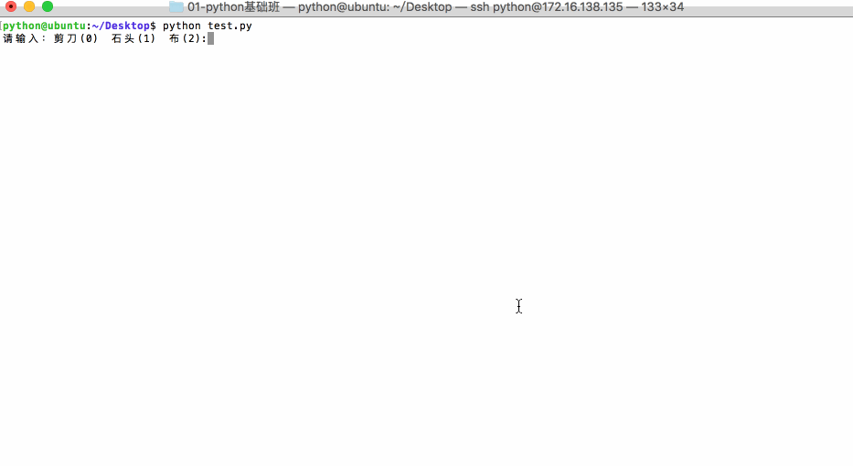

### 2)  参考代码:

```python
# 导入模块 ---> 随机模块
import random
# 定义一个变量 记录用户(玩家)的输入(拳法):
player = int(input("请输入:剪刀(0) 石头(1) 布(2):"))
# 定义一个变量 记录电脑的输入
computer = random.randint(0,2)

# 以玩家为第一视角:
# 假如说玩家胜利(剪刀 = 布 或者 石头 = 剪刀 或者 布 = 石头)
# 假如说玩家和电脑平局(玩家输入的 == 电脑输入的)
# 假如说玩家失败(除了胜利和平局 其他都是失败)

# 玩家胜利
if (player == 0 and computer == 2) or (player == 1 and computer == 0) or (player == 2 and computer == 1):
    print("玩家胜利")
elif (player == computer):
    print("玩家和电脑达成平局")
else:
    print("玩家失败")
```


# 十三.循环结构

## 1.  什么是循环结构?

循环结构是指在程序中需要反复执行某个功能而设置的一种程序结构。它由循环体中的条件，判断继续执行某个功能还是退出循环。

.jpg)


## 2.  循环结构举例:

跟媳妇承认错误，说一万遍"媳妇儿，我错了"

```
    print("媳妇儿，我错了")
    print("媳妇儿，我错了")
    print("媳妇儿，我错了")
    ...(还有9997遍)...
```

使用循环语句一句话搞定:

```python
    # 定义一个变量, 记录循环次数
    i = 0
    while i < 10000:
        print("媳妇儿，我错了")
        # 对变量进行累加操作
        i += 1
```


##  3.  while循环    

### 1 )  使用格式: 

    定义一个变量,记录循环次数
    while 判断条件(变量的判断)
    
        如果判断条件满足执行的代码
        
        对变量的值进行修改,之后再次进行循环

### 2)  while循环举例

demo

```python
    i = 0
    while i < 5:
        print("当前是第%d次执行循环" % (i + 1))
        print("i=%d" % i)
        i+=1
```

结果:

```
    当前是第1次执行循环
    i=0
    当前是第2次执行循环
    i=1
    当前是第3次执行循环
    i=2
    当前是第4次执行循环
    i=3
    当前是第5次执行循环
    i=4
```


```python
# while循环

# 写while循环的时候一定要注意:
# 定义一个变量, 切记要对变量进行加1 或者 减1 (等等)操作
# 否则会形成死循环

index = 0
while index < 5:
    print('旋风冲锋---龙卷风')
    index += 1

print('冲锋完成')

# 死循环:  条件一直满足, 程序停不下来的循环
index = 0
while index < 5:
    print('冲吧,四驱车')
print('冲冲冲,啥时候冲锋完毕?')
```


### 2) 总结

* while和if的用法基本类似，区别在于：

  ​	if 条件成立，则执行一次； 

  ​	while 条件成立，则重复执行，直到条件不成立为止。

* 一般情况下，需要**多次重复**执行的代码，都可以用循环的方式来完成

* 循环不是必须要使用的，但是为了提高代码的重复使用率，所以有经验的开发者都会采用循环

* 不可以停止的循环(判断条件一直满足) 称之为死循环,   在开发中我们应该尽量防止死循环,因为死循环太浪费设备性能.

* while循环内部的代码需要进行缩进,python对缩进要求非常严格.


## 4.while循环应用

### 1)   计算1~100的累加和（包含1和100）

参考代码如下:

```python
i = 1
sum = 0
while i <= 100:
    sum = sum + i
    i += 1

print("1~100的累积和为:%d" % sum)
```


### 2)  计算1~100之间偶数的累加和（包含1和100）

参考代码如下:

```python
i = 1
sum = 0
while i <= 100:
    if i % 2 == 0:
        sum = sum + i
    i+=1

print("1~100的累积和为:%d" % sum)


# 计算1~100之间偶数的乘积（包含1和100）
num = 1
# 定义一个变量记录
result = 1
while num <= 100:

    # 判断是否是偶数
    if num % 2 == 0:
        result *= num
    num += 1

print("1~100的偶数的乘积:%d" % result)
```


## 5.  while循环嵌套

- 前面学习过if的嵌套了，想一想if嵌套是什么样子的？
- 类似if的嵌套，while嵌套就是：while里面还有while


### 1)  while嵌套的格式

```
    while 条件1:

        条件1满足时，做的事情1
        条件1满足时，做的事情2
        条件1满足时，做的事情3
        ...(省略)...

        while 条件2:
            条件2满足时，做的事情1
            条件2满足时，做的事情2
            条件2满足时，做的事情3
            ...(省略)...
```

#### 说明:

* while循环嵌套:  外面的循环执行一次,内部循环会执行n次,一直到执行完毕,再执行外部的循环.

* 无论是内部的while循环还是外部的while循坏都需要定义一个变量,  作为循环次数的记录

* 内部while和外部while都需要对变量进行累加操作.  以保证循环次数的减少

  ​

  ​


### 2)  while嵌套应用一

要求：打印如下图形：

```
    *
    * *
    * * *
    * * * *
    * * * * *
```


解答: 

```python
# 考虑第一件事情 分析如何打印出5行
# 定义一个变量
row = 1
# # 循环
while row <= 5:
    print("*")
    row += 1

# 考虑第二件事情 打印出每一行的每一列的*
# 在默认的情况下 使用print 默认打印完成后 会有一个换行
# print("哈哈") 完整的格式 print("哈哈", end="\n")
# 定义一个变量
col = 1
while col <= 5:
    print("*", end="")
    col += 1

# 定义一个变量 记录行数
row = 1
while row <= 5:
    # 定义一个变量 记录列数
    col = 1
    while col <= row:
        print("*", end="")
        col += 1
    # 换行
    print()
    row += 1
```


#### 提升训练:   

试着实现如下功能:

```
*
* *
* * *
* * * *
* * * * *
* * * *
* * *
* *
*
```

实现:

```python
row = 1
while row <= 9:
    if row <= 5:
        col = 1
        while col <= row:
            print("*", end="")
            col += 1
        print("")
    else:
        col = 9
        while col >= row:
            print("*", end="")
            col -= 1
        print("")
    row += 1
```


### 3)  while嵌套应用二：九九乘法表

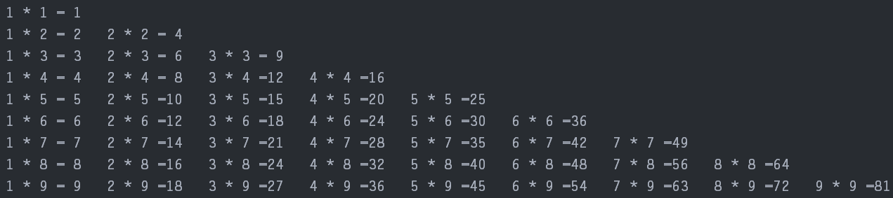


参考代码：

```python
# 定义一个变量 记录行数
x = 1
while x <= 9:
    print(x)
    x += 1

# 定义一个数 记录列数
y = 1
while y <= 9:
    print(y,end="")
    y += 1

print()
# 定义一个变量 记录行数
# %2d 显示两位 如果只有一位 使用空格站位 默认为右对齐
# 如果左对齐 就是 %-2d
x = 1
while x <= 9:
    y = 1
    while y <= x:
        print("%d * %d =%2d\t" %(y,x,y*x),end="")
        y += 1
    # 换行
    print()
    x += 1
```


## 6. for循环

像while循环一样，for可以完成循环的功能。

在Python中 for循环可以遍历任何序列的项目，如一个列表或者一个字符串等。


### 1) for循环的格式

```
for 临时变量 in 列表或者字符串等可迭代对象:
    循环满足条件时执行的代码
```

> demo1:

```python
name = 'itheima'

for x in name:
    print(x)
```

运行结果如下:

```
i
t
h
e
i
m
a
```

> demo2:

```python
>>> name = "hello"
>>> for x in name:
        print(x)
        if x == 'l':
            print("Hello world!")
```

运行结果如下:

```
h
e
l
Hello world!
l
Hello world!
o
```

> demo3:

```PYTHON
for i in range(5):
    print(i)

'''
效果等同于 while 循环的：

i = 0
while i < 5:
    print(i)
    i += 1
    
'''
```

####补充知识:

python中 range() 函数用法: 

```
函数语法
range(start, stop[, step])
```

参数说明：

- start: 计数从 start 开始。默认是从 0 开始。例如range（5）等价于range（0， 5）;
- stop: 计数到 stop 结束，但不包括 stop。例如：range（0， 5） 是[0, 1, 2, 3, 4]没有5
- step：步长，默认为1。例如：range（0， 5） 等价于 range(0, 5, 1)


运行结果如下:

```
0
1
2
3
4
```


```python
# 字符串:
# 有序的字符序列

# 自定义一个字符串
name = "itheima"
# for循环
for c in name:
	print(c)

# 范围标识 range()
# range(1,5) 数学中[1,5)
for i in range(0,5):
    print("第%d次" % (i + 1))
    print("代码敲了一遍又一遍...")

# range(0) ----> [0,x)
for i in range(5):
    print("%d" % (i + 1))
```


### 2)  总结

* for循环后面可以跟随一个else.构成for......else句式:    (也可以不要else,具体看需求)

  ```
  for 临时变量 in 列表或者字符串等可迭代对象:
      将会执行的语句
  else:
      for循环执行完毕之后,会执行调用的语句
  ```


* for循环中的"临时变量" 的作用范围仅仅是当前for循环体中缩进的区域

* for循环判断的条件依然是 for 后面的条件是否为True,为True则可以进入,否则不允许进入循环体.

* for循环中的in是个关键字 写for循环的时候不能够去掉in 

  ​


##  7.break和continue

### 1) break

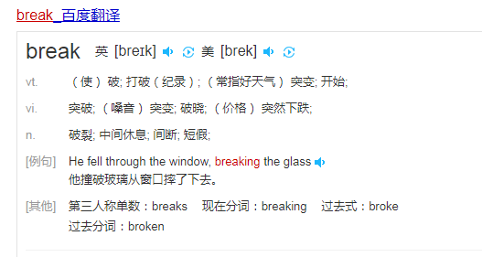

break有打破的意思, 即break能够打破循环(这里的循环指的是一切循环(例如: for循环和while循环))


####for循环中调用break

- 普通的循环示例如下：

```python
name = 'itheima'

for x in name:
    print('----')
    print(x)
else:
    print("==for循环过程中，如果没有执行break退出，则执行本语句==")
```

运行结果:

```
----
i
----
t
----
h
----
e
----
i
----
m
----
a
==for循环过程中，如果没有break则执行==
```

- 带有break的循环示例如下:

```python
name = 'itheima'

for x in name:
    print('----')
    if x == 'e': 
        break
    print(x)
else:
    print("==for循环过程中，如果没有执行break退出，则执行本语句==")
```

运行结果:

```
----
i
----
t
----
h
----
```


#### while循环中调用break

- 普通的循环示例如下：

```python
i = 0

while i<5:
    i = i+1
    print('----')
    print(i)
else:
    print("==while循环过程中，如果没有执行break退出，则执行本语句==")
```

运行结果:

```
----
1
----
2
----
3
----
4
----
5
==while循环过程中，如果没有break则执行==
```

- 带有break的循环示例如下:

```python
i = 0

while i<5:
    i = i+1
    print('----')
    if i==3:
        break
    print(i)
else:
    print("==while循环过程中，如果没有执行break退出，则执行本语句==")
```

运行结果:

```
----
1
----
2
----
```


```python
# while循环和break配合使用
# 如果执行了break  while循环将终止 break后面的也就不再执行 (直接跳出循环)
# 定义一个变量
i = 0
while i < 5:
    print(i)
    # 如果i == 2 执行下break
    if i == 2:
        break
    i += 1

print("测试")


# for循环和break配合使用
# 如果执行了break  for循环将终止 break后面的也就不再执行 (直接跳出循环)
for i in range(5):
    print(i)
    if i == 2:
        break

print("测试")
```

### **小结:**

- break的作用：立刻结束break所在的循环


### 2) continue

####  for循环中使用continue

- 带有continue的循环示例如下:

```python
name = 'itheima'

for x in name:
    print('----')
    if x == 'e': 
        continue
    print(x)
else:
    print("==while循环过程中，如果没有break则执行==")
```

运行结果:

```
----
i
----
t
----
h
----
----
i
----
m
----
a
==while循环过程中，如果没有break则执行==
```


#### while循环中使用continue

- 带有continue的循环示例如下:

```python
i = 0

while i<5:
    i = i+1
    print('----')
    if i==3:
        continue
    print(i)
```

运行结果:

```
----
1
----
2
----
----
4
----
5
```


```python
# while循环和continue配合使用
# 如果在while中 如果执行了continue 将提前结束本次循环 continue后面的代码将不再执行
# 定义一个变量
i = 0
while i < 5:
    i += 1
    if i == 2:
        continue
        print("测试")
    print(i)


# for循环和continue 配合使用
# 如果在for中 如果执行了continue 将提前结束本次循环 continue后面的代码将不再执行
for i in range(5):
    if i == 2:
        continue
    print(i)
```

### **小结:**

- continue的作用：用来结束**本次**循环，紧接着执行下一次的循环

### 总结:

- break/continue只能用在循环中，除此以外不能单独使用

- break/continue在嵌套循环中，只对最近的一层循环起作用

- continue是结束单次循环,break是结束整个循环,注意对比记忆

  ​


