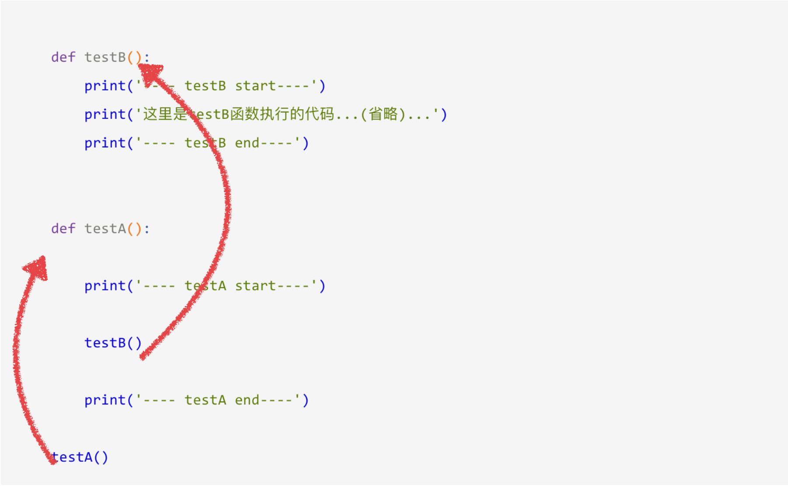

# 一.  字符串的介绍

## 1.  什么是字符串

它是编程语言中表示文本的数据类型。

> 字符串就是 有序的字符序列.


## 2.  python中字符串的定义方式

Python中字符串的定义: 

*  双引号定义形式                   例如:   a  =   "hello   python"
*  单引号定义形式                    例如:   b  =   '你好中国,   你好Python'

两者定义出来的字符串是完全相同的.  使用哪种形式都可以


## 3. 字符串输出

在程序中我们可以通过print()方法输出字符串: 

demo: 

```python
    name = 'itheima'
    position = '讲师'
    address = '北京市'

    print('--------------------------------------------------')
    print("姓名：%s" % name)
    print("职位：%s" % position)
    print("公司地址：%s" % address)
    print('--------------------------------------------------')
```

结果:

```
    --------------------------------------------------
    姓名： itheima
    职位： 讲师
    公司地址： 北京市
    --------------------------------------------------
```


## 4.  字符串输入

之前在学习input的时候，通过它能够完成从键盘获取数据，然后保存到指定的变量中；

注意：input获取的数据，都以字符串的方式进行保存，即使输入的是数字，那么也是以字符串方式保存

demo:

```python
    userName = input('请输入用户名:')
    print("用户名为：%s" % userName)

    password = input('请输入密码:')
    print("密码为：%s" % password)
```

结果：（根据输入的不同结果也不同）

```
    请输入用户名:itheima
    用户名为： itheima
    请输入密码:haohaoxuexitiantianxiangshang
    密码为： haohaoxuexitiantianxiangshang
```


```python
# 字符串其实就是一个有序的字符序列(顺序是不可以改变的)

# python中定义一个字符串 无论是单引号 还是双引号 是等价的
# 定义一个字符串
name = "hello"
name1 = 'hello'

# 判断
if name == name1:
    print("name 和 name1是等价的")

# 定义一个空的字符串 '' 或者 "" 或者 str()
# 空字符串 代表的就是 字符串中没有一个字符
# python中提供了一个len函数(内置函数) 计算字符串中的字符个数
name = str()
print(type(name))
# # 定义一个变脸 记录字符个数
l = len(name)
print("name的字符个数:%d" % l)

#哈喽
#你好
#世界
print("哈喽\n你好\n世界")

# 保留其文本格式 可以使用三引号(" 或者 ')

my_str ='''哈喽你好你好你好你好你好你好
你好世界世界世界世界
世界世界世界世界世界
哈喽你好你好你好你好你好你好
你好世界世界世界世界
世界世界世界世界世界'''
print(len(my_str))

```


## 总结:

* 字符串就是一组字符的有序集合.

* 字符串有三种表现形式:  用 ' ' 或者 " "  包裹  ,   也可以用多行注释的形式表示  变量名 =  '''字符串内容'''  或者  变量名 =  """字符串内容"""

* 想要查看字符串的类型, 我们可以调用方法  type(字符串变量名)  

* 想要获取字符串的长度,  我们可以使用 len(字符串变量名) 来查看

* 字符串可以是我们平时说的话语,也可以是某一类描述, 任何内内容都可以充当字符串内容.

  ​


## 5.  字符串的下标和切片

所谓`“下标”`，就是编号.  

就好比超市中的存储柜的编号，通过这个编号就能找到相应的存储空间

或者是 可以理解为 座位号:  动车或者高铁的座位号,教师的座位号等等.


### 1)  下标: 

* 字符串中"下标"的使用

  > 如果有字符串:`name = 'abcdef'`，在内存中的实际存储情况如下:

  

**小结:**

* 无论是字符串中还是别的(我们即将会讲到的列表和元组),  下标索引值都是从0开始的
* 下标索引值类似于当前位置的坐标.  或者是编号
* 以字符串举例:   这里所标识的是**字符串**中每个**字符**的位置编号
* 下标索引值可以从左侧算起  也可以从右侧算起:
  * 从左侧算起:   0,  1,  2,  3,  4.......
  * 从右侧算起:   -1,  -2,  -3,  -4.......


如果想取出部分字符，那么可以通过`下标`的方法，（注意python中下标从 0 开始）

```python
   name = 'abcdef'

   print(name[0])
   print(name[1])
   print(name[2])
```

运行结果:

```
a
b
c
```


```python
# 有序的"字符"序列

# 定义一个字符串
my_str = "hello"
# 得到e这个字符 并打印(程序中 是从0开始) -> 下标索引
# 传入一个正常的下标索引
# 如果从左到右开始索引是0, 1, 2, 3....
ret = my_str[4]
print(ret)

# 从右到左开始的索引是-1, -2, -3, ....
ret = my_str[-4]
print(ret)

# 一定要保证字符串的下标索引是存在的

# 利用while 打印出字符串中的每个字符
# 定义一个变量
index = 0
# 定义一个变量记录字符串的长度
l = len(my_str)

while index < l:
    ret = my_str[index]
    print(ret)
    index += 1
```


### 2)  切片

切片是指截取某一对象其中一部分的操作。  (**字符串、列表、元组**都支持切片操作。)

** **切片的语法**：[起始:结束:步长]**

**注意：选取的区间从"起始"位开始，到"结束"位的前一位结束（不包含结束位本身)，步长表示选取间隔。**

* 切片是半开半闭区间    即:   包含起始位置, 但是不包含结束位置   数学表示:  [起始: 结束)
* 切片的语法非常重要, 希望大家能够重视


我们以字符串为例讲解。

如果取出一部分，则可以在中括号[]中，使用:

```python
     name = 'abcdef'

     print(name[0:3]) # 取 下标0~2 的字符
```

运行结果:

    abc

```python
     name = 'abcdef'

     print(name[0:5]) # 取 下标为0~4 的字符
```

运行结果:

    abcde

```python
     name = 'abcdef'

     print(name[3:5]) # 取 下标为3、4 的字符
```

运行结果:

    de

```python
     name = 'abcdef'

     print(name[2:]) # 取 下标为2开始到最后的字符
```

运行结果:


    cdef

```python
     name = 'abcdef'

     print(name[1:-1]) # 取 下标为1开始 到 最后第2个  之间的字符
```

运行结果:

    bcde

尝试用我们所学习的内容,完成下面的切片: 

```
a = "abcdef"

 'abc'

 'ace'

 'bd'

 'fdb' 

 'fd'
```


结果:

```python
# 切片的语法：[起始:结束(开区间):步长]
# 字符串是不可变的(复制版的)
a = "abcdef"
# 'abc' -> a[0:3]   或者  a[:3]
# 如果是从头部开始 0可以省略
ret1 = a[:3]
print(ret1)
# 验证字符串是不可变的
print(a)
# 'ace'  a[:5:2]  或者  a[0:5:2] 或者 a[::2]
#默认步长是1
ret2 = a[::2]
print(ret2)

# 'bd'
ret3 = a[1:4:2]
print(ret3)

# 'fdb'
ret4 = a[::-2]
print(ret4)

# 'fd'
ret5 = a[-1:-4:-2]
print(ret5)
```


### 3)  总结: 

* 我们可以从字符串中获取相对应的字符,使用切片的方式,也可以使用下标索引的方式.
* 使用切片的方式获取比较方便,可以根据公司的需求来进行
* 字符串无论怎样切片,修改的都不是原来的字符串,而是复制出来的新字符串
* 字符串切片需要遵循的格式:  字符串名称 [ 起始 : 结束 : 步长 ]   其中结束的索引值不包含
* 字符串切片可以从左侧也可以从右侧进行.   相对应的索引值不同:
  * 从左侧进行:  索引值为:0,  1,  2,  3,  4.....
  * 从右侧进行:  索引值为:-1, -2, -3, -4..... 
* 从右侧进行切片的时候,需要注意步长也为**负数**,否则仍然是从左侧进行.


## 6.字符串的常见操作

### 1)  find

> Python find() 方法检测字符串中是否包含子字符串 str ，如果指定 beg（开始） 和 end（结束） 范围，则检查是否包含在指定范围内，如果包含子字符串返回开始的索引值，否则返回-1。

```
find()方法语法：
	str.find(str, beg=0, end=len(string))
```

> sub:    要查找的**小字符串**
>
> start:   beg -- 开始索引，默认为0。
>
> end:    end -- 结束索引，默认为字符串的长度。


例如: 

```python
mystr = "hello world itcast and itcastcpp"
ret1 = mystr.find("itcast")
print(ret1)
```

结果:

```
12
```


### 2)  index

> Python index() 方法检测字符串中是否包含子字符串 str ，如果指定 beg（开始） 和 end（结束） 范围，则检查是否包含在指定范围内，该方法与 python find()方法一样，只不过如果str不在 string中会报一个异常。

```
index()方法语法：
	str.index(str, beg=0, end=len(string))
```

> str :    指定检索的字符串
>
> beg:   开始索引，默认为0。
>
> end:   结束索引，默认为字符串的长度。


例如: 

```python
mystr = 'hello world itcast and itcastcpp'
ret1 = mystr.find('itcast', 0, 10)
print(ret1)

ret2 = mystr.index('itcast', 0, 10)
print(ret2)
```

结果: 

```
-1


Traceback (most recent call last):
	File "<stdin>", line 5, in <module>
ValueError: substring not found
```


### 3)  count

> Python count() 方法用于统计字符串里某个字符出现的次数。可选参数为在字符串搜索的开始与结束位置

```
count()方法语法：
	str.count(sub, start= 0,end=len(string))
```

> sub:   搜索的子字符串
>
> start:  字符串开始搜索的位置。默认为第一个字符,第一个字符索引值为0。
>
> end:   字符串中结束搜索的位置。字符中第一个字符的索引为 0。默认为字符串的最后一个位置。


例如: 

```
mystr = 'hello world itcast and itcastcpp'
mystr.count("itcast")
```

结果: 

```
2
```


### 4)  replace

> Python replace() 方法把字符串中的 old（旧字符串） 替换成 new(新字符串)，如果指定第三个参数max，则替换不超过 max 次。

```
replace()方法语法：
	str.replace(old, new[, max])
```

> old --   将被替换的子字符串。
>
> new -- 新字符串，用于替换old子字符串。
>
> max -- 可选字符串, 替换不超过 max 次

```python
name = 'hello world ha ha'
name.replace("ha", "Ha")
name.replace("ha", "Ha", 1)
```

结果: 

```
'hello world Ha Ha'
'hello world Ha ha'
```


###5)  split

> Python split()通过指定分隔符对字符串进行切片，如果参数num 有指定值，则仅分隔 num 个子字符串

```
split()方法语法：
	str.split(str="", num=string.count(str)).
```

> str --    分隔符，默认为所有的空字符，包括空格、换行(\n)、制表符(\t)等。
>
> num -- 分割次数。

```python
name = 'hello world ha ha'
name.split(" ")
name.split(" ", 2)
```

结果: 

```
['hello', 'world', 'ha', 'ha']
['hello', 'world', 'ha ha']
```


###  6)  capitalize

> Python capitalize()将字符串的第一个字母变成大写,其他字母变小写。对于 8 位字节编码需要根据本地环境。

```
capitalize()方法语法：
	str.capitalize()
```

例如: 

```python
mystr = 'hello world itcast And Itcastcpp'
mystr.capitalize()
```

结果: 

````
'Hello world itcast and itcastcpp'
````


### 7)  title

> Python title() 方法返回"标题化"的字符串,就是说所有单词都是以大写开始，其余字母均为小写(见 istitle())。

```
title()方法语法：
	str.title();
```

例如: 

```python
 a = "hello itcast and itcastCPP"
 a.title()
```

结果: 

```
'Hello Itcast And Itcastcpp'
```


### 8)  startswith

> Python startswith() 方法用于检查字符串是否是以指定子字符串开头，如果是则返回 True，否则返回 False。如果参数 beg 和 end 指定值，则在指定范围内检查。

```
startswith()方法语法：
	str.startswith(str, beg=0,end=len(string));
```

> str -- 检测的字符串。
>
> strbeg -- 可选参数用于设置字符串检测的起始位置。
>
> strend -- 可选参数用于设置字符串检测的结束位置。

例如: 

```python
mystr = 'hello world itcast and itcastcpp'
mystr.startswith("hello")
mystr.startswith("Hello")
```

结果:

```
True
False
```


### 9) endswith

> Python endswith() 方法用于判断字符串是否以指定后缀结尾，如果以指定后缀结尾返回True，否则返回False。可选参数"start"与"end"为检索字符串的开始与结束位置。

```
endswith()方法语法：
	str.endswith(suffix[, start[, end]])
```

> suffix -- 该参数可以是一个字符串或者是一个元素。
>
> start -- 字符串中的开始位置。
>
> end -- 字符中结束位置。

例如: 

```python
mystr = 'hello world itcast and itcastcpp'
mystr.endswith('cpp')
mystr.endswith('app')
```

结果:

```
True
False
```


### 10)   lower

> Python lower() 方法转换字符串中所有大写字符为小写。

```
lower()方法语法：
	str.lower()
```

例如: 

```python
mystr = 'HELLO World itcast and itcastcpp'
mystr.lower()
```

结果:

```
'hello world itcast and itcastcpp'
```


### 11) upper

> Python upper() 方法将字符串中的小写字母转为大写字母。

```
upper()方法语法：
	str.upper()
```

例如:

```python
mystr = 'HELLO World itcast and itcastcpp'
mystr.upper()
```

结果:

```
'HELLO WORLD ITCAST AND ITCASTCPP'

```


### 12)  ljust

> Python ljust() 方法返回一个原字符串左对齐,并使用空格填充至指定长度的新字符串。如果指定的长度小于原字符串的长度则返回原字符串。

```
ljust()方法语法：
	str.ljust(width[, fillchar])
```

> width -- 指定字符串长度。
>
> fillchar -- 填充字符，默认为空格。

例如:

```python
mystr = 'hello'
ret = mystr.ljust(10,'*')
print(ret)
```

结果: 

```
'hello*****'
```


### 13)   rjust

> Python rjust() 返回一个原字符串右对齐,并使用空格填充至长度 width 的新字符串。如果指定的长度小于字符串的长度则返回原字符串。

```
rjust()方法语法：
	str.rjust(width[, fillchar])
```

> * width -- 指定填充指定字符后中字符串的总长度.
>
> - fillchar -- 填充的字符，默认为空格

例如: 

```python
mystr = "hello"
ret = mystr.rjust(10, '_')
print(ret)
```

结果: 

```
*****hello
```


### 14)  center

> Python center() 返回一个原字符串居中,并使用空格填充至长度 width 的新字符串。默认填充字符为空格。

```
center()方法语法：
	str.center(width[, fillchar])
```

> - width -- 字符串的总宽度。
> - fillchar -- 填充字符。

例如: 

```python
mystr = 'hello world itcast and itcastcpp'
ret = mystr.center(50,'@')
print(ret)
```

结果:

```
@@@@@@@@@hello world itcast and itcastcpp@@@@@@@@@
```


###15)   lstrip

> Python lstrip() 方法用于截掉字符串左边的空格或指定字符。

```
lstrip()方法语法：
	str.lstrip([chars])
```

> - chars --指定截取的字符。

例如:

```python
str = "     this is string example....wow!!!     ";
print str.lstrip();
str = "88888888this is string example....wow!!!8888888";
print str.lstrip('8');
```

结果: 

```
this is string example....wow!!!
this is string example....wow!!!8888888
```


### 16)  rstrip

> Python rstrip() 删除 string 字符串末尾的指定字符（默认为空格）.

```
rstrip()方法语法：
	str.rstrip([chars])
```

> - chars -- 指定删除的字符（默认为空格）

例如: 

```python
mystr = '    hello    '
ret = mystr.rstrip()
print(ret)
```

结果:

```
'    hello'
```


###17)  strip

> Python strip() 方法用于移除字符串头尾指定的字符（默认为空格）。

```
strip()方法语法：
	str.strip([chars]);
```

> - chars -- 移除字符串头尾指定的字符。

例如:

```python
a = '\n\t itcast \t\n'
ret = a.strip()
print(ret)
```

结果:

```
'itcast'
```


###18)  rfind

> Python rfind() 返回字符串最后一次出现的位置(从右向左查询)，如果没有匹配项则返回-1。

```
rfind()方法语法：
	str.rfind(str, beg=0 end=len(string))
```

> - str -- 查找的字符串
> - beg -- 开始查找的位置，默认为 0
> - end -- 结束查找位置，默认为字符串的长度。

例如:

```python
mystr = 'hello world itcast and itcastcpp'
ret = mystr.rfind("itcast")
print(ret)
```

结果:

```
23
```


###19)   rindex

> Python rindex() 返回子字符串 str 在字符串中最后出现的位置，如果没有匹配的字符串会报异常，你可以指定可选参数[beg:end]设置查找的区间。

```
rindex()方法语法：
	str.rindex(str, beg=0 end=len(string))
```

> - str -- 查找的字符串
> - beg -- 开始查找的位置，默认为0
> - end -- 结束查找位置，默认为字符串的长度。

例如:

```python
mystr = 'hello world itcast and itcastcpp'
ret1 = mystr.rindex('it')
print(ret1)
ret2 = mystr.rindex("IT")
print(ret2)
```

结果:

```
23

Traceback (most recent call last):
	File "<stdin>", line 4, in <module>
ValueError: substring not found
```


###20)   partition

> partition() 方法用来根据指定的分隔符将字符串进行分割。
>
> 如果字符串包含指定的分隔符，则返回一个3元的元组，第一个为分隔符左边的子串，第二个为分隔符本身，第三个为分隔符右边的子串。
>
> partition() 方法是在2.5版中新增的。

```
partition()方法语法：
	str.partition(str)
```

> str : 指定的分隔符。

例如:

```python
mystr = 'hello world itcast and itcastcpp'
ret = mystr.partition('itcast')
print(ret)
```

结果:

````
('hello world', 'itcast', ' and itcastcpp')
````


###21)   rpartition

> 类似于 partition()函数,不过是从右边开始.

```
rpartition()方法语法：
	str.partition(str)
```

> str : 指定的分隔符。

例如:

```python
mystr = 'hello world itcast and itcastcpp'
ret1 = mystr.partition('itcast')
print(ret1)
ret2 = mystr.rpartition('itcast')
print(ret2)
```

结果:

```
('hello world', 'itcast', ' and itcastcpp')
('hello world itcast and ', 'itcast', 'cpp')
```


### 22)   splitlines

> Python splitlines() 按照行('\r', '\r\n', \n')分隔，返回一个包含各行作为元素的列表，如果参数 keepends 为 False，不包含换行符，如果为 True，则保留换行符。

```
splitlines()方法语法：
	str.splitlines([keepends])
```

> - keepends -- 在输出结果里是否去掉换行符('\r', '\r\n', \n')，默认为 False，不包含换行符，如果为 True，则保留换行符。

例如:

```python
mystr = 'hello\nworld'
print(mystr)
ret = mystr.splitlines()
print(ret)
```

结果:

```
hello
world
['hello', 'world']
```


###23)   isalpha

> Python isalpha() 方法检测字符串是否只由字母组成。

```
isalpha()方法语法：
	str.isalpha()
```

例如:

```python
mystr = 'abc'
ret1 = mystr.isalpha()
print(ret1)

mystr1 = '123'
ret2 = mystr.isalpha()
print(ret2)

mystr2 = 'abc 123'
ret3 = mystr2.isalpha()
print(ret3)
```

结果:

```
True
False
False
```


###24)    isdigit

> Python isdigit() 方法检测字符串是否只由数字组成。

```
isdigit()方法语法：
	str.isdigit()
```

例如:

```python
mystr1 = 'abc'
ret1 = mystr1.isdigit()
print(ret1)

mystr2 = '123'
ret2 = mystr2.isdigit()
print(ret2)

mystr3 = 'abc123'
ret3 = mystr3.isdigit()
print(ret3)
```

结果:

```
False
True
False
```


###25)  isalnum

> Python isalnum() 方法检测字符串是否由字母和数字组成。

```
isalnum()方法语法：
	str.isalnum()
```

例如:

```python
mystr1 = '123'
ret1 = mystr.isalnum()
print(ret1)

mystr2 = 'abc'
ret2 = mystr2.isalnum()
print(ret2)

mystr3 = 'abc123'
ret3 = mystr3.isalnum()
print(ret3)

mystr4 = 'abc 123'
ret4 = mystr4.isalnum()
print(ret4)
```

结果:

```
True
True
True
False
```


###26)  isspace

> Python isspace() 方法检测字符串是否只由空格组成。

```
isspace()方法语法：
	str.isspace()
```

例如:

```python
mystr = 'abc123'
ret = mystr.isspace()
print(ret)

mystr1 = ''
ret1 = mystr1.isspace()
print(ret1)

mystr2 = '  '
ret2 = mystr2.isspace()
print(ret2)

mystr3 = '    '
ret3 = mystr3.isspace()
print(ret3)
```

结果:

```
False
False
True
True
```


###27)   join

> Python join() 方法用于将序列中的元素以指定的字符连接生成一个新的字符串

```
join()方法语法：
	str.join(sequence)
```

> - sequence -- 要连接的元素序列。

例如:

```python
str = ' '
li = ['my', 'name', 'is', 'meiZong']
ret = str.join(li)
print(ret)

str1 = '_'
ret1 = str1.join(li)
print(ret1)
```

结果:	

```
'my name is meiZong'
'my_name_is_meiZong'
```


### 思考题: 

- （面试题）给定一个字符串aStr，返回使用空格或者'\t'分割后的倒数第二个子串

  例如: 

  ```
  aStr  =  'haha  nihao  a  \t  heihei   \t  woshi  nide  \t  hao  \n pengyou'
  ```

  应该怎样处理: 

  这样吗?

  ```
  ret = aStr.split(' \n\t')
  print(ret)
  ```

  还是这样:

  ```
  ret1 = aStr.split()
  print(ret1)
  ```

  ​


  

  结果如下: 

  ```
  ['haha  nihao  a  \t  heihei   \t  woshi  nide  \t  hao  \n pengyou']
  ['haha', 'nihao', 'a', 'heihei', 'woshi', 'nide', 'hao', 'pengyou']
  ```

  ​


### 代码:

```python
# 定义一个字符串
a = "abcdef"

# <1>find
#获取对应字符串的下标索引
#如果查询到对应的字符串 会返回一个下标索引
#如果没有查询到 会返回一个-1
ret1 = a.find("cdd")
print(ret1)

# <2>index
# 跟find()方法一样，只不过如果str不在 mystr中会报一个异常.
ret2 = a.index("cdd")
print(ret2)

# <3>count
# 返回 str在start和end之间 在 mystr里面出现的次数
ret3 = a.count("q")
print(ret3)

# <4>replace
# 把 mystr 中的 str1 替换成 str2,如果 count 指定，则替换不超过 count 次.
ret4 = a.replace("a", "w")
print(ret4)
print(a)

# 5>split
# 以 str 为分隔符切片 mystr，如果 maxsplit有指定值，则仅分隔 maxsplit 个子字符串
ret5 = a.split("ad")
print(ret5)

#可以使用count来判断下字符的个数 如果字符的个数大于0 存在index
count = a.count("a")
#如果大于0
if count > 0:
    index = a.index("a")
    print(index)
```

```python
# 定义一个字符串
a = "abcAef"

# <6>capitalize
# 把字符串的第一个字符大写
ret1 = a.capitalize()
print(ret1)
print(a)

# <7>title
# 把字符串的每个单词首字母大写
ret2 = a.title()
print(ret2)

# <8>startswith
# 检查字符串是否是以 hello 开头, 是则返回 True，否则返回 False
ret3 = a.startswith("abca")
print(ret3)

# <9>endswith
# 检查字符串是否以obj结束，如果是返回True,否则返回 False.
ret4 = a.endswith(".MP4")
print(ret4)

# <10>lower
# 转换 mystr 中所有大写字符为小写
ret5 = a.lower()
print(ret5)

# <11>upper
# 转换 mystr 中的小写字母为大写
ret6 = a.upper()
print(ret6)
```

```python
# 定义一个字符串
a = "   2222abcd33333"
# <12>ljust
# 返回一个原字符串左对齐,并使用空格填充至长度 width 的新字符串
ret1 = a.ljust(10, "1")
print(ret1)

# <13>rjust
# 返回一个原字符串右对齐,并使用空格填充至长度 width 的新字符串
ret2 = a.rjust(10, "1")
print(ret2)

# <14>center
# 返回一个原字符串居中,并使用空格填充至长度 width 的新字符串
ret3 = a.center(10, "2")
print(ret3)

# <15>lstrip
# 删除 mystr 左边的空白字符(无论是空格 还是\n 或者是\t)
# \t 就是 键盘上的tab键
print(a)
ret4 = a.lstrip("2")
print(ret4)

# <16>rstrip
# 删除 mystr 字符串末尾的空白字符
ret5 = a.rstrip("3")
print(ret5)

# <17>strip
# 删除mystr字符串两端的空白字符
ret6 = a.strip(" 3")
print(ret6)
```

```python
# 定义一个字符串
a = "acbdf"

# <18>rfind
# 类似于 find()函数，不过是从右边开始查找.
# 从左侧到右侧查找
ret1 = a.find("b")
print(ret1)
ret1 = a.rfind("b")
print(ret1)


# <19>rindex
# 类似于 index()，不过是从右边开始. 异常


# <20>partition 开发中使用
# 把mystr以str分割成三部分,str前，str和str后
ret2 = a.partition("c")
print(type(ret2))
print(ret2)

# <21>rpartition
# 类似于 partition()函数,不过是从右边开始.
ret3 = a.rpartition("c")
print(ret3)

```

```python
# 定义一个字符串
a = "      "

# <22>splitlines
# 按照行分隔，返回一个包含各行作为元素的列表
ret1 = a.splitlines()
print(ret1)


# <23>isalpha
# 如果 mystr 所有字符都是字母 则返回 True,否则返回 False
ret2 = a.isalpha()
print(ret2)


# <24>isdigit
# 如果 mystr 只包含数字则返回 True 否则返回 False.
ret3 = a.isdigit()
print(ret3)

# <25>isalnum
# 如果 mystr 所有字符都是字母或数字则返回 True,否则返回 False
ret4 = a.isalnum()
print(ret4)


# <26>isspace
# 如果 mystr 中只包含空格，则返回 True，否则返回 False.
ret5 = a.isspace()
print(ret5)


# <27>join
# mystr 中每个元素后面插入str,构造出一个新的字符串
# 定义一个变量 记录列表
my_list = ["1", "x", "hello"]

# 最终打印出来一个字符串为 100x00hello
ret6 = "00".join(my_list)
print(ret6)


# __________________________________________
my_str = "    ab cd    "
# # 最终结果为abcd
ret = my_str.replace(" ", "")
print(ret)
ret2 = my_str.split()
print(ret2)
ret3 = "".join(ret2)
print(ret3)
```


```python
# 内置函数help
# 对字符串不了解 不知道他有什么特点 有哪些方法
# 或者对他的方法不熟悉
my_str = "hello"
print(type(my_str))
# 查找
help(str.lower)
# 如果查看一个类的所有方法
# 首先要确定他的类型 -> type(数值) <class "类型">
# help(类型)
# 如果查看这个类型的指定的方法
# help(类型.方法名)
```


###  总结:

* 字符串是 Python 中最常用的数据类型。我们可以使用引号('或")来创建字符串。

* 创建字符串很简单，只要为变量分配一个值即可。例如：var1 = 'Hello World!'

* Python不支持单字符类型，单字符在 Python 中也是作为一个字符串使用。

* Python访问子字符串，可以使用方括号来截取字符串

* 你可以对已存在的字符串进行修改，并赋值给另一个变量,  字符串不支持修改.

* Python 支持格式化字符串的输出 。尽管这样可能会用到非常复杂的表达式，但最基本的用法是将一个值插入到一个有字符串格式符 %s 的字符串中。

* python三引号允许一个字符串跨多行，字符串中可以包含换行符、制表符以及其他特殊字符。

  三引号的语法是一对连续的单引号或者双引号（通常都是成对的用）。


# 二.   列表(list)

## 1.  列表的介绍

> 前面学习的字符串可以用来存储一串信息，那么想一想，怎样存储咱们班所有同学的名字呢？
>
> 定义100个变量，每个变量存放一个学生的姓名可行吗？有更好的办法吗？

答：列表


列表:  和变量一样,列表也是一个容器,该容器能够存储多种数据类型.


###1)    列表的格式

我们可以定义一个列表,如下所示: 

```
namesList = ['xiaoWang', 123, 2323.23,  True, False]

其中: 
	列表名(标识符)  =  [元素一,  元素二,  元素三,  元素四.....]
	
列表中的元素可以是不同类型的数据.
```


### 2)  列表元素的获取

demo:

```python
    namesList = ['xiaoWang','xiaoZhang','xiaoHua']
    print(namesList[0])
    print(namesList[1])
    print(namesList[2])
```

结果：

```
    xiaoWang
    xiaoZhang
    xiaoHua
```


```python
# 定义一个字符串
my_str = "ab"
# 想打印xiaoming -> 字符串的切片 比较麻烦
# 定义一个列表
# 格式: 列表名 = [元素1, 元素2, 元素3,....]

my_list = ["xiaoming", "xiaohong"]
# # -> 支持下标索引
#
my_name = my_list[0]
print(my_name)

# 定义一个列表
my_list = [10, 3.14, "hello", True]
print(my_list)
# 需求 我想打印hello (从左到右) 0, 1, 2,....
# 也可以从右到左 -1, -2, -3, ....
ret1 = my_list[-2]
print(ret1)


# 定义一个空列表
# my_list = []  或者 list()
# my_list = list()
# # 打印下元素个数
l = len(my_list)
print(l)


# 可以定义空的列表 只要是列表那么久应该有[]
# 也支持下标索引获取元素
# 保存数据的元素 可以是任意类型
```

###3)  总结:

* 列表就是一个容器, 它能够容纳各种数据类型, 表现形式是用 [] 包裹
* 列表中的元素可以重复,  并且是有顺序排列的, 我们可以通过下标索引的形式获取.
  * 这里说的下标索引有从左向右的: 0, 1, 2, 3....
  * 和从右往左的: -1, -2, -3, -4.....
* 我们定义空列表可以通过 []  或者是  list()的形式来定义.
* 获取列表中元素长度


## 2.  列表的循环遍历

> 了更有效率的输出列表的每个数据，可以使用循环来完成

### 1)  使用for循环

demo:

```python
namesList = ['xiaoWang', 123, 2323.23,  True, False]
for name in namesList:
    print(name)
```

结果:

```
xiaoWang
123
2323.23
True
False
```


### 2)  使用while循环

demo:

```python
namesList = ['xiaoWang', 123, 2323.23,  True, False]

length = len(namesList)

i = 0

while i<length:
    print(namesList[i])
    i+=1
```

结果:

```
xiaoWang
123
2323.23
True
False
```


```python
# 列表和字符串一样 是有序的
# "abcd"
# ["a", "b", "c", "d"]

# for循环
# 字符串
name = "hello"
for c in name:
    print(c)

# for循环
# 定义一个列表
# my_list = [1, 3, "hello", "哈哈"]
# 遍历列表的元素
for value in my_list:
    print(value)

# while循环
# 定义一个列表
my_list = [1, 3, "hello", "哈哈"]
# 定义一个变量 -> 下标索引
index = 0
# 定义一个变量 保存列表中的元素个数
l = len(my_list)
while index < l:
    # 通过下标索引获取列表中的元素
    value = my_list[index]
    print(value)
    index += 1
```


## 3.  列表的相关操作

> 列表中存放的数据是可以进行修改的，比如"增"、"删"、"改""

### 1)  添加元素

> append, extend, insert


#### append

> append() 方法用于在列表末尾添加新的对象。

```
append()方法语法：
	list.append(obj)
```


demo:

```python
#定义变量A，默认有3个元素
A = ['xiaoWang','xiaoZhang','xiaoHua']

print("-----添加之前，列表A的数据-----")
for tempName in A:
	print(tempName)

#提示、并添加元素
temp = input('请输入要添加的学生姓名:')
A.append(temp)

print("-----添加之后，列表A的数据-----")
for tempName in A:
	print(tempName)
```

结果:


demo:

```python
my_list = [100, 100.00, '100', True]
my_list.append([101, '101'])
print(my_list)
```

结果: 

```
[100, 100.0, '100', True, [101, '101']]
```


#### extend

>  extend() 函数用于在列表末尾一次性追加另一个序列中的多个值（用新列表扩展原来的列表）。

````
extend()方法语法：
	list.extend(seq)

````

demo:

```python
a = [1, 2]
b = [3, 4]
a.append(b)
print(a)

x = [1, 2]
y = [3, 4]
x.extend(y)
print(x)
```

结果: 

```
[1, 2, [3, 4]]
[1, 2, 3, 4]
```


####insert:

>  insert() 函数用于将指定对象插入列表的指定位置。

```
insert()方法语法：
	list.insert(index, obj)
```

> - index -- 对象 obj 需要插入的索引位置。
> - obj -- 要插入列表中的对象。


demo:

```python
a = [1, 2, 3, 4]
a.insert(2, 'x')
print(a)
```

结果: 

```
[1, 2, 'x', 3, 4]
```


```python
# 列表中添加元素的方法有三种:
# append
# extend
# insert

# append:
# 只要是python中的对象,都可以插入
my_list = ['12','23',23, 34]
my_list.append(2323)
print(my_list)
my_list.append(True)
print(my_list)
my_list.append("2323")
print(my_list)
my_list.append("12")
print(my_list)
my_list.append(3.134)
print(my_list)
my_list.append([23,'2323'])
print(my_list)

# extend:
# 添加一个可以遍历的对象
my_list.extend([3,2,4,5,2])
print(my_list)
my_list.extend('hahhaha')
print(my_list)
# my_list.extend(2323)   # extend添加的对象需要可以遍历,这样写是错误的
# print(my_list)    
# my_list.extend(True)   # extend添加的对象需要可以遍历,这样写是错误的
# print(my_list)
my_list.extend("2323")
print(my_list)
my_list.extend("12")
print(my_list)
# my_list.extend(3.134)  # extend添加的对象需要可以遍历,这样写是错误的
# print(my_list)
my_list.extend([23,'2323'])
print(my_list)

# insert 插入到制定位置
my_list1 = []
my_list1.insert(0,'hello')
print(my_list1)

```

####总结:

* append和extend给列表添加元素都是从列表的尾部添加, insert是在指定位置添加.
* append 添加的元素不限制类型,  任意对象都可以使用append加入列表
* extend加入列表的元素有限制:  只有能够遍历的对象才可以, 并且添加到列表的元素是对象遍历之后的每一小部分.
* 目前我们所学的能够遍历的对象只有:  字符串和列表  (后期还会有元组 和 字典)
* 列表加入元素的方式可以根据需求随意选择


### 2)  修改元素

> 修改元素的时候，要通过下标来确定要修改的是哪个元素，然后才能进行修改

demo:

```python
#定义变量A，默认有3个元素
A = ['xiaoWang','xiaoZhang','xiaoHua']

print("-----修改之前，列表A的数据-----")
for tempName in A:
	print(tempName)

#修改元素
A[1] = 'xiaoLu'

print("-----修改之后，列表A的数据-----")
for tempName in A:
	print(tempName)
```

结果: 

```
-----修改之前，列表A的数据-----
xiaoWang
xiaoZhang
xiaoHua
-----修改之后，列表A的数据-----
xiaoWang
xiaoLu
xiaoHua
```


```python
# 定义一个列表
my_list = ['ab',23, 2.23]

# 获取
value = my_list[1]
print(value)

# 把获取的数据进行修改
my_list[1] = "22222"
print(my_list)


my_list[-1] = 223
print(my_list)
```

#### 总结:

* 修改元素只需要遵循如下顺序:  先获取, 后修改
* 在列表中获取元素只需要根据下标索引值拿取. 
* 修改时,  那刚刚拿取的元素重新赋值即可.
* 列表是可变的, 所以里面的元素也是可以修改的.


### 3) 查找元素

>  所谓的查找，就是看看指定的元素是否存在

#### in

#### not   in    

> python中查找的常用方法为：

- in（存在）,如果存在那么结果为true，否则为false
- not in（不存在），如果不存在那么结果为true，否则false


demo:

```python
#待查找的列表
nameList = ['xiaoWang','xiaoZhang','xiaoHua']

#获取用户要查找的名字
findName = input('请输入要查找的姓名:')

#查找是否存在
if findName in nameList:
	print('在列表中找到了相同的名字')
else:
    print('没有找到')
```

结果1：(找到):


结果2：(没有找到):


说明：

> in的方法只要会用了，那么not in也是同样的用法，只不过not in判断的是不存在


#### index   count

```python
a = ['a', 'b', 'c', 'a', 'b']
index = a.index('a', 1, 3) # 注意是左闭右开区间
print(index)


index1 = a.index('a')
print(index1)

index2 = a.count('b')
print(index2)

# index和count结合使用
count = a.count('a')
if count > 0:
    index = a.index('a')
```

结果:

```
Traceback (most recent call last):
  File "<stdin>", line 1, in <module>
ValueError: 'a' is not in list

0

2

0
```


```python
# 查找元素(in, not in, index, count)

# 定义一个列表, 判断老李是否在列表中
str = '老李'
my_list = ['老李', '老张', '小明', 300, 300]
if str in my_list:
    print('存在在列表中')


# 使用not in 判断一个元素不再列表中
if "小红" not in my_list:
    print("小红不再列表中")

# index 通过index 获取某个元素在列表中的下表索引
ret1 = my_list.index(300)
print(ret1)

# count查找某个元素的值在列表中出现的次数
ret2 = my_list.count(300)
print(ret2)

# 查询4000 如果有给出下标索引值 如果没有 什么也不做
# count配合index实现:
count = my_list.count(300)
if count > 0:
    index = my_list.index(300)
    print(index)

# 使用in配合完成
if 300 in my_list:
    index = my_list.index(300)
    print(index)
```

#### 总结: 

* 查找元素一般使用 in  或者 not  in  或者 index    count结合
* in  或者  not in  我们搭配 if 语句来实现
* 如果单独使用 index 有崩溃的风险(index没有查找到元素的情况下,会崩溃) 
* 要想使用index, 需要先判断元素在列表中的count值, 只有元素的个数大于等于1个, 代表列表中有此元素, 才可以用index进行下标值的获取, 这样比较安全, 排除了崩溃的可能.
* 我们这里不可以使用find 或者 rfind ,   因为 find 和 rfind 是字符串常用的方法,我们这里说的是列表.


### 4)  删除元素

> 类比现实生活中，如果某位同学调班了，那么就应该把这个条走后的学生的姓名删除掉；在开发中经常会用到删除这种功能。

列表元素的常用删除方法有：

- del：根据下标进行删除, 也可以删除掉整个列表对象,提前释放内存
- pop：删除最后一个元素,  也可以删除单个指定元素  把删除的元素返回回来
- remove：根据元素的值进行删除  如果要删除的元素值不再列表,会崩溃
- clear: 清空这个列表     把列表中的元素删除干净,但是列表还在

#### del: 

> 使用 del 语句可以从一个列表中依索引而不是值来删除一个元素。可以用 del 语句从列表中删除一个切割，或清空整个列表。

demo:

```python
a = [-1, 1, 66.25, 333, 333, 1234.5]
del a[0]
print(a)

del a[2:4]
print(a)

del a[:]
print(a)

b = [1, 20, 40]
del b
print(b)
```

结果: 

```
[1, 66.25, 333, 333, 1234.5]

[1, 66.25, 1234.5]

[]

Traceback (most recent call last):
  File "day04_01/测试.py", line 13, in <module>
    print(b)
NameError: name 'b' is not defined
```


#### pop

> 从列表的指定位置删除元素，并将其返回。
>
> 如果没有指定索引，a.pop()返回最后一个元素。元素随即从列表中被删除。

demo:

```python
a = [3, 4, 5]
result = a.pop()
print(result)
print(a)

b = [1, 3, 4]
result1 = b.pop(1)
print(result1)
print(b)
```

结果: 

```
5
[3, 4]
3
[1, 4]
```


#### remove

> 删除列表中值为 x 的第一个元素。如果没有这样的元素，就会返回一个错误。

```python
a = [3, 4, 5]
a.remove(4)
print(a)

b = [1, 3, 5]
b.remove(10)
print(b)
```

结果: 

```
[3, 5]

Traceback (most recent call last):
  File "测试.py", line 6, in <module>
    b.remove(10)
ValueError: list.remove(x): x not in list
```


#### clear

> 移除列表中的所有项，等于del a[:]

```python
a = [3, 4, 5]
a.clear()
print(a)
```

结果: 

```
[]

```


```python
# 删除元素 del, pop, remove
# 定义一个列表
my_list = ["小明", 20, "小红", 32]

# del 删除指定的元素(通过下标索引)
# 格式: del 列表名[下标索引]
# del 这个函数 是python内置函数
del my_list[1]
print(my_list)

# del 第二种用法 ----> 了解
# 提前杀死对象 提前释放内存
del my_list

# pop是属于列表的方法
# pop 默认情况下 会从列表的后面开始删除
# .pop() 会有一个返回值 告知删除元素的值
print(my_list.pop())
print(my_list)

# pop(下标索引)
ret1 = my_list.pop(0)
print(ret1)
print(my_list)

# remove通过对象(数值)来删除列表中的元素
my_list.remove('小红')
print(my_list)

# clear 清空列表(列表中的所有元素全部删除)
my_list.clear()
print(my_list)

# clear() 等价于:  my_list = [] 或者 my_list = list()
```


### 5)  排序

#### sort

> 对列表中的元素进行排序。

```
sort()方法语法：
	list.sort([func])
```

> - func -- 可选参数, 如果指定了该参数会使用该参数的方法进行排序。


####  reverse

> 倒排列表中的元素。


demo: 

```python
a = [333, 1234.5, 1, 333, -1, 66.25]
a.sort()
print(a)

a.reverse()
print(a)
```

结果: 

```
[-1, 1, 66.25, 333, 333, 1234.5]
[1234.5, 333, 333, 66.25, 1, -1]
```


```python
# 导入模块
import random

# 定义一个列表  列表中有6个元素
# 六个元素的每个数值范围:  [-10, 50]

# 定义一个空的列表 用来保存数据
my_list = []
# for
for i in range(6):
    value = random.randint(-10,50)
    # 把随机数添加到列表中
    my_list.append(value)

print(my_list)
# 排序, 默认是升序排列
my_list.sort()

print(my_list)

# 降序排列
my_list.sort(reverse=True)
print(my_list)

# python3.x中排序只支持数字类型
```


##4. 列表的嵌套

### 列表嵌套

> 类似while循环的嵌套，列表也是支持嵌套的
>
> 一个列表中的元素又是一个列表，那么这就是列表的嵌套
>
> ```python
> schoolNames = [['北京大学','清华大学'],
>                ['南开大学','天津大学','天津师范大学'],
>                ['山东大学',['新东方','蓝翔']],'中国汉阳大学']
> ```


### 列表嵌套的应用

> 1.  一个学校，有3个办公室，现在有8位老师等待工位的分配，请编写程序，完成随机的分配
> 2.  求一个数字列表的最大值和最小值


答案: 

```python
# 需求: 一个学校 有三个办公室 现在有8为老师等待工位的分配
import  random
# 定义一个学校
school = [[],[],[]]

# 定义一个变量保存8位老师
# 让8位老师站好等待随机分配办公室
my_str = 'ABCDEFGH'
for c in my_str:
    # 产生随机数
    index = random.randint(0,2)
    school[index].append(c)

print(school)
```


```python
# 编程 实现对一个元素全为数字的列表 求最大值, 最小值
# 准备一个列表
my_list = [-1,-2,-3,-63,-20,-203]

# 定义一个变量,记录最大值
max = my_list[0]
for value in my_list:
    if value > max:
        max = value
print(max)

# 定义一个变量 记录最小值
min = my_list[0]
for value in my_list:
    if value < min:
        min = value
print(min)
```


#三. 元组

## 1) 元组的定义

> 元组, 英文为 **tuple**
>
> Python的元组与列表类似，不同之处在于**元组的元素不能修改**。元组使用小括号，列表使用方括号。
>
> 元组创建很简单，只需要在括号中添加元素，并使用逗号隔开即可。

```python
my_tuple = ('et', 77, 99.9, True)
print(type(my_tuple))
print(my_tuple)
```

结果:

```
<class 'tuple'>
('et', 77, 99.9, True)
```

## 2)  访问元组元素

```python
my_tuple = ('et', 77, 99.9, True)
print(my_tuple[0])
print(my_tuple[1])
print(my_tuple[2])
print(my_tuple[3])

print(my_tuple[-1])
print(my_tuple[-2])
print(my_tuple[-3])
```

结果:

```
et
77
99.9
True
True
99.9
77
et
```


## 3) 修改元组

```python
my_tuple = ('et', 77, 99.9, True)
my_tuple[0] = 'hello'
print(my_tuple)
```

结果:

```
Traceback (most recent call last):
  File "00-测试.py", line 2, in <module>
    my_tuple[0] = 'hello'
TypeError: 'tuple' object does not support item assignment
```


## 4)  获取元素索引值和数量

####count, index

> index和count与字符串和列表中的用法相同

```python
a = ('a', 'b', 'c', 'a', 'b')
ret1 = a.index('a', 1, 3)  # 注意是左闭右开区间
ret2 = a.index('a', 1, 4)
ret3 = a.count('b')
ret4 = a.count('d')
print(ret2)
print(ret3)
print(ret4)
```

结果: 

```
Traceback (most recent call last):
  File "<stdin>", line 2, in <module>
ValueError: tuple.index(x): x not in tuple

3
2
0
```


```python
 # 元组和列表相比: 列表是可变的, 元组是不可变的

 # 定义一个字符串 '' 或者 ""
 # 定义一个列表 []
 # 定义一个元组 ()

 # 定义一个元组
my_tuple = (1, 3.14, True, 'HELLO')
# 查看数据类型
print(type(my_tuple))

# 定义一个空元组
my_tuple = ()
print(type(my_tuple))
my_tuple1 = tuple()
print(type(my_tuple1))

# 特例:
# 如果元组中只有一个元素
# 如下写法是错误的:  <class 'int'>
my_tuple2 = (1)
print(type(my_tuple2))

# 如下写法才是正确的:  <class 'tuple'>
my_tuple3 = (1,)
print(type(my_tuple3))

# 元组也可以通过下标获取元组中的元素
my_tuple4 = (1, 3.14, True, 'Hello')
# 获取3.14
value = my_tuple4[1]
print(value)

# 是否可以通过下标来修改元组中的值:
# 因为元组是不可改变的 不可以修改元素 或者删除元素
# my_tuple4[2] = 'world'
# print(my_tuple4)


# index count
# 我们是否可以根据index和count获取某个元素的位置?
index = my_tuple4.index(3.14)
print(index)

# 获取某个元素的个数
count = my_tuple4.count(3.14)
print(count)

# for循环遍历:
for value in my_tuple4:
    print(value)

# while循环遍历:
index = 0
length = len(my_tuple4)
while index < length:
    value = my_tuple4[index]
    print(value)
    index += 1
```


# 四.  字典

> ```python
> my_list = ["小明", 22, "007"]
> print(my_list[0])
> print(my_list[1])
> print(my_list[2])
>
> my_tuple = ("小明", 22, "007")
> print(my_tuple[0])
> print(my_tuple[1])
> print(my_tuple[2])
> ```

> 无论是上面所示的列表还是元组, **如果内容较多的情况下**, 我们查找起来会非常麻烦:   (我们需要一个个数当前元素索引)

>  那么有没有一种简便的查找方式呢? 

答:  字典


## 1. 生活中的字典:


字典查找某一个文字 ,一般用到的是, 一对多:  


## 2)  python中的字典:   

python中的字典规定则是  一对一:

```python
my_dict = {'name':'班长'}
```

这里的name 对应的就是'班长' 这个值    不能够对应别的.

## 3)  字典的介绍

>  字典是另一种可变容器模型，且可存储任意类型对象。
>
> 字典的每个键值 key  =>  value对  用冒号 : 分割
>
> 每个键值对之间用逗号 , 分割
>
> 整个字典包括在花括号 {} 中 ,格式如下所示：

```
字典的格式: 
	d = {key1 : value1, key2 : value2, ... }
```

说明：

- 字典和列表一样，也能够存储多个数据, 且数据类型没有要求
- 列表中找某个元素时，是根据下标进行的
- 字典中找某个元素时，是根据'名字'（就是冒号:前面的那个值，例如上面代码中的'name'）
- 字典的每个元素由2部分组成，键:值。例如 'name':'班长' ,'name'为键，'班长'为值

## 4)  根据键--->访问值

例如:

```python
my_dict = {'name':'班长', 'id':100, 'sex':'f', 'address':'地球亚洲中国北京'}

print(my_dict['name'])
print(my_dict['address'])
```

结果:

```
班长
地球亚洲中国北京
```

**需要注意**:

若访问不存在的键，则会报错：

```python
age = my_dict['age']
print(age)
```

结果:

```
Traceback (most recent call last):
  File "00-测试.py", line 1, in <module>
    age = my_dict['age']
KeyError: 'age'
```

在我们不确定字典中是否存在某个键而又想获取其值时，可以使用get方法，还可以设置默认值：

```python
my_dict = {'name': '班长'}
age = my_dict.get('age') #使用get方法,如果没有当前的key,则返回None
print(age)
```

结果:

```
None
```

我们也可以设置一个默认值,如果没有当前的key值时,  则返回默认参数:

```python
my_dict = {'name': '班长'}
age = my_dict.get('age','age值没有')
print(age)
```

结果:

```
age值没有
```


```python
# 使用字典保存
# 格式: 字典名 = {键值1: 实值1, 键值2: 实值2, .....}
# 键值1: 实值1 统称为 键值对  key value 也称之为元素
# 键值数据类型的选择: 必须是不可变的
# 键值 的名字不能重复(才能完成1对1 通过一个key 获取key 的value)
# 字典的key 一般都是使用字符串
# 字典的value 没有规定 (可以重复的)
my_dict = {"name": "小明", "age": 22, "no": "007"}
# 三个元素(键值对)
print(len(my_dict))

# 定义一个特殊 (空字典)
my_dict1 = {}
print(len(my_dict1))
# <class 'dict'>
print(type(my_dict1))

my_dict2 = dict()
print(type(my_dict2))
```


## 5)  字典的常用操作01:

### 1)  修改元素

> 字典的每个元素中的数据是可以修改的，只要通过key找到，即可修改

demo:

```python
my_dict = {'name':'班长', 'id':100, 'sex':'f', 'address':'地球亚洲中国北京'}

new_id = input('请输入新的学号:')

my_dict['id'] = int(new_id)

print('修改之后的id为: %d' % my_dict['id'])
```

结果:


### 2) 添加元素

> 我们在修改一个字典时, 如果当前的key值不存在, 不会报错, 而是进行了增加,  会在原有的字典中再次增加一个.

例如:

```python
my_dict = {'name':'meihao'}
my_dict['age1'] = 101
print(my_dict)
```

结果:

```
{'name': 'meihao', 'age1': 101}
```


### 3)  删除元素

> 对字典进行删除操作，有一下几种：
>
> - del
> - clear()

#### demo: del删除指定的元素

```python
my_dict = {'name':'班长', 'sex':'f', 'address':'地球亚洲中国北京'}

print('删除前: %s' % my_dict['name'])

del my_dict['name']

print('删除后: %s' % my_dict['name'])
```

结果:

```
删除前: 班长

Traceback (most recent call last):
  File "00-测试.py", line 7, in <module>
    print('删除后: %s' % my_dict['name'])
KeyError: 'name'
```


#### demo: clear清空整个字典

```python
my_dict = {'name':'monitor', 'sex':'f', 'address':'China'}

print('清空前: %s' % my_dict)

my_dict.clear()

print('清空后: %s' % my_dict)
```

结果:

```
清空前: {'name': 'monitor', 'sex': 'f', 'address': 'China'}
清空后: {}
```


```python
# 字典是无序的 可变的

# 定义一个字典 名字 年龄 学号
my_dict = {"name": "小红", "age": 22, "no": "009"}

# <1>修改元素
# 字典的每个元素中的数据是可以修改的，只要通过key找到，即可修改
# 通过key 获取对应key的value的值
# print(my_dict["age"])
# # 通过key 修该对应key的value的值
my_dict["age"] = 220
print(my_dict)

# <2>添加元素
# title - "哈哈"
# 格式: 字典名[key] = value
# 如果使用上面的格式 如果这个key不存在 添加一组键值对
#如果使用上面的格式 如果这个key存在 会吧key原来的value的值进行覆盖
my_dict["title"] = "哈哈"
print(my_dict)

# <3>删除元素
# 对字典进行删除操作，有一下几种：
# del (python内置函数)
# clear()
my_dict = {"name": "小红", "age": 22, "no": "009"}
# 删除no 009
# 删除键值对 格式: del 字典名[key]
del my_dict["no"]
print(my_dict)

#  clear 删除字典中的所有的元素
my_dict.clear()
# 等价于 my_dict = {} 或者 my_dict = dict()
print(my_dict)
```


## 6)  字典的常用操作02:

### 1)  len()

> 该方法为python内置方法,可以返回传入对象的长度

例如:

```python
dict = {'name': 'zhangsan', 'sex': 'm'}
length = len(dict)
print(length)
```

结果:

```
2
```


### 2)  keys

> 返回一个包含字典所有key值的列表方法,  我们可以把该方法转为列表

例如:

```python
my_dict = {'name':'monitor', 'sex':'f', 'address':'China'}
keys = my_dict.keys()
print(keys)
```

结果:

```
dict_keys(['name', 'sex', 'address'])

```

把该方法转为列表: 

```python
my_dict = {'name':'monitor', 'sex':'f', 'address':'China'}
keys1 = list(my_dict.keys())
print(keys1)
```

结果:

```
['name', 'sex', 'address']

```


### 3)  values

>  返回一个包含字典所有value的列表方法, 该列表方法可以转换为列表 

例如:

```python
my_dict = {'name': 'zhangsan', 'sex': 'm'}
values = my_dict.values()
print(values)
```

结果: 

```
dict_values(['zhangsan', 'm'])
```

将列表方法转化为列表: 

```python
my_dict = {'name': 'zhangsan', 'sex': 'm'}
values1 = list(my_dict.values())
print(values1)
```

结果:

```
['zhangsan', 'm']
```


### 4)  items

> 返回一个列表,该列表由元组组成,元组又是由key ---> value的键值对组成

例如:

```python
my_dict = {'name': 'zhangsan', 'sex': 'm'}
items = my_dict.items()
print(items)
items1 = list(items)
print(items1)
```

结果:

```
dict_items([('name', 'zhangsan'), ('sex', 'm')])
[('name', 'zhangsan'), ('sex', 'm')]
```


```python
# 定义一个字典
my_dict = {"name": "小红", "age": 22, "no": "009"}

# <1>len()
# 测量字典中，键值对的个数
l = len(my_dict)
print("元素数:%d" % l)


# <2>keys
# 返回一个包含字典所有KEY的列表
keys = my_dict.keys()
print(keys)
# dict_keys(['name', 'age', 'no'])其实就是列表类型 dict_keys
# 如果想转成list类型也可以
print(list(keys))


# <3>values
# 返回一个包含字典所有value的列表
values = my_dict.values()
print(list(values))


# <4>items -> 最外层是一个列表 每个元素是一个元组 (元素1(key), 元素2(value))
items = my_dict.items()
print(items)
# [('name', '小红'), ('age', 22), ('no', '009')]
my_list = list(items)
# 获取no ('no', '009')
# print(my_list[2][0])
```


## 7)  字典的遍历

> 通过for ... in ... 
>
> 我们可以遍历字符串、列表、元组、字典等(**注意python语法的缩进**)

### 字符串遍历

```
my_name = "hello"
for c in my_name:
    print(c)
 
h  
e  
l  
l  
o
```

### 列表遍历

```
# my_list = ['a', 'b', 'c', 'd']
my_list = list("abcd")
for value in my_list:
    print(value)
    
a   
b   
c   
d
```

### 元组遍历

```
my_tuple = tuple("123456")
for value in my_tuple:
    print(value)
    
    
1
2
3
4
5
6
```

### 字典遍历

```python
# 定义一个字典
my_dict = {"name": "小红", "age": 22, "no": "009"}

# 遍历-key
for key in my_dict.keys():
    print(key)

# 遍历value
for value in my_dict.values():
    print(value)

# 遍历items
for item in my_dict.items():
    print(item[0])
    print(item[1])


# 通过设置两个临时变量
for key, value in my_dict.items():
    print("key:", key)
    print("value:", value)
```

结果:

```
name
age
no

小红
22
009

name
小红
age
22
no
009

key: name
value: 小红
key: age
value: 22
key: no
value: 009
```


###  可以获取索引值的遍历形式:

```python
# 如果想使用元素和下标索引 请使用enumerate(列表名)
# 定义一个列表
my_list = list("abcd")
# 不仅要获取列表中的元素 而且需要知道这个元素下标索引
for i, value in enumerate(my_list):
    print(i,value)
print('---------------------')

my_tuple = ('1234')
for i, value in enumerate(my_tuple):
    print(i,value)
print('----------------------')

my_dict = {'name':'meihao','age':'12345'}
for i, item in enumerate(my_dict.items()):
    print(i, item)
print('----------------------')

my_dict = {'name':'meihao','age':'12345'}
for i, key in enumerate(my_dict.keys()):
    print(i, key)
print('----------------------')

my_dict = {'name':'meihao','age':'12345'}
for i, value in enumerate(my_dict.values()):
    print(i, value)
print('----------------------')
```

结果:

```
0 a
1 b
2 c
3 d
---------------------
0 1
1 2
2 3
3 4
----------------------
0 ('name', 'meihao')
1 ('age', '12345')
----------------------
0 name
1 age
----------------------
0 meihao
1 12345
----------------------
```


```python
# 可以遍历的 字符串 列表 元组 字典 -> for循环

# 自定义一个字符串
my_name = "hello"
for c in my_name:
    print(c)


# 自定义一个列表 快速创建一个有规律的列表
my_list = list("abcd")
for value in my_list:
    print(value)


# 自定义一个元组
my_tuple = tuple("123456")
for value in my_tuple:
    print(value)


# 定义一个字典
my_dict = {"name": "小红", "age": 22, "no": "009"}
#
# # 遍历-key
for key in my_dict.keys():
    print(key)

# 遍历value
for value in my_dict.values():
    print(value)

# 遍历items
for item in my_dict.items():
    print(item)
    print(item[0])
    print(item[1])


# 通过设置两个临时变量
for key, value in my_dict.items():
    print("key:", key)
    print("value:", value)
```


# 五. 公共方法和总结

## 1)  关于开闭区间的总结

### 随机数

```python
import random
# 取值范围: [x,  y]
random.randint(x, y)   
```


### 范围

```python
# 取值范围 [x, y)
range(x, y)
```


### 切片 --->  字符串中

```python
# 取值范围[x, y)
'a'[x: y: 步长]
```


## 2)  数据类型是否可变:

### 不可变的:

int   float  bool   str   元组


###可变的:

列表   字典


## 3)  公共方法

###运算符

| 运算符 | Python 表达式      | 结果                         | 描述           | 支持的数据类型           |
| ------ | ------------------ | ---------------------------- | -------------- | ------------------------ |
| +      | [1, 2] + [3, 4]    | [1, 2, 3, 4]                 | 合并           | 字符串、列表、元组       |
| *      | ['Hi!'] * 4        | ['Hi!', 'Hi!', 'Hi!', 'Hi!'] | 复制           | 字符串、列表、元组       |
| in     | 3 in (1, 2, 3)     | True                         | 元素是否存在   | 字符串、列表、元组、字典 |
| not in | 4 not in (1, 2, 3) | True                         | 元素是否不存在 | 字符串、列表、元组、字典 |


## 4)  python内置函数

| 序号 | 方法      | 描述                 |
| ---- | --------- | -------------------- |
| 1    | len(item) | 计算容器中元素个数   |
| 2    | max(item) | 返回容器中元素最大值 |
| 3    | min(item) | 返回容器中元素最小值 |
| 4    | del(item) | 删除变量             |

> **注意：len在操作字典数据时，返回的是键值对个数。**


### len

```python
length = len("hello itcast")

length1 = len([1, 2, 3, 4])

length2 = len((3,4))

length3 = len({"a":1, "b":2})
print(length, length1, lenght2, length3)
```

结果:

```
12   4   2   2

```


### max

```python
max1 = max("hello itcast")

max2 = max([1,4,522,3,4])

max3 = max({"a":1, "b":2})

max4 = max({"a":10, "b":2})

max5 = max({"c":10, "b":12})
print(max1, max2, max3, max4, max5)
```

结果:

```
t 522 b b c
```


### del

> del有两种用法，一种是del加空格，另一种是del()

```python
a = 1
del a
print(a)
```

结果:

```
Traceback (most recent call last):
  File "00-测试.py", line 3, in <module>
    print(a)
NameError: name 'a' is not defined
```


```python
a = ['a', 'b']
del a[0]
print(a)
```

结果:

```
['b']
```


```python
a = ['a', 'b']
del(a)
print(a)
```

结果:

```
Traceback (most recent call last):
  File "00-测试.py", line 3, in <module>
    print(a)
NameError: name 'a' is not defined
```


```python
import random
# 开区间闭区间

# 随机数
# [x, y]
# random.randint(x, y)

# 范围
# [x, y)
# range(x, y)

# 切片 -> 字符串中
# [x, y)
# "a"[x:y:步长]


# 数据类型 是可变 还是不可变

# 不可变的
# int float bool str 元组

# 可变的
# 列表 字典


# 公共方法--------------
# 运算符 +
# 列表
# 注意顺序
# my_list1 = [1, 2]
# my_list2 = [3, 5]
# ret1 = my_list2 + my_list1
# print(ret1)
# 字符串
# name = "小明"
# 占位符
# print("我叫%s" % name)
# ret = "我叫" + name
# ret1 = "我叫%s" % name
# print(ret1)

# 类型不统一 使用str()转类型
# name = "小明"
# age = 18
# ret2 = "我叫" + name + "年龄" + str(age)
# print(ret2)


# 元组
# ret3 = (1, 4) + (6, 9)
# print(ret3)


# 运算符 *
# 字符串
# my_str = "=="*20
# print(my_str)

# 列表
# my_list = ["hello", "world"]*10
# print(my_list)

# 元组
# my_tuple = (11,)*5
# print(my_tuple)


# in

# my_name = "world"
#
# if "l" in my_name:
#     print("存在")

# 元组
# my_tuple = (1, 3, 5)
# if 1 in my_tuple:
#     print("存在")

# 字典
# my_dict = {"name": "小红", "age": 22, "no": "009"}
# 使用in 在字典中其实是判断的是key存不存在
# if "name" in my_dict:
#     print("存在")

# print("测试")
# 就是想查看值到底有没有
# if "小红" in my_dict.values():
#     print("存在")


# del用法总结
# 可以配合列表使用
# my_list = [1, 2, 3]
# del my_list[1]

# 可以配合字典
# my_dict = {"name": "小红", "age": 22, "no": "009"}
# del my_dict["age"]

# 可以提前销毁一个对象
# num = 10
# 在程序没有结束的时候 程序员提前杀死了这个对象 提前释放内存
# NameError: name 'num' is not defined
# del num
# print(num)
#
# input()

# 监听当程序结束后 python会执行一个方法 del num 告知系统回收内存
```


## 练习1:

- 统计字符串中，各个字符的个数
- 比如："hello world" 字符串统计的结果为： h:1 e:1 l:3 o:2 d:1 r:1 w:1


## 练习二:

轨道交通价格调整为：

 6公里(含)内3元;

6公里至12公里(含)4元;

12公里至22公里(含)5元;

22公里至32公里(含)6元;

32公里以上部分，每增加1元可乘坐20公里。

使用市政交通一卡通刷卡乘坐轨道交通，

每自然月内每张卡支出累计满100元以后的乘次，价格给予8折优惠;

满150元以后的乘次，价格给予5折优惠;

支出累计达到400元以后的乘次，不再享受打折优惠。

假设每个月，小明都需要上20天班，每次上班需要来回1次，即每天需要乘坐2次同样路线的地铁

最终得出这"20"天小明做地铁消费多少钱?


## 练习三:

### 编写程序，完成“名片管理器”项目

- 需要完成的基本功能：
  1. 添加名片
  2. 删除名片
  3. 修改名片
  4. 查询名片
  5. 退出系统
- 程序运行后，除非选择退出系统，否则重复执行功能


# 六.函数

## 1.   函数的了解

>  函数是组织好的，可重复使用的，用来实现单一，或相关联功能的代码段。

> 函数的好处: 函数能提高应用的模块性，和代码的重复利用率。你已经知道Python提供了许多内建函数，比如print()。但你也可以自己创建函数，这被叫做用户自定义函数。


demo:

如下图所示,有这样一部分代码, 该代码非常长,而且重复使用: 

```
print("                            _ooOoo_  ")
print("                           o8888888o  ")
print("                           88  .  88  ")
print("                           (| -_- |)  ")
print("                            O\\ = /O  ")
print("                        ____/`---'\\____  ")
print("                      .   ' \\| |// `.  ")
print("                       / \\||| : |||// \\  ")
print("                     / _||||| -:- |||||- \\  ")
print("                       | | \\\\\\ - /// | |  ")
print("                     | \\_| ''\\---/'' | |  ")
print("                      \\ .-\\__ `-` ___/-. /  ")
print("                   ___`. .' /--.--\\ `. . __  ")
print("                ."" '< `.___\\_<|>_/___.' >'"".  ")
print("               | | : `- \\`.;`\\ _ /`;.`/ - ` : | |  ")
print("                 \\ \\ `-. \\_ __\\ /__ _/ .-` / /  ")
print("         ======`-.____`-.___\\_____/___.-`____.-'======  ")
print("                            `=---='  ")
print("  ")
print("         .............................................  ")
print("                  佛祖镇楼                  BUG辟易  ")
print("          佛曰:  ")
print("                  写字楼里写字间，写字间里程序员；  ")
print("                  程序人员写程序，又拿程序换酒钱。  ")
print("                  酒醒只在网上坐，酒醉还来网下眠；  ")
print("                  酒醉酒醒日复日，网上网下年复年。  ")
print("                  但愿老死电脑间，不愿鞠躬老板前；  ")
print("                  奔驰宝马贵者趣，公交自行程序员。  ")
print("                  别人笑我忒疯癫，我笑自己命太贱；  ")
print("                  不见满街漂亮妹，哪个归得程序员？")
```

如果上面的代码我们有如下需求: 

```
此处要求输出‘佛祖镇楼’

此处又要求输出‘佛祖镇楼’

此处再次要求输出‘佛祖镇楼’

此处还要求输出‘佛祖镇楼’

...
```

那么我们可以怎么做呢?   是不停的复制粘贴吗?  

还是可以想象办法?

例如使用**函数**


#### 总结: 

针对经常重复使用,且代码段很长的程序,我们可以使用函数将代码段进行封装, 哪里需要,直接调用封装好的函数名即可,不用重复写代码.

* 函数的出现解决了多次重复书写某一部分代码的问题
* 函数往往是某个功能的集合
* 这里的函数不要和我们数学中的函数联系起来.
* 函数就是个代码块.具有对立的功能.也可以理解为一个对象.


##2.  函数的定义和调用

### 1)  定义函数


函数定义的简单规则：

- 函数代码块以 **def** 关键词开头，后接函数标识符名称和小括号 **()**。
- 函数内容以冒号开始，并且必须要缩进。

```
Python 定义函数使用 def 关键字，一般格式如下:

def 函数名（）:
	函数体
```

demo:

```python
# 定义一个函数，能够完成打印信息的功能
def func_name():
    print('------------------------------------')
    print('         人生苦短，我用Python')
    print('------------------------------------')
```


###  2) 调用函数

> 定义了函数之后，就相当于有了一个具有某些功能的代码，想要让这些代码能够执行，需要调用它
>
> 调用函数很简单，通过 **函数名()** 即可完成调用

例如: 

```python
# 调用上面定义的函数
func_name()  
```

结果:

```
------------------------------------
         人生苦短，我用Python
------------------------------------
```


### 3)  注意:

- 每次调用某个函数时，该函数体都会从头开始执行
- 当这个函数中的代码执行完毕后，意味着调用结束
- 函数的定义一定要在函数调用之前.否则会找不到函数


### 4)  练一练

要求：定义一个函数，能够输出自己的姓名和年龄，并且调用这个函数让它执行

- 使用def定义函数
- 编写完函数之后，通过 **函数名()** 进行调用


```python
# 使用函数分为两步
# 第一步 先定义函数
# def -> define 定义
# 格式: def 函数名():
#           执行的代码01
#           执行的代码02
#           执行的代码03
#           执行的代码....
def my_func():
    print("hello python")

# 第二步 函数的调用(执行)
# 格式: 函数名()
my_func()

def func1():
    print('name:%s, age:%s' %('meihao','20'))
func1()
```


## 3)    函数的文档说明

什么是函数的文档说明:   

> 给函数添加一些注释, 解释说明当前函数的主要功能, 参数作用, 返回值情况.


给函数添加文档说明:

```
def 函数名(a, b):
	'''
	这里可以书写该函数的主要作用
    :param a: 第一个参数介绍
    :param b: 第二个参数介绍
	:return:  返回值的介绍
	'''
```


例如:

```python
def func_name():
    '''
    该函数的主要作用是打印输出一些信息
    :return:该函数没有返回值
    '''
    print('这里是函数体的内容部分')
```

如果我们调用该函数:

```python
func_name()
```

结果:

```
这里是函数体的内容部分
```


但是如果我们使用python内置函数help() 就可以发现刚刚定义的函数文档内容了.

```python
help(func_name)
```

结果:

```
Help on function func_name in module __main__:

func_name()
    该函数的主要作用是打印输出一些信息
    :return:该函数没有返回值
```


## 4)  函数参数一:

> 定义一般函数的时候我们可能用不到函数的参数,  但是有些问题需要外部给内部的函数传值, 就需要函数能够接受参数
>
> 让函数能够接收参数是对函数进行的扩展.


#### 1)  定义:

定义一个带有参数的函数

```
定义一个带有参数的函数,格式如下:

def 函数名(参数1, 参数2, ...):
	函数体
```

例如: 

```python
def add2num(a, b):
    c = a + b
    print(c)
```


#### 2)  调用:

```python
# 调用带有参数的函数时，需要在小括号中，传递数据
add2num(11, 22) 
```


函数调用效果演示:


#### 3.  练一练

要求：定义一个函数，需要对传入的三个参数完成先加后减操作,  并把结果打印输出:

- 使用def定义函数，要注意有3个参数
- 调用的时候，注意这个函数定义时参数的个数，根据个数传递具体参数


```python
#定义一个没有参数的函数
def my_func2():
    num1 = 80
    num2 = 9
    ret = num1 + num2
    # 打印
    print(ret)

my_func2()

# 定义一个有参数的函数
# 形参: 形式参数
# 格式: def 函数名(形参1, 形参2, ...):
def my_func(a, b):
    # 求和
    ret = a + b
    # 打印
    print(ret)

# 执行一个有参数的函数
# 实参: 实际参数
# 格式: 函数名(实参1, 实参2,...)
num1 = 80
num2 = 9
# 在执行函数的时候 就好比是a = num1 b = num2
my_func(num1, num2)

# 通过一个函数 打印一句话 无论输入什么字符串
# 最终格式: 你好XX
def my_func(name):
    print("你好%s" % name)
my_func("小红")


# 定义一个函数 有三个参数 名字 年龄 手机号 调用函数 打印 名字:xx 年龄:xx 手机号:xxxx
def my_print_info(name, age, tel):
    print("姓名:%s 年龄:%d 电话:%s" % (name, age, tel))

# 调用
my_print_info("小明", 22, "13790909090")

# 'hello ' + 'python'
```


## 4.  函数的返回值

### 1)  什么是返回值

>  “返回值”:  就是程序中的函数执行完成后，返回回来的数据.

* 其中:  一个函数可以有返回值也可以没有返回值,这个要看业务需求

* 返回值可以是多种多样的,  任何类型都有可能

* 函数返回数据的时候用的关键字是  return

  ​

### 2)  定义带有返回值的函数

```python
# 定义一个带有返回值的函数
def func():
    print('你好,这里是函数内部')
    return '函数调用完成'
```

也可以写成这样:

```python
# 定义一个带有返回值的函数
def func(a, b):
    print('你好,这里是函数内部')
    return a + b
```

也可以写成这样:

```python
# 定义一个带有返回值的函数
def func():
    print('你好,这里是函数内部')
    return True
```


**扩展部分,了解即可:**

也可以写成这样:   (下面的代码是函数的递归调用,这部分不需要掌握,如果实在搞不懂,也可以不需要了解,对工作没有影响)

```python
def deep(num):
    print(num)
    if num == 20:
        return
    num += 1
    return deep(num)

deep(1)
```

结果是什么?      结果为 1 到 20 的所有数字


### 3)  接收函数返回值   

>  函数调用后,如果有返回值, 我们可以定义一个变量来进行接收.

```python
#定义函数
def add2num(a, b):
    return a+b

#调用函数，顺便保存函数的返回值
result = add2num(100, 98)

#因为result已经保存了add2num的返回值，所以接下来就可以使用了
print(result)
```

如上所示: 我们用了变量result来保存函数的返回值.

结果:

```
198
```


```python
# 定义一个函数
def add2num(a, b):
    ret = a + b
    return ret

num = add2num(10, 11)
print(num)


# 定义一个变量 记录圆周率
pi = 3.1415926

# 我想要在执行一个函数的时候 给我圆周率
def my_pi():
    return 3.1415926

ret = my_pi()
print(ret)


# python 学习了 一个内置函数 len(object)
# 定一个字符串
my_str = "hello"
# 内置函数如何实现的
def my_len(object):
    num = 0
    # 猜测
    for i in object:
        num += 1
    # 如果有一个return 数值 成为这个函数有返回值
    return num

my_l = my_len(my_str)
# None 没有返回值 空值类型
print("自定义的:",my_l)

l = len(my_str)
print(l)


# return 当成跳出函数的方式来使用,而不是用它返回内容
def func(a):
    if a < 0:
        print('请传入正确的参数.')
        return
    return a + 1

# 函数的调用
func(-10)
```


### 总结: 

* 函数可以有返回值,也可以没有

* 函数的返回值自定

* 程序读取到return 关键字后,  就会退出当前的函数体, 即 return之后的代码将不会执行

* 如果return 后面有内容, 则返回return后面的内容,  如果单独写一个return, 即 return后面没有写明返回内容,则返回None,  但是函数体的执行到此仍然结束, 不再往下执行.

* 有时候,我们会把 return 当成跳出当前函数的方式来使用,  而不是用它返回内容.


###4)  函数的返回值(二)

> 需求:   如果我们需要在某一个函数中返回多个值, 应该怎样处理?

有些同学说:  **调用多个return**

那么我们就来验证一下, 在一个函数中调用多个return 是否可行:

```python
def create_nums():
    print("---1---")
    return 1  
    print("---2---")
    return 2
    print("---3---")
create_nums()
```

结果:

```
---1---
```


### 总结1：

- 一个函数中可以有多个return语句，但是只要有一个return语句被执行到，那么这个函数就会结束，因此后面的return是没什么用处的

- 但是下面这样的情况中, return都会被调用到: 

  ```python
  def create_nums(num):
      if num > 100:
          return '大于100'
      else:
          return '小于100'
  create_nums(98)
  ```

  ​

### 5) 返回多个值的方式

> 由上面的验证,我们可以得到结论:  一个函数中想要同时返回多个数据, 不能够靠写多个return来实现.  那么我们可以怎样实现这样的需求呢?

答:  我们可以在函数的return 后面, 直接返回一个元组, 列表 或者 字典等.


例如: 

```python
def function1():
    return [1, 2, 3]
def function2():
    return (1, 2, 3)
def function3():
    return {"num1": 1, "num2": 2, "num3": 3}

# 调用函数,获取里面的数据
ret1 = function1()
print(ret1[0])
print(ret1[1])
print(ret1[2])

# 调用函数,获取里面的数据
ret2 = function2()
print(ret2[0])
print(ret2[1])
print(ret2[2])

# 调用函数,获取里面的数据
ret3 = function3()
print(ret3['num1'])
print(ret3['num2'])
print(ret3['num3'])
```

可以得到结果: 

```
1
2
3
1
2
3
1
2
3
```


**其中**:   如果return后面想要返回元组, 可以不用加 ( )     python返回多个值时, 默认就是元组格式:

```python
def func():
    return 1, 2, 3

result = func()
print(result)
print(type(result))
```

结果:

```
(1, 2, 3)
<class 'tuple'>
```


## 5.  四种类型的函数

#### 1)   无参数，无返回值的函数

> 此类函数，不能接收参数，也没有返回值，一般情况下，打印提示灯类似的功能，使用这类的函数

```python
def printMenu():
    print('--------------------------')
    print('      xx涮涮锅 点菜系统')
    print('')
    print('  1.  羊肉涮涮锅')
    print('  2.  牛肉涮涮锅')
    print('  3.  猪肉涮涮锅')
    print('--------------------------')
```

结果:

```
--------------------------
      xx涮涮锅 点菜系统

  1.  羊肉涮涮锅
  2.  牛肉涮涮锅
  3.  猪肉涮涮锅
--------------------------
```


#### 2)  无参数，有返回值的函数

> 此类函数，不能接收参数，但是可以返回某个数据，一般情况下，像采集数据，用此类函数

```python
# 获取温度
def getTemperature():
    # 这里是获取温度的一些处理过程
    # 为了简单起见，先模拟返回一个数据
    return 24

temperature = getTemperature()
print('当前的温度为:%d'%temperature)
```

结果:

```
当前的温度为: 24
```


#### 3)  有参数，无返回值的函数

>  此类函数，能接收参数，但不可以返回数据，一般情况下，对某些变量设置数据而不需结果时，用此类函数

```python
def func(score):
    if score >= 90:
        print('优')
    elif score >= 80:
        print('良')
    elif score >= 70:
        print('中')
    elif score >= 60:
        print('差')
    else:
        print('不及格')
func(64)
```


#### 4) 有参数，有返回值的函数

> 此类函数，不仅能接收参数，还可以返回某个数据，一般情况下，像数据处理并需要结果的应用，用此类函数

```python
# 计算1~num的累积和
def calculateNum(num):
    result = 0
    i = 1
    while i<=num:
        result = result + i
        i+=1
    return result

result = calculateNum(100)
print('1~100的累积和为:%d'%result)
```

结果:

```
1~100的累积和为: 5050
```


#### 总结

- 函数根据有没有参数，有没有返回值可以相互组合
- 定义函数时，是根据实际的功能需求来设计的，所以不同开发人员编写的函数类型各不相同


```python

# 四种函数的类型
# 01- 无参数无返回值
# 02- 无参数有返回值
# 03- 有参数无返回值
# 04- 有参数有返回值


# 01- 无参数无返回值
def my_print():
    print("你好")
    print("python")

# 执行函数
my_print()

# 02- 无参数有返回值
def my_pi():
    return 3.1415926

print(my_pi())


# 03- 有参数无返回值
def print_info(name):
    print("你好%s" % name)

print_info("龟叔")

# 定义一个列表
name_list = ["龟叔", "小明", "小红", "张三"]

for new_name in name_list:
    # print(new_name)
    print_info(new_name)


# 04- 有参数有返回值
def my_func(a, b):
    ret = a - b
    return ret

def my_func(a, b):
    return a - b

result = my_func(10, 5)
print(result)
```


## 6.函数的嵌套调用

demo:

```python
def testB():
    print('---- testB start----')
    print('这里是testB函数执行的代码...(省略)...')
    print('---- testB end----')

def testA():
    print('---- testA start----')
    testB()
    print('---- testA end----')

testA()
```

结果：

```
---- testA start----
---- testB start----
这里是testB函数执行的代码...(省略)...
---- testB end----
---- testA end----
```


#### 总结：

> 一个函数里面又调用了另外一个函数，这就是所谓的函数嵌套调用 



>  如果函数A中，调用了另外一个函数B，那么先把函数B中的任务都执行完毕之后才会回到上次 函数A执行的位置

> 一个函数中可以嵌套无数个函数.
>
> 函数可以连着进行嵌套,  即 a函数嵌套于 b函数, b函数又嵌套于 c函数, c函数又.......

```python
# 获取数字的方法
def getNum():
    num = input('请输入一个家长编号(范围从1~3):')
    name = getName(num)
    childName = getChild(name)
    score = getScore(childName)
    scoreLevel(score)

# 获取分数的方法
def getScore(name):
    if name == '小王':
        return 87
    elif name == '小张':
        return  76
    elif name == '小孙':
        return  56

# 获取学生姓名的方法
def getChild(name):
    if name == '大王':
        return '小王'
    elif name == '老张':
        return  '小张'
    elif name == '老孙':
        return  '小孙'

# 获取家长姓名的方法
def getName(num):
    if num == '1':
        return '大王'
    elif num == '2':
        return  '老张'
    elif num == '3':
        return  '老孙'

# 获取分数层级的方法
def scoreLevel(score):
    if score >= 90:
        print('优')
    elif score >= 80:
        print('良')
    elif score >= 70:
        print('中')
    elif score >= 60:
        print('差')
    else:
        print('不及格')

# 调用方法
getNum()
```


## 7.  函数应用:  打印图形和数学计算

### 目标

- 感受函数的嵌套调用
- 感受程序设计的思路,复杂问题分解为简单问题

### 思考&实现1

1. 写一个函数打印一条横线
2. 打印自定义行数的横线

```python
# 打印一条横线
def printOneLine():
    print("-"*30)

# 打印多条横线
def printNumLine(num):
    i=0

    # 因为printOneLine函数已经完成了打印横线的功能，
    # 只需要多次调用此函数即可
    while i<num:
        printOneLine()
        i+=1
        
# 或者: 
# 打印自定义行数的横线
def print_lines(num):
    # for循环
    for i in range(num):
        # 执行函数print_one_line
       printOneLine()

# 最终执行print_lines
print_lines(10)

printNumLine(3)
```


### 思考&实现2

1. 写一个函数求三个数的和
2. 写一个函数求三个数的平均值

```python
# 求3个数的和
def sum3Number(a,b,c):
    return a+b+c # return 的后面可以是数值，也可是一个表达式

# 完成对3个数求平均值
def average3Number(a,b,c):

    # 因为sum3Number函数已经完成了3个数的就和，所以只需调用即可
    # 即把接收到的3个数，当做实参传递即可
    sumResult = sum3Number(a,b,c)
    aveResult = sumResult/3.0
    return aveResult

# 调用函数，完成对3个数求平均值
result = average3Number(11,2,55)
print("average is %d"%result)
```


