#  一.   继承

## 1. 继承的概念

### 1)   现实中的继承

在现实生活中，继承一般指的是子女继承父辈的财产，如下图


搞不好,结果如下..


### 2)   程序中的继承

- 在程序中，继承描述的是多个类之间的所属关系。
- 如果一个类A里面的属性和方法可以复用，则可以通过继承的方式，传递到类B里。
- 那么类A就是基类，也叫做父类；类B就是派生类，也叫做子类。

```python
# 父类
class A(object):
    def __init__(self):
        self.num = 10

    def print_num(self):
        print(self.num + 10)
# 子类
class B(A):
    pass

b = B()
print(b.num) 
b.print_num()
```

计算结果:

```
10
20
```


## 2*  单继承

> 单继承：子类只继承一个父类

- 故事情节：煎饼果子老师傅在煎饼果子界摸爬滚打几十年，拥有一身精湛的煎饼果子技术，并总结了一套"古法煎饼果子配方"。
- 可是老师傅年迈已久，在嗝屁之前希望把自己的配方传承下去，于是老师傅把配方传给他的徒弟大猫...

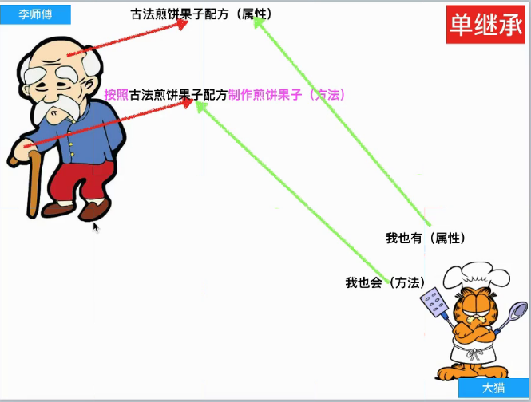

```python
# 定义一个Master类
class Master(object):
    def __init__(self):
        # 属性
        self.kongfu = "古法煎饼果子配方" 

    # 实例方法
    def make_cake(self):
        print("按照 <%s> 制作了一份煎饼果子..." % self.kongfu)


# 定义Prentice类，继承了 Master，则Prentice是子类，Master是父类。
class Prentice(Master): 
 #子类可以继承父类所有的属性和方法，哪怕子类没有自己的属性和方法，也可以使用父类的属性和方法。
    pass                

laoli = Master()
print(laoli.kongfu)
laoli.make_cake()

damao = Prentice()  # 创建子类实例对象
print(damao.kongfu) # 子类对象可以直接使用父类的属性
damao.make_cake()   # 子类对象可以直接使用父类的方法
```

#### 说明：

- 虽然子类没有定义`__init__`方法初始化属性，也没有定义实例方法，但是父类有。所以只要创建子类的对象，就默认执行了那个继承过来的`__init__`方法

#### 总结：

- 子类在继承的时候，在定义类时，小括号()中为父类的名字
- 父类的属性、方法，会被继承给子类

#### 剧情发展：

> 大猫掌握了师傅的配方，可以制作古法煎饼果子。但是大猫是个爱学习的好孩子，他希望学到更多的煎饼果子的做法，于是通过百度搜索，找到了一家煎饼果子培训学校。（多继承）


## 3*   多继承

>  多继承：子类继承多个父类

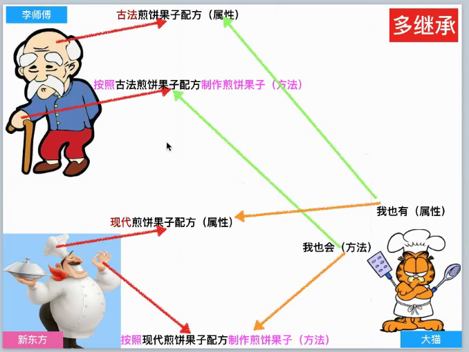

```python
class Master(object):
    def __init__(self):
        # 实例变量，属性
        self.kongfu = "古法煎饼果子配方"  

    # 实例方法，方法
    def make_cake(self):                    
        print("[古法] 按照 <%s> 制作了一份煎饼果子..." % self.kongfu)

    def dayandai(self):
        print("师傅的大烟袋..")

class School(object):
    def __init__(self):
        self.kongfu = "现代煎饼果子配方"

    def make_cake(self):
        print("[现代] 按照 <%s> 制作了一份煎饼果子..." % self.kongfu)

    def xiaoyandai(self):
        print("学校的小烟袋..")

# 多继承，继承了多个父类（School在前）
class Prentice(School, Master):  
    pass

damao = Prentice()
print(damao.kongfu)
damao.make_cake()
damao.dayandai()
damao.xiaoyandai()


class Prentice(Master, School):  # 多继承，继承了多个父类（Master在前）
    pass

damao = Prentice()
# 执行Master的属性
print(damao.kongfu) 
# 执行Master的实例方法
damao.make_cake() 

# 子类的魔法属性__mro__决定了属性和方法的查找顺序
print(Prentice.__mro__)

# 不重名不受影响
damao.dayandai() 
damao.xiaoyandai()
```


#### 说明：

- 多继承可以继承多个父类，也继承了所有父类的属性和方法
- 注意：如果多个父类中有同名的 属性和方法，则默认使用第一个父类的属性和方法（根据类的魔法属性**mro**的顺序来查找）
- 多个父类中，不重名的属性和方法，不会有任何影响。


#### 剧情发展：

> 大猫掌握了 师傅的配方 和 学校的配方，通过研究，大猫在两个配方的基础上，创建了一种全新的煎饼果子配方，称之为 "猫氏煎饼果子配方"。（子类重写父类同名属性和方法）


## 4*  子类重写父类的同名属性和方法

```python
class Master(object):
    def __init__(self):
        self.kongfu = "古法煎饼果子配方" 

    def make_cake(self): 
        print("[古法] 按照 <%s> 制作了一份煎饼果子..." % self.kongfu)


class School(object):
    def __init__(self):
        self.kongfu = "现代煎饼果子配方"

    def make_cake(self):
        print("[现代] 按照 <%s> 制作了一份煎饼果子..." % self.kongfu)


class Prentice(School, Master):  # 多继承，继承了多个父类
    def __init__(self):
        self.kongfu = "猫氏煎饼果子配方"

    def make_cake(self):
        print("[猫氏] 按照 <%s> 制作了一份煎饼果子..." % self.kongfu)


# 如果子类和父类的方法名和属性名相同，则默认使用子类的
# 叫 子类重写父类的同名方法和属性
damao = Prentice()
print(damao.kongfu) # 子类和父类有同名属性，则默认使用子类的
damao.make_cake() # 子类和父类有同名方法，则默认使用子类的

# 子类的魔法属性__mro__决定了属性和方法的查找顺序
print(Prentice.__mro__)
```


#### 剧情发展：

> 大猫的新配方大受欢迎，但是有些顾客希望也能吃到古法配方和 现代配方 的煎饼果子...


## 5*  子类调用父类同名属性和方法

```python
class Master(object):

    def make_cake(self):                   
        print("按照 [古法] 制作了一份煎饼果子...")


class School(object):

    def make_cake(self):
        print(" 按照 [现代] 制作了一份煎饼果子...")

# 自定义类
class Master(object):
    # 实例方法
    def make_cake(self):
        print("按照 [古法] 制作了一份煎饼果子...")

# 自定义类
class School(object):

    def make_cake(self):
        print("按照 [现代] 制作了一份煎饼果子...")


# 多继承，继承了多个父类
class Prentice(School, Master):

    # 实例方法
    def make_cake(self):
        print("按照 [猫氏] 制作了一份煎饼果子...")

    # 调用父类方法格式：父类类名.父类方法(self)
    def make_old_cake(self):

        # 调用父类Master的实例方法
        Master.make_cake(self)

    def make_new_cake(self):

        # 调用父类School的实例方法
        School.make_cake(self)

# 实例化对象，自动执行子类的__init__方法
damao = Prentice()

damao.make_cake() # 调用子类的方法（默认重写了父类的同名方法）

print("--" * 10)
damao.make_old_cake() # 进入实例方法去调用父类Master的方法

print("--" * 10)
damao.make_new_cake() # 进入实例方法去调用父类School的方法

print("--" * 10)
damao.make_cake() # 调用本类的实例方法
```

执行结果：

```
按照 [猫氏] 制作了一份煎饼果子...
--------------------
按照 [古法] 制作了一份煎饼果子...
--------------------
按照 [现代] 制作了一份煎饼果子...
--------------------
按照 [猫氏] 制作了一份煎饼果子...
```


#### 剧情发展：

> 大猫的煎饼果子店非常红火，终于有一天，他成了世界首富！！
>
> 但是他也老了，所以他希望把 师傅的配方 和 学校的配方 以及自己的配方 继续传承下去...（多层继承）


## 6. super()的使用

```python
# 自定义类
class Master(object):

    # 实例方法，方法
    def make_cake(self):
        print("按照 [古法] 制作了一份煎饼果子...")


# 父类是 Master类
class School(Master):

    # 实例方法，方法
    def make_cake(self):
        print("按照 [现代] 制作了一份煎饼果子...")
        # 执行父类的实例方法
        super().make_cake()


# 父类是 School 和 Master
# 多继承，继承了多个父类
class Prentice(School, Master):
    # 实例方法，方法
    def make_cake(self):
        print("按照 [猫氏] 制作了一份煎饼果子...")

    def make_all_cake(self):

        # 方式1. 指定执行父类的方法（代码臃肿）
        # School.make_cake(self)
        # Master.make_cake(self)

        # 方法2. super() 带参数版本，只支持新式类
        # super(Prentice, self).make_cake()
        # self.make_cake()

        # 方法3. super()的简化版，只支持新式类
        # 执行父类的 实例方法
        super().make_cake()


damao = Prentice()
damao.make_cake()
damao.make_all_cake()

# print(Prentice.__mro__)
```


#### 知识点：

> 子类继承了多个父类，如果父类类名修改了，那么子类也要涉及多次修改。而且需要重复写多次调用，显得代码臃肿。
>
> 使用super() 可以逐一调用所有的父类方法，并且只执行一次。调用顺序遵循 **mro** 类属性的顺序。
>
> **注意：如果继承了多个父类，且父类都有同名方法，则默认只执行第一个父类的(同名方法只执行一次，目前super()不支持执行多个父类的同名方法)**
>
> super() 在Python2.3之后才有的机制，用于通常单继承的多层继承。


# 二.  面向对象

>  面向对象三大特性：封装、继承、多态

## 1. 私有权限   ---   私有方法和私有属性

#### 封装的意义：

1. 将属性和方法放到一起做为一个整体，然后通过实例化对象来处理；
2. 隐藏内部实现细节，只需要和对象及其属性和方法交互就可以了；
3. 对类的属性和方法增加 访问权限控制。

#### 私有权限：在属性名和方法名 前面 加上两个下划线 __

> 1. 类的私有属性 和 私有方法，都不能通过对象直接访问，但是可以在本类内部访问；
> 2. 类的私有属性 和 私有方法，都不会被子类继承，子类也无法访问；
> 3. 私有属性 和 私有方法 往往用来处理类的内部事情，不通过对象处理，起到安全作用。

```python
class Master(object):
    def __init__(self):
        self.kongfu = "古法煎饼果子配方" 
    def make_cake(self):          
        print("[古法] 按照 <%s> 制作了一份煎饼果子..." % self.kongfu)

class School(object):
    def __init__(self):
        self.kongfu = "现代煎饼果子配方"

    def make_cake(self):
        print("[现代] 按照 <%s> 制作了一份煎饼果子..." % self.kongfu)

class Prentice(School, Master):
    def __init__(self):
        self.kongfu = "猫氏煎饼果子配方"
        # 私有属性，可以在类内部通过self调用，但不能通过对象访问
        self.__money = 10000  

    # 私有方法，可以在类内部通过self调用，但不能通过对象访问
    def __print_info(self):
        print(self.kongfu)
        print(self.__money)

    def make_cake(self):
        self.__init__()
        print("[猫氏] 按照 <%s> 制作了一份煎饼果子..." % self.kongfu)

    def make_old_cake(self):
        Master.__init__(self) 
        Master.make_cake(self)


    def make_new_cake(self):
        School.__init__(self) 
        School.make_cake(self)

class PrenticePrentice(Prentice):
    pass


damao = Prentice()
# 对象不能访问私有权限的属性和方法
print(damao.__money)
damao.__print_info()


pp = PrenticePrentice()
# 子类不能继承父类私有权限的属性和方法
print(pp.__money) 
pp.__print_info()
```


#### 总结

- Python中没有像C++中 public 和 private 这些关键字来区别公有属性和私有属性。
- Python是以属性命名方式来区分，如果在属性和方法名前面加了2个下划线'__'，则表明该属性和方法是私有权限，否则为公有权限。


## 2.  修改私有属性的值

- 如果需要修改一个对象的属性值，通常有2种方法

  > 1. 对象名.属性名 = 数据 ----> 直接修改
  > 2. 对象名.方法名() ----> 间接修改

- 私有属性不能直接访问，所以无法通过第一种方式修改，一般的通过第二种方式修改私有属性的值：定义一个可以调用的公有方法，在这个公有方法内访问修改。

```python
class Master(object):
    def __init__(self):
        self.kongfu = "古法煎饼果子配方" 
    def make_cake(self):          
        print("[古法] 按照 <%s> 制作了一份煎饼果子..." % self.kongfu)

class School(object):
    def __init__(self):
        self.kongfu = "现代煎饼果子配方"

    def make_cake(self):
        print("[现代] 按照 <%s> 制作了一份煎饼果子..." % self.kongfu)

class Prentice(School, Master):
    def __init__(self):
        self.kongfu = "猫氏煎饼果子配方"
        # 私有属性，可以在类内部通过self调用，但不能通过对象访问
        self.__money = 10000  


    # 现代软件开发中，通常会定义get_xxx()方法和set_xxx()方法来获取和修改私有属性值。

    # 返回私有属性的值
    def get_money(self):
        return self.__money

    # 接收参数，修改私有属性的值
    def set_money(self, num):
        self.__money = num


    def make_cake(self):
        self.__init__()
        print("[猫氏] 按照 <%s> 制作了一份煎饼果子..." % self.kongfu)

    def make_old_cake(self):
        Master.__init__(self) 
        Master.make_cake(self)

    def make_new_cake(self):
        School.__init__(self) 
        School.make_cake(self)

class PrenticePrentice(Prentice):
    pass


damao = Prentice()
# 对象不能访问私有权限的属性和方法
print(damao.__money)
damao.__print_info()

# 可以通过访问公有方法set_money()来修改私有属性的值
damao.set_money(100)

# 可以通过访问公有方法get_money()来获取私有属性的值
print(damao.get_money())
```


## 3. 多态

所谓多态：定义时的类型和运行时的类型不一样，此时就成为多态 ，多态的概念是应用于Java和C#这一类强类型语言中，而Python崇尚“鸭子类型”。

> 鸭子类型：虽然我想要一只"鸭子"，但是你给了我一只鸟。 但是只要这只鸟走路像鸭子，叫起来像鸭子，游泳也像鸭子，我就认为这是鸭子。

Python的多态，就是弱化类型，重点在于对象参数是否有指定的属性和方法，如果有就认定合适，而不关心对象的类型是否正确。

- Python伪代码实现Java或C#的多态

```python
class F1(object):
    def show(self):
        print('F1.show')

class S1(F1):
    def show(self):
        print('S1.show')

class S2(F1):
    def show(self):
        print('S2.show')
        

# 由于在Java或C#中定义函数参数时，必须指定参数的类型
# 为了让Func函数既可以执行S1对象的show方法，又可以执行S2对象的show方法，
# 所以在def Func的形参中obj的类型是 S1和S2的父类即F1
# 
# 而实际传入的参数是：S1对象和S2对象

def Func(F1 obj): 
    """Func函数需要接收一个F1类型或者F1子类的类型"""

    print(obj.show())

s1_obj = S1()
Func(s1_obj) # 在Func函数中传入S1类的对象 s1_obj，执行 S1 的show方法，结果：S1.show

s2_obj = S2()
Func(s2_obj) # 在Func函数中传入Ss类的对象 ss_obj，执行 Ss 的show方法，结果：S2.show
```

>  通俗点理解：定义obj这个变量是说的类型是：F1的类型，但是在真正调用Func函数时给其传递的不一定是F1类的实例对象，有可能是其子类的实例对象， 这种情况就是所谓的多态

- Python “鸭子类型”

```python
class F1(object):
    def show(self):
        print('F1.show')

class S1(F1):
    def show(self):
        print('S1.show')

class S2(F1):
    def show(self):
        print('S2.show')

def Func(obj):  
    # python是弱类型，即无论传递过来的是什么，obj变量都能够指向它，这也就没有所谓的多态了（弱化了这个概念）
    print(obj.show())

s1_obj = S1()
Func(s1_obj) 

s2_obj = S2()
Func(s2_obj)
```


## 4. 类属性和实例属性

在了解了类基本的东西之后，下面看一下python中这几个概念的区别

先来谈一下`类属性`和`实例属性`

在前面的例子中我们接触到的就是实例属性（对象属性），顾名思义，类属性就是`类对象`所拥有的属性，它被所有`类对象`的`实例对象`所共有，在内存中只存在一个副本，这个和C++中类的静态成员变量有点类似。对于公有的类属性，在类外可以通过`类对象`和`实例对象`访问


### 类属性

```python
class People(object):
    name = 'Tom'  # 公有的类属性
    __age = 12  # 私有的类属性

p = People()

print(p.name)  # 正确
print(People.name)  # 正确
print(p.__age)  # 错误，不能在类外通过实例对象访问私有的类属性
print(People.__age) # 错误，不能在类外通过类对象访问私有的类属性
```


### 实例属性(对象属性)

```python
class People(object):
    address = '山东'  # 类属性
    def __init__(self):
        self.name = 'xiaowang'  # 实例属性
        self.age = 20  # 实例属性

p = People()
p.age = 12  # 实例属性
print(p.address)  # 正确
print(p.name)  # 正确
print(p.age)  # 正确

print(People.address)  # 正确
print(People.name)  # 错误
print(People.age)  # 错误
```


### 通过实例(对象)去修改类属性

```python
class People(object):
    country = 'china' #类属性


print(People.country)
p = People()
print(p.country)
p.country = 'japan' 
print(p.country)  # 实例属性会屏蔽掉同名的类属性
print(People.country)
del p.country  # 删除实例属性
print(p.country)
```

### 总结

- 如果需要在类外修改`类属性`，必须通过`类对象`去引用然后进行修改。如果通过实例对象去引用，会产生一个同名的`实例属性`，这种方式修改的是`实例属性`，不会影响到`类属性`，并且之后如果通过实例对象去引用该名称的属性，实例属性会强制屏蔽掉类属性，即引用的是`实例属性`，除非删除了该`实例属性`。


## 5.  静态方法和类方法

####1*)   类方法

是类对象所拥有的方法，需要用修饰器`@classmethod`来标识其为类方法，对于类方法，第一个参数必须是类对象，一般以`cls`作为第一个参数（当然可以用其他名称的变量作为其第一个参数，但是大部分人都习惯以'cls'作为第一个参数的名字，就最好用'cls'了），能够通过实例对象和类对象去访问。

```python
class People(object):
    country = 'china'

    #类方法，用classmethod来进行修饰
    @classmethod
    def get_country(cls):
        return cls.country

p = People()
print(p.get_country())    #可以用过实例对象引用
print(People.get_country())    #可以通过类对象引用
```

类方法还有一个用途就是可以对类属性进行修改：

```python
class People(object):
    country = 'china'

    #类方法，用classmethod来进行修饰
    @classmethod
    def get_country(cls):
        return cls.country

    @classmethod
    def set_country(cls,country):
        cls.country = country


p = People()
print(p.get_country())   #可以用过实例对象访问
print(People.get_country())    #可以通过类访问

p.set_country('japan')   

print(p.get_country())
print(People.get_country())
```

结果显示在用类方法对类属性修改之后，通过类对象和实例对象访问都发生了改变


####2*)  静态方法

需要通过修饰器`@staticmethod`来进行修饰，静态方法不需要多定义参数，可以通过对象和类来访问。

```python
class People(object):
    country = 'china'

    @staticmethod
    #静态方法
    def get_country():
        return People.country


p = People()
# 通过对象访问静态方法
p.get_contry()

# 通过类访问静态方法
print(People.get_country())
```

## 总结

1. 从类方法和实例方法以及静态方法的定义形式就可以看出来，类方法的第一个参数是类对象cls，那么通过cls引用的必定是类对象的属性和方法；
2. 实例方法的第一个参数是实例对象self，那么通过self引用的可能是类属性、也有可能是实例属性（这个需要具体分析），不过在存在相同名称的类属性和实例属性的情况下，实例属性优先级更高。
3. 静态方法中不需要额外定义参数，因此在静态方法中引用类属性的话，必须通过类实例对象来引用


```
python中的方法总结:
    1.实例方法(对象方法) --> 场景很多
        调用格式: 对象名.实例方法名()
        使用场景: 在方法中需要self
        
    2.类方法 --> 对私有类属性取值或者赋值
        定义格式: @classmethod
                 def 类方法名(cls):
        调用格式: 类名.类方法名()  或者 对象名.类方法名()
        使用场景: 在方法中需要cls类名
        
    3.静态方法 --> 一般不用
        定义格式: @staticmethod
                 def 静态方法名():
        调用格式: 类名.类方法名() 或者 对象名.类方法名()
        使用场景: 在方法中不需要self 也不需要cls       
```


## 6. `__new__`方法

### `__new__和__init__`的作用:

```python
class A(object):
    def __init__(self):
        print("这是 init 方法")

    def __new__(cls):
        print("这是 new 方法")
        return object.__new__(cls)

A()
```

#### 总结

- `__new__`至少要有一个参数cls，代表要实例化的类，此参数在实例化时由Python解释器自动提供
- `__new__`必须要有返回值，返回实例化出来的实例，这点在自己实现`__new__`时要特别注意，可以return父类`__new__`出来的实例，或者直接是object的`__new__`出来的实例
- `__init__`有一个参数self，就是这个`__new__`返回的实例，`__init__`在`__new__`的基础上可以完成一些其它初始化的动作，`__init__`不需要返回值
- 我们可以将类比作制造商，`__new__`方法就是前期的原材料购买环节，`__init__`方法就是在有原材料的基础上，加工，初始化商品环节

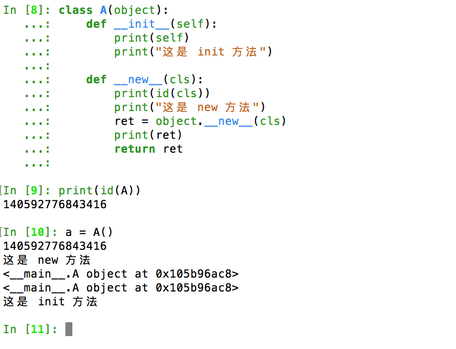

### 补充:

*args:  表示  将位置参数中的剩余实参存放到 args 中, 且以元组的形式保存

```python
def foo(x,*args):
    print(x)
    print(args)
 
foo(1,2,3,4,5)#其中的2,3,4,5都给了args
```

运行结果:

```
1
(2, 3, 4, 5)
```


```python
def foo(x,y=1,*args):
    print(x)
    print(y)
    print(args)
 
foo(1,2,3,4,5)#其中的x为1，y=1的值被2重置了，3,4,5都给了args
```

结果:

```
1
2
(3, 4, 5)
```


```python
def foo(x,*args,y=1):
    print(x)
    print(args)
    print(y)
 
foo(1,2,3,4,5)#其中的x为1，2,3,4,5都给了args,y按照默认参数依旧为1
```

结果:

```
1
(2, 3, 4, 5)
1
```


** kwargs: 表示  形参中按照关键字传值 把多余的值以字典呈现

```python
def foo(x,**kwargs):
    print(x)
    print(kwargs)
    
foo(1,y=1,a=2,b=3,c=4)#将y=1,a=2,b=3,c=4以字典的方式给了kwargs
```

执行结果是：

```
1
{'y': 1, 'a': 2, 'b': 3, 'c': 4}
```


```python
def foo(x,*args,**kwargs):
    print(x)
    print(args)
    print(kwargs)
foo(1,2,3,4,y=1,a=2,b=3,c=4)#将1传给了x，将2,3,4以元组方式传给了args，y=1,a=2,b=3,c=4以字典的方式给了kwargs
```

结果:

```
1
(2, 3, 4)
{'y': 1, 'a': 2, 'b': 3, 'c': 4}
```

位置参数、默认参数、**kwargs三者的顺序必须是位置参数、默认参数、**kwargs，不然就会报错：

```python
def foo(x,y=1,**kwargs):
    print(x)
    print(y)
    print(kwargs)
foo(1,a=2,b=3,c=4)#将1按照位置传值给x，y按照默认参数为1，a=2,b=3,c=4以字典的方式给了kwargs
```

结果:

```
1
1
{'a': 2, 'b': 3, 'c': 4}
```


## 7*  单例模式

### 1. 单例是什么

举个常见的单例模式例子，我们日常使用的电脑上都有一个回收站，在整个操作系统中，回收站只能有一个实例，整个系统都使用这个唯一的实例，而且回收站自行提供自己的实例。因此回收站是单例模式的应用。

确保某一个类只有一个实例，而且自行实例化并向整个系统提供这个实例，这个类称为单例类，单例模式是一种对象创建型模式。

就像游戏中的尤里x


### 2. 创建单例-保证只有1个对象

```python
# 单例模式: 在程序中这个类创建出来的对象 只有一个(也就是占用一分内存地址)
# 单例模式 也只会走一次__init__方法(保证这个单例对象的属性也是唯一的)(name=小明
#  age = 20)
# 合理使用内存 避免浪费(避免浪费内存)

class Person(object):
    # 定义一个私有类属性, 初始化是该类为None
    __instance = None

    def __new__(cls, *args, **kwargs):
        # 如果不存在, 则进入if语句
        if not cls.__instance:
            # 不存在时进入   我们就创建一个
            cls.__instance = object.__new__(cls)
		# 创建出来之后, return返回
        return cls.__instance


# 创建对象
xiaoming = Person('小明', 20)
xiaohong = Person('小红', 32)
xiaozhang = Person('小孙', 31)
print(xiaoming)
print(xiaohong)
print(xiaozhang)
```

运行结果：

```
# 我们可以看到三个值都是一样的,代表对象没有创建多个,而是只有一个,达到我们的目的
<__main__.Person object at 0x00000000023CD2E8>
<__main__.Person object at 0x00000000023CD2E8>
<__main__.Person object at 0x00000000023CD2E8>
```


### 3. 创建单例-保证只执行1次__init__方法

```python
class Person(object):
    __instance = None
    # 创建一个私有类属性, 记录是否是第一次进入
    # 只有第一次进入的时候, 当前初始化的值(True)被使用
    # 其他时候进入的都将该参数变为False
    __isFirst = True

    def __new__(cls, *args, **kwargs):
        if not cls.__instance:
            cls.__instance = object.__new__(cls)

        return cls.__instance

    # 对init方法加工, 使其只能被调用一次, 保证对象的属性只能赋值一次
    def __init__(self, name, age):
        if Person.__isFirst:
            self.name = name
            self.age = age
            Person.__isFirst = False

# 创建对象
xiaoming = Person('小明', 20)
xiaohong = Person('小红', 32)
xiaozhang = Person('小孙', 31)
print(xiaoming)
print(xiaohong)
print(xiaozhang)

print(xiaozhang.name, xiaoming.name, xiaohong.name)
```

运行结果:

```
<__main__.Person object at 0x00000000023CD2E8>
<__main__.Person object at 0x00000000023CD2E8>
<__main__.Person object at 0x00000000023CD2E8>
小明 小明 小明
```

总结: 

- 单例: 单独的实例,  即只能有一个实例
- 这样可以节约内存,  例如针对公共的一些对象,我们只需要指定一个即可, 需要使用时, 直接拿去用.
- 内存有限, 请珍惜.
- 既然该类的对象都只有一个, 那么该对象的属性也只有一份, 不存在别人也有该对象属性的情况.


# 三 .  异常 & 模块(了解)

## 1.  异常

###1)  异常简介

看如下示例:

```python
    print '-----test--1---'
    open('123.txt','r')
    print '-----test--2---'
```

运行结果:

```
-----test--1---
Traceback (most recent call last):
  File "demo.py", line 2, in <module>
    open('123.txt', 'r')
FileNotFoundError: [Errno 2] No such file or directory: '123.txt'
```

说明:

>  打开一个不存在的文件123.txt，当找不到123.txt 文件时，就会抛出给我们一个IOError类型的错误，No such file or directory：123.txt （没有123.txt这样的文件或目录）

**异常:**

> 当Python检测到一个错误时，解释器就无法继续执行了，反而出现了一些错误的提示，这就是所谓的"异常"


## 2.  捕获异常

### 1)  单个异常捕获(try...except...)

```
使用规则:
try:
	可能发生异常的代码01
	可能发生异常的代码02
	...
except 要捕获的异常类型名:
	如果发生异常,进行的后续处理01
	如果发生异常,进行的后续处理02
	...
```


看如下示例:

```python
try:
    print(num)
except NameError:
    print('发生异常了')

print('go on continue')
```

运行结果:

```
发生异常了
go on continue
```

说明:

- 如果我们在可能发生异常的代码外, 添加 try....except.... 方法, 这样就可以捕获发生的异常,可以对异常进行实时跟踪, 而且程序不会崩溃, 可以继续运行后续的代码
- 我们通过运行结果可以看到, 虽然异常发生了, 但是对程序的破坏性不是很大, 有利于程序的继续执行.
- 其中, try:  里面的代码是有可能发生异常的内容
- except  后面紧跟的是发生异常的类型名称, 如果异常名称弄错, 那么当前异常照样捕获不到, 就相当于:  except  鸭子类型异常:    但是发生的是天鹅类型异常,  这样的话except照样捕获不到该异常.
- 使用try...except...能够使我们在异常发生的情况下正常执行程序, 这一点非常非常好. 对于公司来说,这个功能非常有用.


### 2) 多种异常捕获

想一想:

> 上例程序，已经可以使用except捕获异常了, 但是如果try中的代码发生的异常类型有多种, 那么该如何解决呢?

答:  使用 except 捕获多种异常


```
使用规则:
try:
	可能发生异常的代码01
	可能发生异常的代码02
	...
except (要捕获的异常类型名01,要捕获的异常类型名02, 要捕获的异常类型名03...):
	如果发生异常,进行的后续处理01
	如果发生异常,进行的后续处理02
	...
```


例如: 

```python
try:
    print(num)
    open('hm.txt')
except (FileNotFoundError, NameError):
    print('捕获到异常了')
```

运行结果: 

```
捕获到异常了
```

**说明:**

* except后面可以跟 多种类型的异常名, 并且把这些异常名用元组包裹起来, 就可以同时捕获多种异常.
* 其他使用方式不变


### 3) 异常的描述信息获取

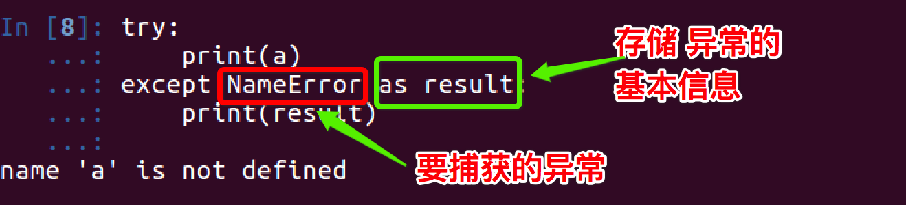


总结: 

* except 后面可以用括号包含多种异常的名字
* except后面可以连接 as 关键字, as 关键字能够把异常信息赋给一个变量, 我们可以通过打印变量的形式来获取有关该异常的描述信息
* 我们也可以简单的理解为:   as 关键字  能够把异常描述信息 保存在变量中.


### 4)  捕获所有异常

我们有两种方式可以捕获所有的异常: 

第一种 : 

```
使用规则: 
try:
	有可能产生异常的代码01
	有可能产生异常的代码02
	...
except:
    捕获到异常后的操作01
    捕获到异常后的操作02
    ...
```

> 说明: 虽然用这样的形式可以捕获异常,但是不建议大家使用, 原因是这样的方式获取的异常不能够查看    聚的异常信息.   


第二种 :  

```
使用规则: 
try:
    有可能产生异常的代码01
	有可能产生异常的代码02
	...
except Exception:
    捕获到异常后的操作01
    捕获到异常后的操作02
    ...
```

> 说明:
>
> * 使用这样的形式可以捕获所有类型的异常, 原因是: Exception是所有异常类的父类.
> * 这样的书写形式后面可以跟 as 关键字, 从而可以存储并打印输出异常的具体信息.
> * 推荐使用这样的形式, 当然, 如果你不需要异常信息, 只想知道代码是否有异常, 可以使用上面的形式


举例:

```python
try:
    open('hm.txt','r')
except:
    print('获取异常...')
```

运行结果: 

```
获取异常...
```

```python
try:
    print(num)
    open('hm.txt')
except Exception as info:
    print('捕获到异常了', info)
```

运行结果:  

```
捕获到异常了 name 'num' is not defined
```

> **注意**:
>
> 上面代码中: 因为异常代码有两行, 所以捕获到的是先执行的第 2 行的异常. 


**总结**:

* 捕获所有异常和正常的捕获行为很像, 只是捕获类名有所变化
* 此处学习捕获所有异常后, 在公司如无其他需求, 一般都是使用上面的两种方法, 获取代码的异常.
* 此处学习的两种方法均可使用, 希望大家牢记, 多多联系.


### 5)  与else的搭配使用

> 在 if 中，它的作用是当条件不满足时执行的代码；
>
> 同样在 try...except...else 中也是如此，即如果没有捕获到异常，那么就执行else中的事情
>
> 如果产生异常, 就不执行 else 中的语句.

```python
try:
    num = 100
    print(num)
except NameError as errorMsg:
    print('产生错误了:%s'%errorMsg)
else:
    print('没有捕获到异常，真高兴')
```

运行结果如下:

```
100
没有捕获到异常，真高兴
```


```python
try:
    # num = 100
    print(num)
except NameError as errorMsg:
    print('产生错误了:%s'%errorMsg)
else:
    print('没有捕获到异常，真高兴')
```

运行结果如下:

```
产生错误了:name 'num' is not defined
```


### 6)  与finally的搭配

finally语句用来表达这样的情况：

> 在程序中，如果一个段代码必须要执行，即无论异常是否产生都要执行，那么此时就需要使用finally。 比如文件关闭，释放锁，把数据库连接返还给连接池等

demo:

```python
try:
    num = 100
    print(num)
except NameError as errorMsg:
    print('产生错误了:%s'%errorMsg)
finally:
    print('finally方法')
```

结果:

```
100
finally方法
```


demo:

```python
try:
    # num = 100
    print(num)
except NameError as errorMsg:
    print('产生错误了:%s'%errorMsg)
finally:
    print('finally方法')
```

结果:

```
产生错误了:name 'num' is not defined
finally方法
```


#### 总结: 

* finally 如果添加了, 那么无论是否发生异常,  finally里面的程序都会执行

* finally一般不写, 除非公司有这方面的需求.

* finally 和 try.... except.... 可以搭配使用, 组成:  try.... except.... finally.....

  * 其中,  try 中出错, 那么执行 except 和 finally 的代码
  * 如果,  try  中没有错误, 那么执行  try  和 finally 中的代码

*  finally 和 try .... except... else .... 可以搭配使用, 组成 try.....except....else.....finally....

  * 其中, 如果 try 中出错, 那么执行 except  和 finally 的代码
  * 如果, try 中如果没有错误, 那么执行  try 和 else 和 finally 的代码

  ```python
  try:
      num = 100
      print(num)
  except NameError as errorMsg:
      print('产生错误了:%s'%errorMsg)
  else:
      print('else')
  finally:
      print('finally方法')
  ```

  结果:

  ```
  100
  else
  finally方法
  ```

* 如果出错,则:

  ```python
  try:
      # num = 100
      print(num)
  except NameError as errorMsg:
      print('产生错误了:%s'%errorMsg)
  else:
      print('else')
  finally:
      print('finally方法')
  ```

  结果:

  ```
  产生错误了:name 'num' is not defined
  finally方法
  ```

  ​


### 7)  异常的传递

#### 1.  try嵌套

> 两个try嵌套, 如果内部的异常没有捕获到, 则异常会往外部传递, 外部会进行捕获:

```python
try:
    num = 100
    print(num)
    try:
        open('text.haha')
    except NameError as error:
        print('嵌套内部的异常捕获:', error)
except Exception as result:
    print('嵌套外围的异常捕获: 产生错误了', result)
```

运行结果:

```
100
嵌套外围的异常捕获: 产生错误了 [Errno 2] No such file or directory: 'text.haha'
```

**说明**:

上例中,内部没有捕获到的原因是:  open()方法出错的异常类型应该是IOName, 而内部我们捕获的类型是NameError.


> 两个try嵌套, 如果内部的异常, 内部已经捕获到, 则不会往外部传递, 外部不会捕获:

```python
try:
    num = 100
    print(num)
    try:
        open('text.haha')
    except Exception as error:
        print('嵌套内部的异常捕获:', error)
except Exception as result:
    print('嵌套外围的异常捕获: 产生错误了', result)
```

运行结果:

```
100
嵌套内部的异常捕获: [Errno 2] No such file or directory: 'text.haha'
```

**说明**:

​	这次内部能够捕获异常的原因是: 内部捕获的是所有的异常类型,使用的是: Exception.


#### 2. 函数嵌套

```python
def demo1():
    print("----demo1-1----")
    print(num)
    print("----demo1-2----")

def demo2():
    try:
        print("----demo2-1----")
        demo1()
        print("----demo2-2----")
    except Exception as result:
        print("捕获到了异常，信息是:%s" % result)
    print("----demo2-3----")

demo2()
```

运行结果: 

```
----demo2-1----
----demo1-1----
捕获到了异常，信息是:name 'num' is not defined
----demo2-3----
```


或者: 

```python
def demo1():
    print("----demo1-1----")
    try:
        print(num)
        print("----demo1-2----")
    except Exception as result:
        print("捕获到了异常，信息是:%s" % result)
    print("----demo1-3----")

def demo2():
    print("----demo2-1----")
    demo1()
    print("----demo2-2----")

demo2()
```

结果:

```
----demo2-1----
----demo1-1----
捕获到了异常，信息是:name 'num' is not defined
----demo1-3----
----demo2-2----
```


**总结**:

* 如果try嵌套，那么如果里面的try没有捕获到这个异常，那么外面的try会接收到这个异常，然后进行处理，如果外边的try依然没有捕获到，那么再往外进行传递。。。
* 如果异常是在函数嵌套中产生的:
  * 例如函数A---->函数B---->函数C,而异常是在函数C中产生的，那么如果函数C中没有对这个异常进行处理，那么这个异常会传递到函数B中，如果函数B有异常处理那么就会按照函数B的处理方式进行执行；如果函数B也没有异常处理，那么这个异常会继续传递，以此类推。。。如果所有的函数都没有处理，那么此时就会进行异常的默认处理，程序最终会崩溃.
* 第一个案例中:  当demo1中发生了异常, 此异常被传递到demo2函数中处理,当处理完成后, 并没有返回demo1中进行执行, 而是在demo2中继续执行.


## 3.  模块

####1. Python中的模块

>  在Python中有一个概念叫做模块（module），这个和C语言中的头文件以及Java中的包很类似，比如在Python中要调用`randint()函数`，必须用import关键字引入 random 这个模块，下面就来了解一下Python中的模块。
>
>  模块就好比是工具包，要想使用这个工具包中的工具(就好比函数)，就需要导入这个模块


####2  import

>  在Python中,  一般用关键字`import`来导入模块
>
>  比如要引用模块 random，就可以在文件最开始的地方用 import random 来导入。

 ```
形如:
import module1,mudule2...
 ```

当解释器遇到 import 语句，我们添加的模块就会被导入。

在调用 random 模块中的函数时，必须这样引用：

```
模块名.函数名

例如:
random.randint()
```

想一想:

> 为什么必须加上模块名调用呢？

答:

> 因为可能存在这样一种情况：在多个模块中含有相同名称的函数，此时如果只是通过函数名来调用，解释器无法知道到底要调用哪个函数。所以如果像上述这样引入模块的时候，调用函数必须加上模块名

```
    import math

    # 这样会报错
    # 求4的非负平方根
    print sqrt(4)

    #这样才能正确输出结果
    print math.sqrt(4)
```


#### 3  from…import

有时候我们只需要用到模块中的某些个函数，只需要引入该函数即可，此时可以用下面方法实现：

```
from 模块名 import 函数名1,函数名2....
```

不仅可以引入函数，还可以引入一些全局变量、类等

**注意**:

> - 通过这种方式引入的时候，调用函数时只能给出函数名，不能给出模块名，但是当两个模块中含有相同名称函数的时候，后面一次引入会覆盖前一次引入。也就是说假如模块A中有函数function( )，在模块B中也有函数function( )，如果引入A中的function在先、B中的function在后，那么当调用function函数的时候，是去执行模块B中的function函数。
> - 如果想一次性引入某个模块中所有的东西，还可以通过 from 模块名 import * 来实现


例如，要导入模块 random 的 randint 方法，使用如下语句：

```python
    from random import randint
```

**注意**:

- 这样的方式不会把整个模块的内容导入到当前文件中,  它只会将模块中的单个方法引入进来


####4. from … import *

把一个模块的所有内容全都导入到当前的文件中也是可行的，只需使用如下声明：

```
from 模块名 import *
```

**注意**:

- 这提供了一个简单的方法来导入一个模块中的所有项目。然而这种声明不该被过多地使用。
- 这个方法最好不要用的太多, 因为这样的方式是把模块中的内容一次性都引入, 会对内存造成很大的压力.


#### 5. as

> as 关键字可以给导入的模块起一个别名 

```
使用格式: 
import 模块名 as 别名
```

说明: 

* 需要说明的是 一旦使用 as 给某个模块起别名以后, 原来模块的名字就不可以使用了, 用了会报错

```python
import random as tt
tt.randint(0, 10)
random.randint(0, 10)
```

运行结果为:

```
Traceback (most recent call last):
  File "demo.py", line 3, in <module>
    random.randint(0, 10)
NameError: name 'random' is not defined
```


#### 6. 定位模块   (linux系统)

当你导入一个模块，Python解析器对模块位置的搜索顺序是：

1. 当前目录
2. 如果不在当前目录，Python则搜索在shell变量PYTHONPATH下的每个目录。
3. 如果都找不到，Python会察看默认路径。UNIX下，默认路径一般为/usr/local/lib/python/
4. 模块搜索路径存储在system模块的sys.path变量中。变量里包含当前目录，PYTHONPATH和由安装过程决定的默认目录。


#### 7. 模块制作

#####1. 定义自己的模块

> 在Python中，每个Python文件都可以作为一个模块，模块的名字就是文件的名字。
>
> 比如有这样一个文件 demo.py，在 demo.py 中定义了函数add

 demo.py文件中: 

```python
# demo.py文件中: 
def add(a, b):
    return a + b
```


##### 2. 调用自己定义的模块

>  那么在其他文件中就可以先import demo，然后通过demo.add(a,b)来调用了，当然也可以通过from demo import add来引入

 main.py文件中:

```python
# main.py
import demo

result = demo.add(11,22)
print(result)
```


##### 3. 测试模块

>  在实际开中，当一个开发人员编写完代码后，会检测这个模块是否达到了想要的效果, 往往会在当前项目中添加一些检测代码, 例如: 

demo.py文件中:

```python
# demo.py文件中
def add(a,b):
    return a+b

# 用来进行自测:
ret = add(12,22)
print('demo:  12+22=%d'%ret)
```

如果此时，在其他py文件中引入了此文件的话，想想看，测试的那段代码是否也会执行呢！

main.py文件中: 

```python
import demo

result = demo.add(11,22)
print(result)
```

运行现象：

```
demo:  12+22=34
33
```

至此，可发现 demo.py 中的测试代码，应该是单独执行 demo.py 文件时才应该执行的，不应该是其他的文件中引用而执行

为了解决这个问题，python在执行一个文件时有个变量`__name__`


##### 4.  `__name__`:

##### demo.py文件中运行的结果为: 

```python
# demo.py文件中
def add(a,b):
    return a+b

# 用来进行自测:
print('demo中__name__的值是: %s' % __name__)
```

结果: 

```
demo中__name__的值是: __main__
```


在别的文件中导入demo.py文件,然后运行:

在main.py文件中运行后: 

```python
import demo
```

运行结果:

```
demo中__name__的值是: demo
```

#### 总结：

- 可以根据__name__变量的结果能够判断出，是直接执行的python脚本还是被引入执行的，从而能够有选择性的执行测试代码
- 就和我们经常看到的NBA一样, 分为 主场 和 客场 ,主场就是在本队的球场打, 客场就是在对方的球队打.
- 或者我们也可以理解为: 在家为主人,  在别人家为客人


####8.模块中的`__all__`

我们可以在模块中添加`__all__`属性.   这个属性的作用是: 

> 如果一个模块中有`__all__`属性，则只有`__all__`内指定的属性, 方法, 类可被导入
>
> 但是这样做有一个限制:  必须用 from 模块名 import *  的形式导入


#####1. 没有`__all__`

demo01.py:

```python
# 全局变量
name = 'itcast'

def hello():
    print('hello')

class Person(object):
    def eat(self):
        print('eat')
```

demo02.py:

```python
from demo01 import *

print(name)
hello()
per = Person()
per.eat()
```

运行demo02.py ,   可得结果:

```
itcast
hello
eat
```


##### 2. 模块中有`__all__`

demo01.py:

```python
__all__ = ['name', 'hello']

# 全局变量
name = 'itcast'

def hello():
    print('hello')

class Person(object):
    def eat(self):
        print('eat')

```

demo02.py:

```python
from demo01 import *

print(name)
hello()
per = Person()
per.eat()
```

运行demo02.py, 可得: 

```
itcast
hello

Traceback (most recent call last):
  File "demo02.py", line 5, in <module>
    per = Person()
NameError: name 'Person' is not defined
```


上例中,如果我们把 Person 添加到`__all__`中,可得:

demo01.py:

```python
__all__ = ['name', 'hello', 'Person']

# 全局变量
name = 'itcast'

def hello():
    print('hello')

class Person(object):
    def eat(self):
        print('eat')
```

demo02.py:

```python
from demo01 import *

print(name)
hello()
per = Person()
per.eat()
```

运行demo02.py, 可得: 

```
itcast
hello
eat
```


### 总结

- 如果一个模块中有`__all__`属性，则只有`__all__`内指定的属性, 方法, 类可被导入, 当然前提是使用from 模块名 import * 的导入形式
- 这样做有利于我们决定是否将模块中的所有内容都展示出去.  可以有选择性的进行保留
- 在程序中一般定义接口的时候, 可能用到. 这里知道即可, 不做过多讲解.


## 4. python中的包

>   包是什么?       其实:  包就是带有`__init__.py`文件的文件夹

### 1. 引入包

> 在程序中, 我们往往会把有联系的模块放在一个包中  (即把有联系的多个.py文件放在一个特殊文件夹下)
>
> 特殊在哪里呢?   这个文件夹下会有一个`__init__.py`的文件

例如:

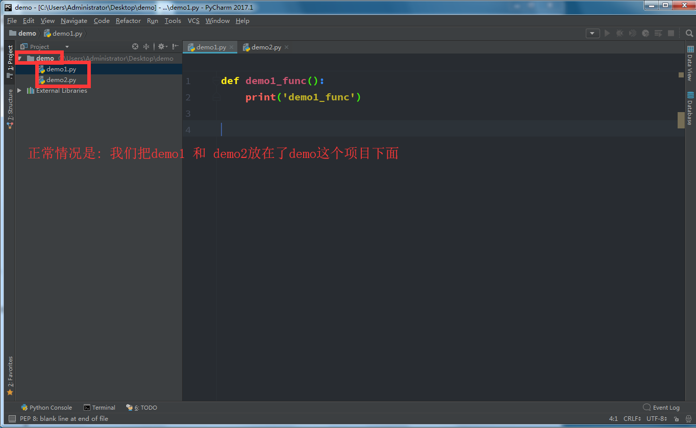

如果这两个文件有联系,我们可以创建一个包(文件夹), 把这两个放在里面: 

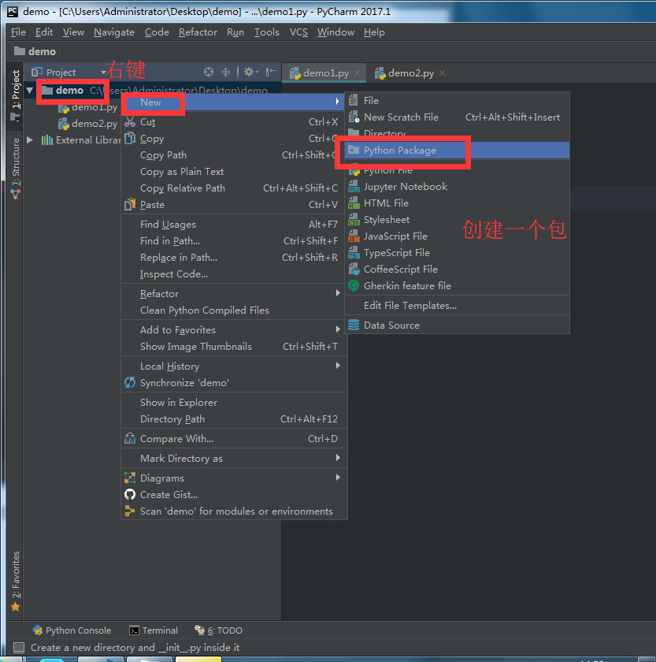

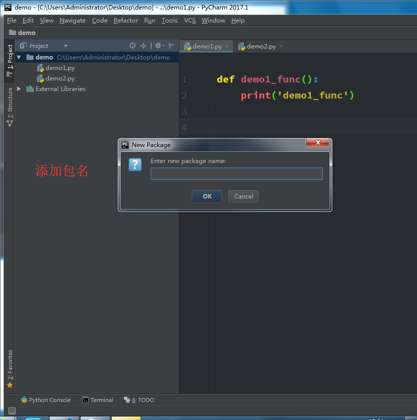

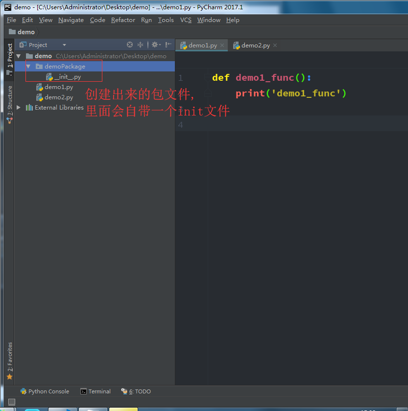

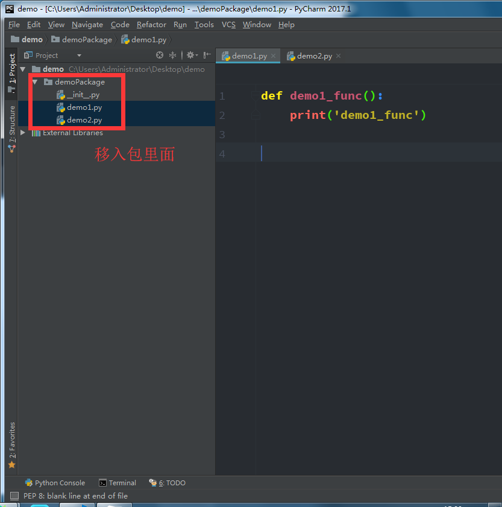

我们在创建一个新的模块(文件), 在新建的模块中, 导入包里面的两个文件:    

这两个文件在包中, 所以我们导入的时候,也要把包名带上: 

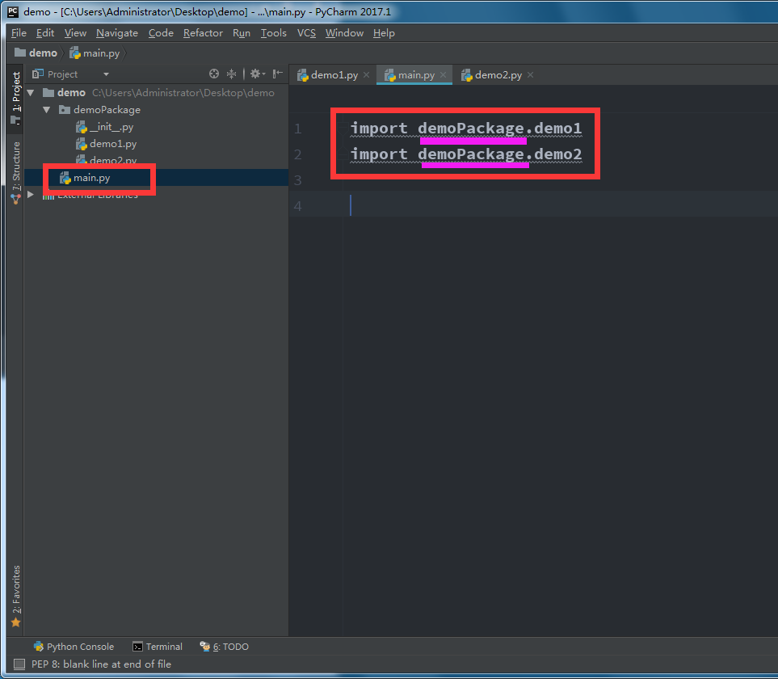

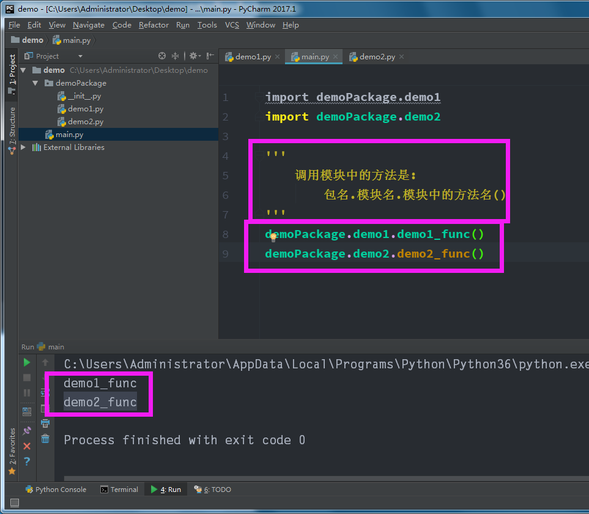


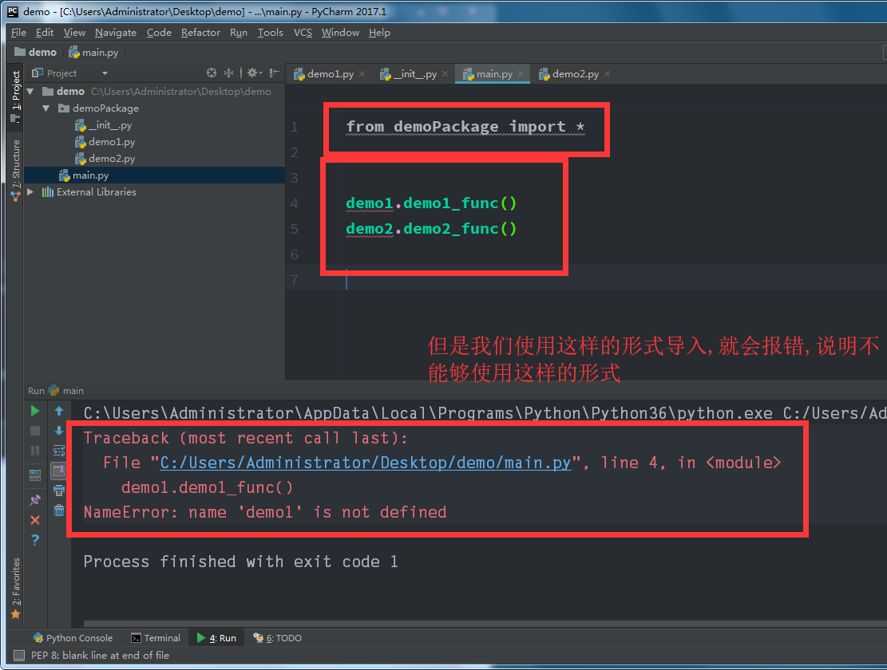


###2.包中的`__init__.py`文件

> `__init__.py` 控制着包的导入行为

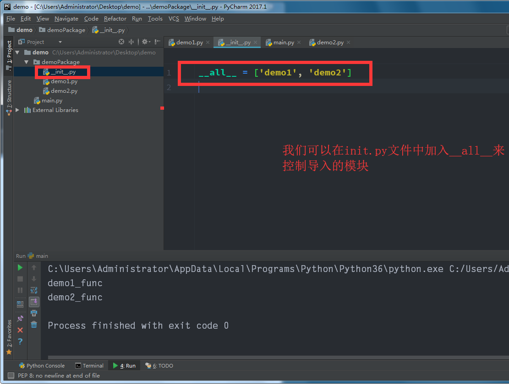

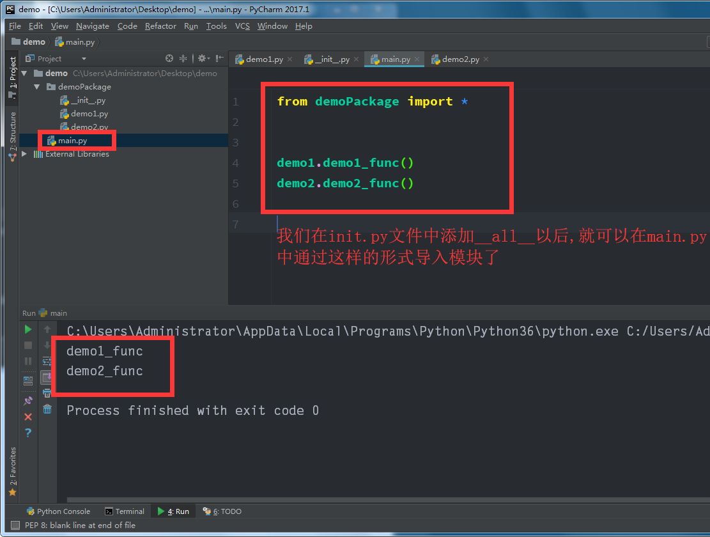

## 总结：

- 包将有联系的模块组织在一起，即放到同一个文件夹下，并且在这个文件夹创建一个名字为`__init__.py` 文件，那么这个文件夹就称之为`包`

- 有效避免模块名称冲突问题，让应用组织结构更加清晰

- `__init__.py`文件有什么用?

  - `__init__.py` 控制着包的导入行为

- `__init__.py`如果为空:

  * 仅仅是把这个包导入，不会导入包中的模块

- ### `__all__`

  * 在`__init__.py`文件中，定义一个`__all__`变量，它控制着 from 包名 import *时导入的模块

- ### 也可以在`__init__`.py文件中定义一些方法,那么这些方法能在包导入后调用

  ### 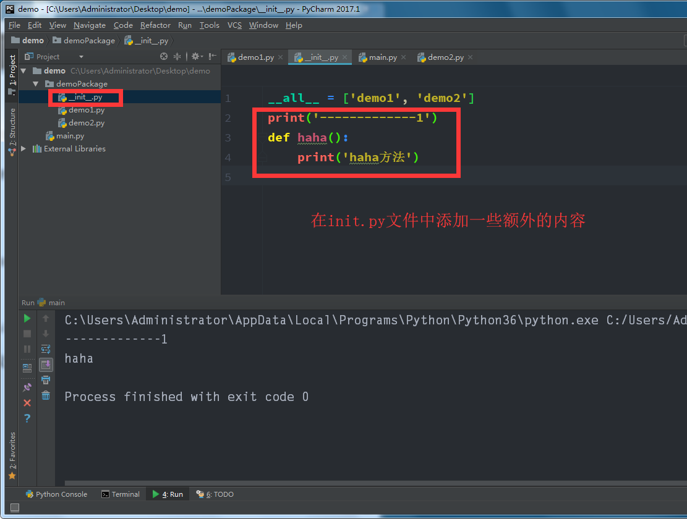

  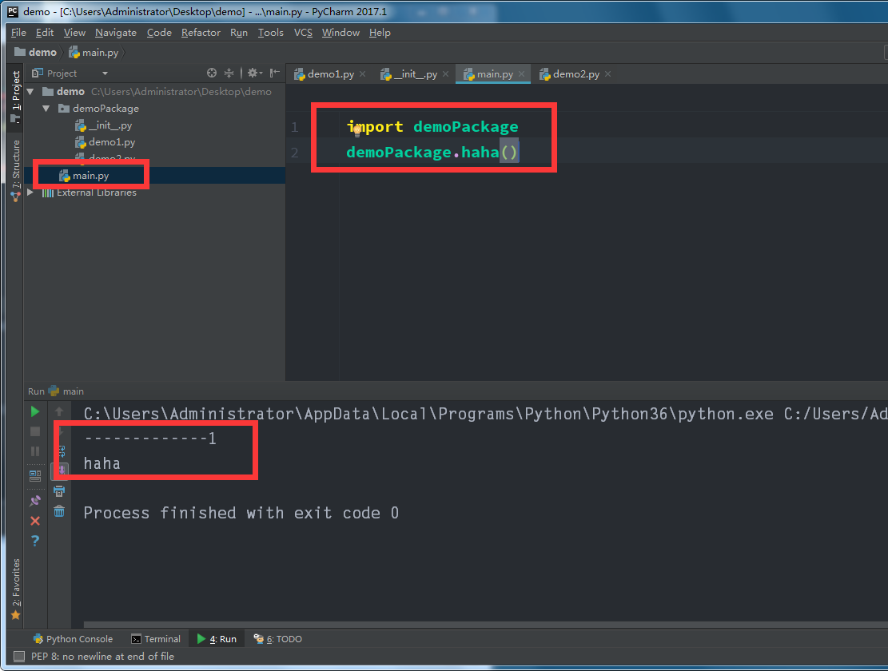

  ​

  ​

  ​

  ​

  ​

  ​

  ​

  ​

  ​

  ​

  ​


